<!-- markdownlint-capture -->
<!-- markdownlint-disable -->

# Code Metrics

This file is dynamically maintained by a bot, *please do not* edit this by hand. It represents various [code metrics](https://aka.ms/dotnet/code-metrics), such as cyclomatic complexity, maintainability index, and so on.

<div id='aspireblog-apphost'></div>

## AspireBlog.AppHost :heavy_check_mark:

The *AspireBlog.AppHost.csproj* project file contains:

- 1 namespaces.
- 1 named types.
- 24 total lines of source code.
- Approximately 10 lines of executable code.
- The highest cyclomatic complexity is 1 :heavy_check_mark:.

<details>
<summary>
  <strong id="global+namespace">
    &lt;global namespace&gt; :heavy_check_mark:
  </strong>
</summary>
<br>

The `<global namespace>` namespace contains 1 named types.

- 1 named types.
- 24 total lines of source code.
- Approximately 10 lines of executable code.
- The highest cyclomatic complexity is 1 :heavy_check_mark:.

<details>
<summary>
  <strong id="program$">
    &lt;Program&gt;$ :heavy_check_mark:
  </strong>
</summary>
<br>

- The `<Program>$` contains 1 members.
- 24 total lines of source code.
- Approximately 10 lines of executable code.
- The highest cyclomatic complexity is 1 :heavy_check_mark:.

| Member kind | Line number | Maintainability index | Cyclomatic complexity | Depth of inheritance | Class coupling | Lines of source / executable code |
| :-: | :-: | :-: | :-: | :-: | :-: | :-: |
| Method | <a href='https://github.com/mpaulosky/AspireBlogApp/blob/main/src/AspireBlog.AppHost/Program.cs#L1' title='<top-level-statements-entry-point>'>1</a> | 73 | 1 :heavy_check_mark: | 0 | 3 | 24 / 5 |

<a href="#global+namespace">:top: back to &lt;global namespace&gt;</a>

</details>

</details>

<a href="#aspireblog-apphost">:top: back to AspireBlog.AppHost</a>

<div id='aspireblog-common'></div>

## AspireBlog.Common :heavy_check_mark:

The *AspireBlog.Common.csproj* project file contains:

- 8 namespaces.
- 38 named types.
- 1,740 total lines of source code.
- Approximately 451 lines of executable code.
- The highest cyclomatic complexity is 5 :heavy_check_mark:.

<details>
<summary>
  <strong id="aspireblog-common-bogusfakes">
    AspireBlog.Common.BogusFakes :heavy_check_mark:
  </strong>
</summary>
<br>

The `AspireBlog.Common.BogusFakes` namespace contains 9 named types.

- 9 named types.
- 700 total lines of source code.
- Approximately 232 lines of executable code.
- The highest cyclomatic complexity is 3 :heavy_check_mark:.

<details>
<summary>
  <strong id="fakeblogpost">
    FakeBlogPost :heavy_check_mark:
  </strong>
</summary>
<br>

- The `FakeBlogPost` contains 3 members.
- 75 total lines of source code.
- Approximately 36 lines of executable code.
- The highest cyclomatic complexity is 3 :heavy_check_mark:.

| Member kind | Line number | Maintainability index | Cyclomatic complexity | Depth of inheritance | Class coupling | Lines of source / executable code |
| :-: | :-: | :-: | :-: | :-: | :-: | :-: |
| Method | <a href='https://github.com/mpaulosky/AspireBlogApp/blob/main/src/AspireBlog.Common/BogusFakes/FakeBlogPost.cs#L61' title='BlogPost FakeBlogPost.FakeData(bool useSeed)'>61</a> | 53 | 3 :heavy_check_mark: | 0 | 7 | 30 / 24 |
| Method | <a href='https://github.com/mpaulosky/AspireBlogApp/blob/main/src/AspireBlog.Common/BogusFakes/FakeBlogPost.cs#L44' title='List<BlogPost> FakeBlogPost.GetBlogPosts(int numberRequested, bool useSeed)'>44</a> | 75 | 2 :heavy_check_mark: | 0 | 3 | 17 / 4 |
| Method | <a href='https://github.com/mpaulosky/AspireBlogApp/blob/main/src/AspireBlog.Common/BogusFakes/FakeBlogPost.cs#L23' title='BlogPost FakeBlogPost.GetNewBlogPost(bool keepId = false, bool useSeed = false)'>23</a> | 66 | 2 :heavy_check_mark: | 0 | 2 | 20 / 8 |

<a href="#FakeBlogPost-class-diagram">:link: to `FakeBlogPost` class diagram</a>

<a href="#aspireblog-common-bogusfakes">:top: back to AspireBlog.Common.BogusFakes</a>

</details>

<details>
<summary>
  <strong id="fakeblogpostdto">
    FakeBlogPostDto :heavy_check_mark:
  </strong>
</summary>
<br>

- The `FakeBlogPostDto` contains 3 members.
- 79 total lines of source code.
- Approximately 38 lines of executable code.
- The highest cyclomatic complexity is 3 :heavy_check_mark:.

| Member kind | Line number | Maintainability index | Cyclomatic complexity | Depth of inheritance | Class coupling | Lines of source / executable code |
| :-: | :-: | :-: | :-: | :-: | :-: | :-: |
| Method | <a href='https://github.com/mpaulosky/AspireBlogApp/blob/main/src/AspireBlog.Common/BogusFakes/FakeBlogPostDto.cs#L63' title='BlogPostDto FakeBlogPostDto.FakeData(bool useSeed)'>63</a> | 53 | 3 :heavy_check_mark: | 0 | 7 | 32 / 24 |
| Method | <a href='https://github.com/mpaulosky/AspireBlogApp/blob/main/src/AspireBlog.Common/BogusFakes/FakeBlogPostDto.cs#L41' title='List<BlogPostDto> FakeBlogPostDto.GetBlogPostDtos(int numberRequested, bool useSeed = false)'>41</a> | 65 | 3 :heavy_check_mark: | 0 | 4 | 22 / 8 |
| Method | <a href='https://github.com/mpaulosky/AspireBlogApp/blob/main/src/AspireBlog.Common/BogusFakes/FakeBlogPostDto.cs#L23' title='BlogPostDto FakeBlogPostDto.GetNewBlogPostDto(bool keepId = false, bool useSeed = false)'>23</a> | 70 | 2 :heavy_check_mark: | 0 | 2 | 17 / 6 |

<a href="#FakeBlogPostDto-class-diagram">:link: to `FakeBlogPostDto` class diagram</a>

<a href="#aspireblog-common-bogusfakes">:top: back to AspireBlog.Common.BogusFakes</a>

</details>

<details>
<summary>
  <strong id="fakecategory">
    FakeCategory :heavy_check_mark:
  </strong>
</summary>
<br>

- The `FakeCategory` contains 3 members.
- 87 total lines of source code.
- Approximately 27 lines of executable code.
- The highest cyclomatic complexity is 3 :heavy_check_mark:.

| Member kind | Line number | Maintainability index | Cyclomatic complexity | Depth of inheritance | Class coupling | Lines of source / executable code |
| :-: | :-: | :-: | :-: | :-: | :-: | :-: |
| Method | <a href='https://github.com/mpaulosky/AspireBlogApp/blob/main/src/AspireBlog.Common/BogusFakes/FakeCategory.cs#L66' title='Category FakeCategory.FakeData(bool useSeed = false)'>66</a> | 59 | 3 :heavy_check_mark: | 0 | 5 | 36 / 14 |
| Method | <a href='https://github.com/mpaulosky/AspireBlogApp/blob/main/src/AspireBlog.Common/BogusFakes/FakeCategory.cs#L47' title='List<Category> FakeCategory.GetCategories(int numberRequested, bool useSeed = false)'>47</a> | 71 | 2 :heavy_check_mark: | 0 | 3 | 19 / 5 |
| Method | <a href='https://github.com/mpaulosky/AspireBlogApp/blob/main/src/AspireBlog.Common/BogusFakes/FakeCategory.cs#L24' title='Category FakeCategory.GetNewCategory(bool keepId = false, bool useSeed = false)'>24</a> | 66 | 2 :heavy_check_mark: | 0 | 2 | 22 / 8 |

<a href="#FakeCategory-class-diagram">:link: to `FakeCategory` class diagram</a>

<a href="#aspireblog-common-bogusfakes">:top: back to AspireBlog.Common.BogusFakes</a>

</details>

<details>
<summary>
  <strong id="fakecategorydto">
    FakeCategoryDto :heavy_check_mark:
  </strong>
</summary>
<br>

- The `FakeCategoryDto` contains 3 members.
- 81 total lines of source code.
- Approximately 27 lines of executable code.
- The highest cyclomatic complexity is 3 :heavy_check_mark:.

| Member kind | Line number | Maintainability index | Cyclomatic complexity | Depth of inheritance | Class coupling | Lines of source / executable code |
| :-: | :-: | :-: | :-: | :-: | :-: | :-: |
| Method | <a href='https://github.com/mpaulosky/AspireBlogApp/blob/main/src/AspireBlog.Common/BogusFakes/FakeCategoryDto.cs#L62' title='CategoryDto FakeCategoryDto.FakeData(bool useSeed = false)'>62</a> | 59 | 3 :heavy_check_mark: | 0 | 5 | 35 / 14 |
| Method | <a href='https://github.com/mpaulosky/AspireBlogApp/blob/main/src/AspireBlog.Common/BogusFakes/FakeCategoryDto.cs#L43' title='List<CategoryDto> FakeCategoryDto.GetCategoryDtos(int numberRequested, bool useSeed = false)'>43</a> | 71 | 2 :heavy_check_mark: | 0 | 3 | 19 / 5 |
| Method | <a href='https://github.com/mpaulosky/AspireBlogApp/blob/main/src/AspireBlog.Common/BogusFakes/FakeCategoryDto.cs#L20' title='CategoryDto FakeCategoryDto.GetNewCategoryDto(bool keepId = false, bool useSeed = false)'>20</a> | 66 | 2 :heavy_check_mark: | 0 | 2 | 22 / 8 |

<a href="#FakeCategoryDto-class-diagram">:link: to `FakeCategoryDto` class diagram</a>

<a href="#aspireblog-common-bogusfakes">:top: back to AspireBlog.Common.BogusFakes</a>

</details>

<details>
<summary>
  <strong id="fakerhelper">
    FakerHelper :heavy_check_mark:
  </strong>
</summary>
<br>

- The `FakerHelper` contains 1 members.
- 14 total lines of source code.
- Approximately 1 lines of executable code.
- The highest cyclomatic complexity is 1 :heavy_check_mark:.

| Member kind | Line number | Maintainability index | Cyclomatic complexity | Depth of inheritance | Class coupling | Lines of source / executable code |
| :-: | :-: | :-: | :-: | :-: | :-: | :-: |
| Method | <a href='https://github.com/mpaulosky/AspireBlogApp/blob/main/src/AspireBlog.Common/BogusFakes/FakerHelper.cs#L21' title='int FakerHelper.GetSeedValue()'>21</a> | 100 | 1 :heavy_check_mark: | 0 | 1 | 8 / 1 |

<a href="#FakerHelper-class-diagram">:link: to `FakerHelper` class diagram</a>

<a href="#aspireblog-common-bogusfakes">:top: back to AspireBlog.Common.BogusFakes</a>

</details>

<details>
<summary>
  <strong id="fakeuser">
    FakeUser :heavy_check_mark:
  </strong>
</summary>
<br>

- The `FakeUser` contains 3 members.
- 68 total lines of source code.
- Approximately 29 lines of executable code.
- The highest cyclomatic complexity is 2 :heavy_check_mark:.

| Member kind | Line number | Maintainability index | Cyclomatic complexity | Depth of inheritance | Class coupling | Lines of source / executable code |
| :-: | :-: | :-: | :-: | :-: | :-: | :-: |
| Method | <a href='https://github.com/mpaulosky/AspireBlogApp/blob/main/src/AspireBlog.Common/BogusFakes/FakeUser.cs#L58' title='User FakeUser.FakeData(bool useSeed = false)'>58</a> | 57 | 2 :heavy_check_mark: | 0 | 3 | 26 / 18 |
| Method | <a href='https://github.com/mpaulosky/AspireBlogApp/blob/main/src/AspireBlog.Common/BogusFakes/FakeUser.cs#L23' title='User FakeUser.GetNewUser(bool keepId = false, bool useSeed = false)'>23</a> | 70 | 2 :heavy_check_mark: | 0 | 2 | 17 / 6 |
| Method | <a href='https://github.com/mpaulosky/AspireBlogApp/blob/main/src/AspireBlog.Common/BogusFakes/FakeUser.cs#L41' title='List<User> FakeUser.GetUserDtos(int numberRequested, bool useSeed = false)'>41</a> | 71 | 2 :heavy_check_mark: | 0 | 3 | 17 / 5 |

<a href="#FakeUser-class-diagram">:link: to `FakeUser` class diagram</a>

<a href="#aspireblog-common-bogusfakes">:top: back to AspireBlog.Common.BogusFakes</a>

</details>

<details>
<summary>
  <strong id="fakeuserdto">
    FakeUserDto :heavy_check_mark:
  </strong>
</summary>
<br>

- The `FakeUserDto` contains 3 members.
- 67 total lines of source code.
- Approximately 28 lines of executable code.
- The highest cyclomatic complexity is 2 :heavy_check_mark:.

| Member kind | Line number | Maintainability index | Cyclomatic complexity | Depth of inheritance | Class coupling | Lines of source / executable code |
| :-: | :-: | :-: | :-: | :-: | :-: | :-: |
| Method | <a href='https://github.com/mpaulosky/AspireBlogApp/blob/main/src/AspireBlog.Common/BogusFakes/FakeUserDto.cs#L58' title='UserDto FakeUserDto.FakeData(bool useSeed = false)'>58</a> | 58 | 2 :heavy_check_mark: | 0 | 3 | 25 / 17 |
| Method | <a href='https://github.com/mpaulosky/AspireBlogApp/blob/main/src/AspireBlog.Common/BogusFakes/FakeUserDto.cs#L23' title='UserDto FakeUserDto.GetNewUserDto(bool keepId = false, bool useSeed = false)'>23</a> | 70 | 2 :heavy_check_mark: | 0 | 2 | 17 / 6 |
| Method | <a href='https://github.com/mpaulosky/AspireBlogApp/blob/main/src/AspireBlog.Common/BogusFakes/FakeUserDto.cs#L41' title='List<UserDto> FakeUserDto.GetUserDtos(int numberRequested, bool useSeed = false)'>41</a> | 71 | 2 :heavy_check_mark: | 0 | 3 | 17 / 5 |

<a href="#FakeUserDto-class-diagram">:link: to `FakeUserDto` class diagram</a>

<a href="#aspireblog-common-bogusfakes">:top: back to AspireBlog.Common.BogusFakes</a>

</details>

<details>
<summary>
  <strong id="fakeuserinfo">
    FakeUserInfo :heavy_check_mark:
  </strong>
</summary>
<br>

- The `FakeUserInfo` contains 3 members.
- 66 total lines of source code.
- Approximately 23 lines of executable code.
- The highest cyclomatic complexity is 3 :heavy_check_mark:.

| Member kind | Line number | Maintainability index | Cyclomatic complexity | Depth of inheritance | Class coupling | Lines of source / executable code |
| :-: | :-: | :-: | :-: | :-: | :-: | :-: |
| Method | <a href='https://github.com/mpaulosky/AspireBlogApp/blob/main/src/AspireBlog.Common/BogusFakes/FakeUserInfo.cs#L58' title='UserInfo FakeUserInfo.FakeData(bool useSeed = false)'>58</a> | 61 | 3 :heavy_check_mark: | 0 | 3 | 24 / 12 |
| Method | <a href='https://github.com/mpaulosky/AspireBlogApp/blob/main/src/AspireBlog.Common/BogusFakes/FakeUserInfo.cs#L23' title='UserInfo FakeUserInfo.GetNewUserInfo(bool keepId = false, bool useSeed = false)'>23</a> | 70 | 2 :heavy_check_mark: | 0 | 2 | 17 / 6 |
| Method | <a href='https://github.com/mpaulosky/AspireBlogApp/blob/main/src/AspireBlog.Common/BogusFakes/FakeUserInfo.cs#L41' title='List<UserInfo> FakeUserInfo.GetUserInfos(int numberRequested, bool useSeed = false)'>41</a> | 71 | 2 :heavy_check_mark: | 0 | 3 | 17 / 5 |

<a href="#FakeUserInfo-class-diagram">:link: to `FakeUserInfo` class diagram</a>

<a href="#aspireblog-common-bogusfakes">:top: back to AspireBlog.Common.BogusFakes</a>

</details>

<details>
<summary>
  <strong id="fakeusermodel">
    FakeUserModel :heavy_check_mark:
  </strong>
</summary>
<br>

- The `FakeUserModel` contains 3 members.
- 73 total lines of source code.
- Approximately 23 lines of executable code.
- The highest cyclomatic complexity is 2 :heavy_check_mark:.

| Member kind | Line number | Maintainability index | Cyclomatic complexity | Depth of inheritance | Class coupling | Lines of source / executable code |
| :-: | :-: | :-: | :-: | :-: | :-: | :-: |
| Method | <a href='https://github.com/mpaulosky/AspireBlogApp/blob/main/src/AspireBlog.Common/BogusFakes/FakeUserModel.cs#L63' title='UserModel FakeUserModel.FakeData(bool useSeed)'>63</a> | 63 | 2 :heavy_check_mark: | 0 | 3 | 25 / 12 |
| Method | <a href='https://github.com/mpaulosky/AspireBlogApp/blob/main/src/AspireBlog.Common/BogusFakes/FakeUserModel.cs#L24' title='UserModel FakeUserModel.GetNewUser(bool keepId = false, bool useSeed = false)'>24</a> | 70 | 2 :heavy_check_mark: | 0 | 2 | 19 / 6 |
| Method | <a href='https://github.com/mpaulosky/AspireBlogApp/blob/main/src/AspireBlog.Common/BogusFakes/FakeUserModel.cs#L44' title='List<UserModel> FakeUserModel.GetUsers(int numberRequested, bool useSeed = false)'>44</a> | 71 | 2 :heavy_check_mark: | 0 | 3 | 19 / 5 |

<a href="#FakeUserModel-class-diagram">:link: to `FakeUserModel` class diagram</a>

<a href="#aspireblog-common-bogusfakes">:top: back to AspireBlog.Common.BogusFakes</a>

</details>

</details>

<details>
<summary>
  <strong id="aspireblog-common-constants">
    AspireBlog.Common.Constants :heavy_check_mark:
  </strong>
</summary>
<br>

The `AspireBlog.Common.Constants` namespace contains 1 named types.

- 1 named types.
- 29 total lines of source code.
- Approximately 2 lines of executable code.
- The highest cyclomatic complexity is 0 :heavy_check_mark:.

<details>
<summary>
  <strong id="servicenames">
    ServiceNames :heavy_check_mark:
  </strong>
</summary>
<br>

- The `ServiceNames` contains 6 members.
- 19 total lines of source code.
- Approximately 2 lines of executable code.
- The highest cyclomatic complexity is 0 :heavy_check_mark:.

| Member kind | Line number | Maintainability index | Cyclomatic complexity | Depth of inheritance | Class coupling | Lines of source / executable code |
| :-: | :-: | :-: | :-: | :-: | :-: | :-: |
| Field | <a href='https://github.com/mpaulosky/AspireBlogApp/blob/main/src/AspireBlog.Common/Constants/ServiceNames.cs#L22' title='string ServiceNames.Migration'>22</a> | 93 | 0 :heavy_check_mark: | 0 | 0 | 1 / 1 |
| Field | <a href='https://github.com/mpaulosky/AspireBlogApp/blob/main/src/AspireBlog.Common/Constants/ServiceNames.cs#L20' title='string ServiceNames.MongoDbName'>20</a> | 93 | 0 :heavy_check_mark: | 0 | 0 | 1 / 1 |
| Field | <a href='https://github.com/mpaulosky/AspireBlogApp/blob/main/src/AspireBlog.Common/Constants/ServiceNames.cs#L24' title='string ServiceNames.OutputCache'>24</a> | 93 | 0 :heavy_check_mark: | 0 | 0 | 1 / 1 |
| Field | <a href='https://github.com/mpaulosky/AspireBlogApp/blob/main/src/AspireBlog.Common/Constants/ServiceNames.cs#L18' title='string ServiceNames.ServerName'>18</a> | 93 | 0 :heavy_check_mark: | 0 | 0 | 1 / 1 |
| Field | <a href='https://github.com/mpaulosky/AspireBlogApp/blob/main/src/AspireBlog.Common/Constants/ServiceNames.cs#L26' title='string ServiceNames.WebApp'>26</a> | 93 | 0 :heavy_check_mark: | 0 | 0 | 1 / 1 |
| Field | <a href='https://github.com/mpaulosky/AspireBlogApp/blob/main/src/AspireBlog.Common/Constants/ServiceNames.cs#L28' title='string ServiceNames.WebUI'>28</a> | 93 | 0 :heavy_check_mark: | 0 | 0 | 1 / 1 |

<a href="#ServiceNames-class-diagram">:link: to `ServiceNames` class diagram</a>

<a href="#aspireblog-common-constants">:top: back to AspireBlog.Common.Constants</a>

</details>

</details>

<details>
<summary>
  <strong id="aspireblog-common-entities">
    AspireBlog.Common.Entities :heavy_check_mark:
  </strong>
</summary>
<br>

The `AspireBlog.Common.Entities` namespace contains 3 named types.

- 3 named types.
- 190 total lines of source code.
- Approximately 63 lines of executable code.
- The highest cyclomatic complexity is 4 :heavy_check_mark:.

<details>
<summary>
  <strong id="blogpost">
    BlogPost :heavy_check_mark:
  </strong>
</summary>
<br>

- The `BlogPost` contains 13 members.
- 43 total lines of source code.
- Approximately 17 lines of executable code.
- The highest cyclomatic complexity is 4 :heavy_check_mark:.

| Member kind | Line number | Maintainability index | Cyclomatic complexity | Depth of inheritance | Class coupling | Lines of source / executable code |
| :-: | :-: | :-: | :-: | :-: | :-: | :-: |
| Field | <a href='https://github.com/mpaulosky/AspireBlogApp/blob/main/src/AspireBlog.Common/Entities/BlogPost.cs#L6' title='string? BlogPost._title'>6</a> | 100 | 0 :heavy_check_mark: | 0 | 1 | 1 / 0 |
| Property | <a href='https://github.com/mpaulosky/AspireBlogApp/blob/main/src/AspireBlog.Common/Entities/BlogPost.cs#L43' title='UserDto? BlogPost.Author'>43</a> | 100 | 2 :heavy_check_mark: | 0 | 2 | 1 / 0 |
| Property | <a href='https://github.com/mpaulosky/AspireBlogApp/blob/main/src/AspireBlog.Common/Entities/BlogPost.cs#L41' title='CategoryDto? BlogPost.Category'>41</a> | 100 | 2 :heavy_check_mark: | 0 | 2 | 1 / 0 |
| Property | <a href='https://github.com/mpaulosky/AspireBlogApp/blob/main/src/AspireBlog.Common/Entities/BlogPost.cs#L29' title='string? BlogPost.Content'>29</a> | 100 | 2 :heavy_check_mark: | 0 | 3 | 1 / 2 |
| Property | <a href='https://github.com/mpaulosky/AspireBlogApp/blob/main/src/AspireBlog.Common/Entities/BlogPost.cs#L31' title='DateTime? BlogPost.CreatedOn'>31</a> | 100 | 2 :heavy_check_mark: | 0 | 2 | 1 / 0 |
| Property | <a href='https://github.com/mpaulosky/AspireBlogApp/blob/main/src/AspireBlog.Common/Entities/BlogPost.cs#L8' title='ObjectId BlogPost.Id'>8</a> | 100 | 2 :heavy_check_mark: | 0 | 5 | 1 / 3 |
| Property | <a href='https://github.com/mpaulosky/AspireBlogApp/blob/main/src/AspireBlog.Common/Entities/BlogPost.cs#L39' title='string? BlogPost.ImageUrl'>39</a> | 100 | 2 :heavy_check_mark: | 0 | 2 | 1 / 2 |
| Property | <a href='https://github.com/mpaulosky/AspireBlogApp/blob/main/src/AspireBlog.Common/Entities/BlogPost.cs#L27' title='string? BlogPost.Introduction'>27</a> | 100 | 2 :heavy_check_mark: | 0 | 3 | 1 / 2 |
| Property | <a href='https://github.com/mpaulosky/AspireBlogApp/blob/main/src/AspireBlog.Common/Entities/BlogPost.cs#L33' title='bool BlogPost.IsPublished'>33</a> | 100 | 2 :heavy_check_mark: | 0 | 0 | 1 / 0 |
| Property | <a href='https://github.com/mpaulosky/AspireBlogApp/blob/main/src/AspireBlog.Common/Entities/BlogPost.cs#L37' title='DateTime? BlogPost.ModifiedOn'>37</a> | 100 | 2 :heavy_check_mark: | 0 | 2 | 1 / 0 |
| Property | <a href='https://github.com/mpaulosky/AspireBlogApp/blob/main/src/AspireBlog.Common/Entities/BlogPost.cs#L35' title='DateTime? BlogPost.PublishedOn'>35</a> | 100 | 2 :heavy_check_mark: | 0 | 2 | 1 / 0 |
| Property | <a href='https://github.com/mpaulosky/AspireBlogApp/blob/main/src/AspireBlog.Common/Entities/BlogPost.cs#L25' title='string? BlogPost.Slug'>25</a> | 100 | 2 :heavy_check_mark: | 0 | 3 | 1 / 2 |
| Property | <a href='https://github.com/mpaulosky/AspireBlogApp/blob/main/src/AspireBlog.Common/Entities/BlogPost.cs#L12' title='string? BlogPost.Title'>12</a> | 89 | 4 :heavy_check_mark: | 0 | 4 | 14 / 6 |

<a href="#BlogPost-class-diagram">:link: to `BlogPost` class diagram</a>

<a href="#aspireblog-common-entities">:top: back to AspireBlog.Common.Entities</a>

</details>

<details>
<summary>
  <strong id="category">
    Category :heavy_check_mark:
  </strong>
</summary>
<br>

- The `Category` contains 6 members.
- 71 total lines of source code.
- Approximately 16 lines of executable code.
- The highest cyclomatic complexity is 4 :heavy_check_mark:.

| Member kind | Line number | Maintainability index | Cyclomatic complexity | Depth of inheritance | Class coupling | Lines of source / executable code |
| :-: | :-: | :-: | :-: | :-: | :-: | :-: |
| Field | <a href='https://github.com/mpaulosky/AspireBlogApp/blob/main/src/AspireBlog.Common/Entities/Category.cs#L8' title='string? Category._categoryName'>8</a> | 100 | 0 :heavy_check_mark: | 0 | 1 | 1 / 0 |
| Property | <a href='https://github.com/mpaulosky/AspireBlogApp/blob/main/src/AspireBlog.Common/Entities/Category.cs#L72' title='UserDto? Category.ArchivedBy'>72</a> | 100 | 2 :heavy_check_mark: | 0 | 2 | 7 / 1 |
| Property | <a href='https://github.com/mpaulosky/AspireBlogApp/blob/main/src/AspireBlog.Common/Entities/Category.cs#L33' title='string? Category.CategoryName'>33</a> | 89 | 4 :heavy_check_mark: | 0 | 4 | 20 / 6 |
| Property | <a href='https://github.com/mpaulosky/AspireBlogApp/blob/main/src/AspireBlog.Common/Entities/Category.cs#L23' title='ObjectId Category.Id'>23</a> | 100 | 2 :heavy_check_mark: | 0 | 6 | 14 / 3 |
| Property | <a href='https://github.com/mpaulosky/AspireBlogApp/blob/main/src/AspireBlog.Common/Entities/Category.cs#L64' title='bool Category.IsArchived'>64</a> | 100 | 2 :heavy_check_mark: | 0 | 3 | 9 / 4 |
| Property | <a href='https://github.com/mpaulosky/AspireBlogApp/blob/main/src/AspireBlog.Common/Entities/Category.cs#L54' title='string? Category.Slug'>54</a> | 100 | 2 :heavy_check_mark: | 0 | 3 | 9 / 2 |

<a href="#Category-class-diagram">:link: to `Category` class diagram</a>

<a href="#aspireblog-common-entities">:top: back to AspireBlog.Common.Entities</a>

</details>

<details>
<summary>
  <strong id="user">
    User :heavy_check_mark:
  </strong>
</summary>
<br>

- The `User` contains 6 members.
- 73 total lines of source code.
- Approximately 30 lines of executable code.
- The highest cyclomatic complexity is 2 :heavy_check_mark:.

| Member kind | Line number | Maintainability index | Cyclomatic complexity | Depth of inheritance | Class coupling | Lines of source / executable code |
| :-: | :-: | :-: | :-: | :-: | :-: | :-: |
| Property | <a href='https://github.com/mpaulosky/AspireBlogApp/blob/main/src/AspireBlog.Common/Entities/User.cs#L64' title='string? User.Email'>64</a> | 100 | 2 :heavy_check_mark: | 0 | 6 | 11 / 6 |
| Property | <a href='https://github.com/mpaulosky/AspireBlogApp/blob/main/src/AspireBlog.Common/Entities/User.cs#L30' title='string? User.FirstName'>30</a> | 100 | 2 :heavy_check_mark: | 0 | 6 | 11 / 6 |
| Property | <a href='https://github.com/mpaulosky/AspireBlogApp/blob/main/src/AspireBlog.Common/Entities/User.cs#L52' title='string? User.FullName'>52</a> | 100 | 2 :heavy_check_mark: | 0 | 5 | 10 / 6 |
| Property | <a href='https://github.com/mpaulosky/AspireBlogApp/blob/main/src/AspireBlog.Common/Entities/User.cs#L18' title='ObjectId User.Id'>18</a> | 100 | 2 :heavy_check_mark: | 0 | 6 | 11 / 3 |
| Property | <a href='https://github.com/mpaulosky/AspireBlogApp/blob/main/src/AspireBlog.Common/Entities/User.cs#L41' title='string? User.LastName'>41</a> | 100 | 2 :heavy_check_mark: | 0 | 5 | 10 / 6 |
| Property | <a href='https://github.com/mpaulosky/AspireBlogApp/blob/main/src/AspireBlog.Common/Entities/User.cs#L74' title='string[]? User.Roles'>74</a> | 100 | 2 :heavy_check_mark: | 0 | 3 | 9 / 3 |

<a href="#User-class-diagram">:link: to `User` class diagram</a>

<a href="#aspireblog-common-entities">:top: back to AspireBlog.Common.Entities</a>

</details>

</details>

<details>
<summary>
  <strong id="aspireblog-common-enum">
    AspireBlog.Common.Enum :heavy_check_mark:
  </strong>
</summary>
<br>

The `AspireBlog.Common.Enum` namespace contains 3 named types.

- 3 named types.
- 41 total lines of source code.
- Approximately 6 lines of executable code.
- The highest cyclomatic complexity is 0 :heavy_check_mark:.

<details>
<summary>
  <strong id="categorynames">
    CategoryNames :heavy_check_mark:
  </strong>
</summary>
<br>

- The `CategoryNames` contains 6 members.
- 12 total lines of source code.
- Approximately 2 lines of executable code.
- The highest cyclomatic complexity is 0 :heavy_check_mark:.

| Member kind | Line number | Maintainability index | Cyclomatic complexity | Depth of inheritance | Class coupling | Lines of source / executable code |
| :-: | :-: | :-: | :-: | :-: | :-: | :-: |
| Field | <a href='https://github.com/mpaulosky/AspireBlogApp/blob/main/src/AspireBlog.Common/Enum/Enums.cs#L36' title='CategoryNames.AspNetCore'>36</a> | 93 | 0 :heavy_check_mark: | 0 | 0 | 1 / 1 |
| Field | <a href='https://github.com/mpaulosky/AspireBlogApp/blob/main/src/AspireBlog.Common/Enum/Enums.cs#L37' title='CategoryNames.BlazorServer'>37</a> | 93 | 0 :heavy_check_mark: | 0 | 0 | 1 / 1 |
| Field | <a href='https://github.com/mpaulosky/AspireBlogApp/blob/main/src/AspireBlog.Common/Enum/Enums.cs#L38' title='CategoryNames.BlazorWasm'>38</a> | 93 | 0 :heavy_check_mark: | 0 | 0 | 1 / 1 |
| Field | <a href='https://github.com/mpaulosky/AspireBlogApp/blob/main/src/AspireBlog.Common/Enum/Enums.cs#L39' title='CategoryNames.EntityFrameworkCore'>39</a> | 93 | 0 :heavy_check_mark: | 0 | 0 | 1 / 1 |
| Field | <a href='https://github.com/mpaulosky/AspireBlogApp/blob/main/src/AspireBlog.Common/Enum/Enums.cs#L40' title='CategoryNames.NetMaui'>40</a> | 93 | 0 :heavy_check_mark: | 0 | 0 | 1 / 1 |
| Field | <a href='https://github.com/mpaulosky/AspireBlogApp/blob/main/src/AspireBlog.Common/Enum/Enums.cs#L41' title='CategoryNames.Other'>41</a> | 93 | 0 :heavy_check_mark: | 0 | 0 | 1 / 1 |

<a href="#CategoryNames-class-diagram">:link: to `CategoryNames` class diagram</a>

<a href="#aspireblog-common-enum">:top: back to AspireBlog.Common.Enum</a>

</details>

<details>
<summary>
  <strong id="gender">
    Gender :heavy_check_mark:
  </strong>
</summary>
<br>

- The `Gender` contains 2 members.
- 8 total lines of source code.
- Approximately 2 lines of executable code.
- The highest cyclomatic complexity is 0 :heavy_check_mark:.

| Member kind | Line number | Maintainability index | Cyclomatic complexity | Depth of inheritance | Class coupling | Lines of source / executable code |
| :-: | :-: | :-: | :-: | :-: | :-: | :-: |
| Field | <a href='https://github.com/mpaulosky/AspireBlogApp/blob/main/src/AspireBlog.Common/Enum/Enums.cs#L18' title='Gender.Female'>18</a> | 93 | 0 :heavy_check_mark: | 0 | 0 | 1 / 1 |
| Field | <a href='https://github.com/mpaulosky/AspireBlogApp/blob/main/src/AspireBlog.Common/Enum/Enums.cs#L17' title='Gender.Male'>17</a> | 93 | 0 :heavy_check_mark: | 0 | 0 | 1 / 1 |

<a href="#Gender-class-diagram">:link: to `Gender` class diagram</a>

<a href="#aspireblog-common-enum">:top: back to AspireBlog.Common.Enum</a>

</details>

<details>
<summary>
  <strong id="roles">
    Roles :heavy_check_mark:
  </strong>
</summary>
<br>

- The `Roles` contains 3 members.
- 9 total lines of source code.
- Approximately 2 lines of executable code.
- The highest cyclomatic complexity is 0 :heavy_check_mark:.

| Member kind | Line number | Maintainability index | Cyclomatic complexity | Depth of inheritance | Class coupling | Lines of source / executable code |
| :-: | :-: | :-: | :-: | :-: | :-: | :-: |
| Field | <a href='https://github.com/mpaulosky/AspireBlogApp/blob/main/src/AspireBlog.Common/Enum/Enums.cs#L27' title='Roles.Admin'>27</a> | 93 | 0 :heavy_check_mark: | 0 | 0 | 1 / 1 |
| Field | <a href='https://github.com/mpaulosky/AspireBlogApp/blob/main/src/AspireBlog.Common/Enum/Enums.cs#L26' title='Roles.Author'>26</a> | 93 | 0 :heavy_check_mark: | 0 | 0 | 1 / 1 |
| Field | <a href='https://github.com/mpaulosky/AspireBlogApp/blob/main/src/AspireBlog.Common/Enum/Enums.cs#L28' title='Roles.User'>28</a> | 93 | 0 :heavy_check_mark: | 0 | 0 | 1 / 1 |

<a href="#Roles-class-diagram">:link: to `Roles` class diagram</a>

<a href="#aspireblog-common-enum">:top: back to AspireBlog.Common.Enum</a>

</details>

</details>

<details>
<summary>
  <strong id="aspireblog-common-guardclauses">
    AspireBlog.Common.GuardClauses :heavy_check_mark:
  </strong>
</summary>
<br>

The `AspireBlog.Common.GuardClauses` namespace contains 1 named types.

- 1 named types.
- 22 total lines of source code.
- Approximately 6 lines of executable code.
- The highest cyclomatic complexity is 5 :heavy_check_mark:.

<details>
<summary>
  <strong id="guardclauseextensions">
    GuardClauseExtensions :heavy_check_mark:
  </strong>
</summary>
<br>

- The `GuardClauseExtensions` contains 1 members.
- 18 total lines of source code.
- Approximately 6 lines of executable code.
- The highest cyclomatic complexity is 5 :heavy_check_mark:.

| Member kind | Line number | Maintainability index | Cyclomatic complexity | Depth of inheritance | Class coupling | Lines of source / executable code |
| :-: | :-: | :-: | :-: | :-: | :-: | :-: |
| Method | <a href='https://github.com/mpaulosky/AspireBlogApp/blob/main/src/AspireBlog.Common/GuardClauses/ObjectIdGuard.cs#L8' title='ObjectId GuardClauseExtensions.EmptyObjectId(IGuardClause guardClause, ObjectId input, string parameterName, string? message = null, Func<Exception>? exceptionCreator = null)'>8</a> | 68 | 5 :heavy_check_mark: | 0 | 8 | 15 / 6 |

<a href="#GuardClauseExtensions-class-diagram">:link: to `GuardClauseExtensions` class diagram</a>

<a href="#aspireblog-common-guardclauses">:top: back to AspireBlog.Common.GuardClauses</a>

</details>

</details>

<details>
<summary>
  <strong id="aspireblog-common-interfaces">
    AspireBlog.Common.Interfaces :heavy_check_mark:
  </strong>
</summary>
<br>

The `AspireBlog.Common.Interfaces` namespace contains 4 named types.

- 4 named types.
- 48 total lines of source code.
- Approximately 0 lines of executable code.
- The highest cyclomatic complexity is 1 :heavy_check_mark:.

<details>
<summary>
  <strong id="iblogpostservice">
    IBlogPostService :heavy_check_mark:
  </strong>
</summary>
<br>

- The `IBlogPostService` contains 7 members.
- 10 total lines of source code.
- Approximately 0 lines of executable code.
- The highest cyclomatic complexity is 1 :heavy_check_mark:.

| Member kind | Line number | Maintainability index | Cyclomatic complexity | Depth of inheritance | Class coupling | Lines of source / executable code |
| :-: | :-: | :-: | :-: | :-: | :-: | :-: |
| Method | <a href='https://github.com/mpaulosky/AspireBlogApp/blob/main/src/AspireBlog.Common/Interfaces/IBlogPostService.cs#L9' title='Task<MethodResult> IBlogPostService.CreateBlogPostAsync(BlogPostDto model)'>9</a> | 100 | 1 :heavy_check_mark: | 0 | 3 | 1 / 0 |
| Method | <a href='https://github.com/mpaulosky/AspireBlogApp/blob/main/src/AspireBlog.Common/Interfaces/IBlogPostService.cs#L11' title='Task<MethodResult> IBlogPostService.DeleteBlogPostAsync(BlogPostDto model)'>11</a> | 100 | 1 :heavy_check_mark: | 0 | 3 | 1 / 0 |
| Method | <a href='https://github.com/mpaulosky/AspireBlogApp/blob/main/src/AspireBlog.Common/Interfaces/IBlogPostService.cs#L7' title='Task<IEnumerable<BlogPostDto?>?> IBlogPostService.GetBlogPostsAsync(int count, int page)'>7</a> | 100 | 1 :heavy_check_mark: | 0 | 4 | 1 / 0 |
| Method | <a href='https://github.com/mpaulosky/AspireBlogApp/blob/main/src/AspireBlog.Common/Interfaces/IBlogPostService.cs#L5' title='Task<BlogPostDto?> IBlogPostService.GetByIdAsync(ObjectId id)'>5</a> | 100 | 1 :heavy_check_mark: | 0 | 4 | 1 / 0 |
| Method | <a href='https://github.com/mpaulosky/AspireBlogApp/blob/main/src/AspireBlog.Common/Interfaces/IBlogPostService.cs#L6' title='Task<BlogPostDto?> IBlogPostService.GetBySlugAsync(string slug)'>6</a> | 100 | 1 :heavy_check_mark: | 0 | 3 | 1 / 0 |
| Method | <a href='https://github.com/mpaulosky/AspireBlogApp/blob/main/src/AspireBlog.Common/Interfaces/IBlogPostService.cs#L8' title='Task<IQueryable<BlogPostDto?>?> IBlogPostService.GetQuerableBlogPostsAsync(int count, int page)'>8</a> | 100 | 1 :heavy_check_mark: | 0 | 4 | 1 / 0 |
| Method | <a href='https://github.com/mpaulosky/AspireBlogApp/blob/main/src/AspireBlog.Common/Interfaces/IBlogPostService.cs#L10' title='Task<MethodResult> IBlogPostService.UpdateBlogPostAsync(BlogPostDto model)'>10</a> | 100 | 1 :heavy_check_mark: | 0 | 3 | 1 / 0 |

<a href="#IBlogPostService-class-diagram">:link: to `IBlogPostService` class diagram</a>

<a href="#aspireblog-common-interfaces">:top: back to AspireBlog.Common.Interfaces</a>

</details>

<details>
<summary>
  <strong id="icategoryservice">
    ICategoryService :heavy_check_mark:
  </strong>
</summary>
<br>

- The `ICategoryService` contains 7 members.
- 10 total lines of source code.
- Approximately 0 lines of executable code.
- The highest cyclomatic complexity is 1 :heavy_check_mark:.

| Member kind | Line number | Maintainability index | Cyclomatic complexity | Depth of inheritance | Class coupling | Lines of source / executable code |
| :-: | :-: | :-: | :-: | :-: | :-: | :-: |
| Method | <a href='https://github.com/mpaulosky/AspireBlogApp/blob/main/src/AspireBlog.Common/Interfaces/ICategoryService.cs#L9' title='Task<MethodResult> ICategoryService.CreateCategoryAsync(CategoryDto model)'>9</a> | 100 | 1 :heavy_check_mark: | 0 | 3 | 1 / 0 |
| Method | <a href='https://github.com/mpaulosky/AspireBlogApp/blob/main/src/AspireBlog.Common/Interfaces/ICategoryService.cs#L11' title='Task<MethodResult> ICategoryService.DeleteCategoryAsync(CategoryDto model)'>11</a> | 100 | 1 :heavy_check_mark: | 0 | 3 | 1 / 0 |
| Method | <a href='https://github.com/mpaulosky/AspireBlogApp/blob/main/src/AspireBlog.Common/Interfaces/ICategoryService.cs#L5' title='Task<CategoryDto?> ICategoryService.GetByIdAsync(ObjectId id)'>5</a> | 100 | 1 :heavy_check_mark: | 0 | 4 | 1 / 0 |
| Method | <a href='https://github.com/mpaulosky/AspireBlogApp/blob/main/src/AspireBlog.Common/Interfaces/ICategoryService.cs#L6' title='Task<CategoryDto?> ICategoryService.GetBySlugAsync(string slug)'>6</a> | 100 | 1 :heavy_check_mark: | 0 | 3 | 1 / 0 |
| Method | <a href='https://github.com/mpaulosky/AspireBlogApp/blob/main/src/AspireBlog.Common/Interfaces/ICategoryService.cs#L7' title='Task<IEnumerable<CategoryDto?>?> ICategoryService.GetCategoriesAsync(int count, int page)'>7</a> | 100 | 1 :heavy_check_mark: | 0 | 4 | 1 / 0 |
| Method | <a href='https://github.com/mpaulosky/AspireBlogApp/blob/main/src/AspireBlog.Common/Interfaces/ICategoryService.cs#L8' title='Task<IQueryable<CategoryDto?>?> ICategoryService.GetQuerableCategoriesAsync(int count, int page)'>8</a> | 100 | 1 :heavy_check_mark: | 0 | 4 | 1 / 0 |
| Method | <a href='https://github.com/mpaulosky/AspireBlogApp/blob/main/src/AspireBlog.Common/Interfaces/ICategoryService.cs#L10' title='Task<MethodResult> ICategoryService.UpdateCategoryAsync(CategoryDto model)'>10</a> | 100 | 1 :heavy_check_mark: | 0 | 3 | 1 / 0 |

<a href="#ICategoryService-class-diagram">:link: to `ICategoryService` class diagram</a>

<a href="#aspireblog-common-interfaces">:top: back to AspireBlog.Common.Interfaces</a>

</details>

<details>
<summary>
  <strong id="iloginprovider">
    ILoginProvider :heavy_check_mark:
  </strong>
</summary>
<br>

- The `ILoginProvider` contains 2 members.
- 5 total lines of source code.
- Approximately 0 lines of executable code.
- The highest cyclomatic complexity is 1 :heavy_check_mark:.

| Member kind | Line number | Maintainability index | Cyclomatic complexity | Depth of inheritance | Class coupling | Lines of source / executable code |
| :-: | :-: | :-: | :-: | :-: | :-: | :-: |
| Method | <a href='https://github.com/mpaulosky/AspireBlogApp/blob/main/src/AspireBlog.Common/Interfaces/ILoginProvider.cs#L14' title='Task ILoginProvider.LoginAsync()'>14</a> | 100 | 1 :heavy_check_mark: | 0 | 1 | 1 / 0 |
| Method | <a href='https://github.com/mpaulosky/AspireBlogApp/blob/main/src/AspireBlog.Common/Interfaces/ILoginProvider.cs#L15' title='Task ILoginProvider.LogoutAsync()'>15</a> | 100 | 1 :heavy_check_mark: | 0 | 1 | 1 / 0 |

<a href="#ILoginProvider-class-diagram">:link: to `ILoginProvider` class diagram</a>

<a href="#aspireblog-common-interfaces">:top: back to AspireBlog.Common.Interfaces</a>

</details>

<details>
<summary>
  <strong id="iuserservice">
    IUserService :heavy_check_mark:
  </strong>
</summary>
<br>

- The `IUserService` contains 7 members.
- 10 total lines of source code.
- Approximately 0 lines of executable code.
- The highest cyclomatic complexity is 1 :heavy_check_mark:.

| Member kind | Line number | Maintainability index | Cyclomatic complexity | Depth of inheritance | Class coupling | Lines of source / executable code |
| :-: | :-: | :-: | :-: | :-: | :-: | :-: |
| Method | <a href='https://github.com/mpaulosky/AspireBlogApp/blob/main/src/AspireBlog.Common/Interfaces/IUserService.cs#L9' title='Task<MethodResult> IUserService.CreateUserAsync(UserDto model)'>9</a> | 100 | 1 :heavy_check_mark: | 0 | 3 | 1 / 0 |
| Method | <a href='https://github.com/mpaulosky/AspireBlogApp/blob/main/src/AspireBlog.Common/Interfaces/IUserService.cs#L11' title='Task<MethodResult> IUserService.DeleteUserAsync(UserDto model)'>11</a> | 100 | 1 :heavy_check_mark: | 0 | 3 | 1 / 0 |
| Method | <a href='https://github.com/mpaulosky/AspireBlogApp/blob/main/src/AspireBlog.Common/Interfaces/IUserService.cs#L6' title='Task<UserDto?> IUserService.GetByIdAsync(ObjectId id)'>6</a> | 100 | 1 :heavy_check_mark: | 0 | 4 | 1 / 0 |
| Method | <a href='https://github.com/mpaulosky/AspireBlogApp/blob/main/src/AspireBlog.Common/Interfaces/IUserService.cs#L8' title='Task<IQueryable<UserDto?>?> IUserService.GetQuerableUsersAsync(int count, int page)'>8</a> | 100 | 1 :heavy_check_mark: | 0 | 4 | 1 / 0 |
| Method | <a href='https://github.com/mpaulosky/AspireBlogApp/blob/main/src/AspireBlog.Common/Interfaces/IUserService.cs#L7' title='Task<IEnumerable<UserDto?>?> IUserService.GetUsersAsync(int count, int page)'>7</a> | 100 | 1 :heavy_check_mark: | 0 | 4 | 1 / 0 |
| Method | <a href='https://github.com/mpaulosky/AspireBlogApp/blob/main/src/AspireBlog.Common/Interfaces/IUserService.cs#L5' title='LoggedInUser? IUserService.LoginUser(LoginModel model)'>5</a> | 100 | 1 :heavy_check_mark: | 0 | 3 | 1 / 0 |
| Method | <a href='https://github.com/mpaulosky/AspireBlogApp/blob/main/src/AspireBlog.Common/Interfaces/IUserService.cs#L10' title='Task<MethodResult> IUserService.UpdateUserAsync(UserDto model)'>10</a> | 100 | 1 :heavy_check_mark: | 0 | 3 | 1 / 0 |

<a href="#IUserService-class-diagram">:link: to `IUserService` class diagram</a>

<a href="#aspireblog-common-interfaces">:top: back to AspireBlog.Common.Interfaces</a>

</details>

</details>

<details>
<summary>
  <strong id="aspireblog-common-mappers">
    AspireBlog.Common.Mappers :heavy_check_mark:
  </strong>
</summary>
<br>

The `AspireBlog.Common.Mappers` namespace contains 6 named types.

- 6 named types.
- 307 total lines of source code.
- Approximately 34 lines of executable code.
- The highest cyclomatic complexity is 2 :heavy_check_mark:.

<details>
<summary>
  <strong id="blogpostdtomapper">
    BlogPostDtoMapper :heavy_check_mark:
  </strong>
</summary>
<br>

- The `BlogPostDtoMapper` contains 1 members.
- 32 total lines of source code.
- Approximately 2 lines of executable code.
- The highest cyclomatic complexity is 1 :heavy_check_mark:.

| Member kind | Line number | Maintainability index | Cyclomatic complexity | Depth of inheritance | Class coupling | Lines of source / executable code |
| :-: | :-: | :-: | :-: | :-: | :-: | :-: |
| Method | <a href='https://github.com/mpaulosky/AspireBlogApp/blob/main/src/AspireBlog.Common/Mappers/BlogPostDtoMapper.cs#L22' title='BlogPostDto BlogPostDtoMapper.MapToBlogPostDto(BlogPost? blogPost)'>22</a> | 81 | 1 :heavy_check_mark: | 0 | 5 | 26 / 2 |

<a href="#BlogPostDtoMapper-class-diagram">:link: to `BlogPostDtoMapper` class diagram</a>

<a href="#aspireblog-common-mappers">:top: back to AspireBlog.Common.Mappers</a>

</details>

<details>
<summary>
  <strong id="blogpostmapper">
    BlogPostMapper :heavy_check_mark:
  </strong>
</summary>
<br>

- The `BlogPostMapper` contains 2 members.
- 53 total lines of source code.
- Approximately 16 lines of executable code.
- The highest cyclomatic complexity is 1 :heavy_check_mark:.

| Member kind | Line number | Maintainability index | Cyclomatic complexity | Depth of inheritance | Class coupling | Lines of source / executable code |
| :-: | :-: | :-: | :-: | :-: | :-: | :-: |
| Method | <a href='https://github.com/mpaulosky/AspireBlogApp/blob/main/src/AspireBlog.Common/Mappers/BlogPostMapper.cs#L22' title='BlogPost BlogPostMapper.MapToBlogPost(BlogPostDto blogPostDto)'>22</a> | 82 | 1 :heavy_check_mark: | 0 | 3 | 26 / 2 |
| Method | <a href='https://github.com/mpaulosky/AspireBlogApp/blob/main/src/AspireBlog.Common/Mappers/BlogPostMapper.cs#L44' title='BlogPost? BlogPostMapper.Merge(BlogPostDto? blogPostDto, BlogPost? entity)'>44</a> | 61 | 1 :heavy_check_mark: | 0 | 4 | 20 / 14 |

<a href="#BlogPostMapper-class-diagram">:link: to `BlogPostMapper` class diagram</a>

<a href="#aspireblog-common-mappers">:top: back to AspireBlog.Common.Mappers</a>

</details>

<details>
<summary>
  <strong id="categorydtomapper">
    CategoryDtoMapper :heavy_check_mark:
  </strong>
</summary>
<br>

- The `CategoryDtoMapper` contains 1 members.
- 24 total lines of source code.
- Approximately 2 lines of executable code.
- The highest cyclomatic complexity is 1 :heavy_check_mark:.

| Member kind | Line number | Maintainability index | Cyclomatic complexity | Depth of inheritance | Class coupling | Lines of source / executable code |
| :-: | :-: | :-: | :-: | :-: | :-: | :-: |
| Method | <a href='https://github.com/mpaulosky/AspireBlogApp/blob/main/src/AspireBlog.Common/Mappers/CategoryDtoMapper.cs#L22' title='CategoryDto CategoryDtoMapper.MapToCategoryDto(Category category)'>22</a> | 82 | 1 :heavy_check_mark: | 0 | 3 | 18 / 2 |

<a href="#CategoryDtoMapper-class-diagram">:link: to `CategoryDtoMapper` class diagram</a>

<a href="#aspireblog-common-mappers">:top: back to AspireBlog.Common.Mappers</a>

</details>

<details>
<summary>
  <strong id="categorymapper">
    CategoryMapper :heavy_check_mark:
  </strong>
</summary>
<br>

- The `CategoryMapper` contains 2 members.
- 50 total lines of source code.
- Approximately 10 lines of executable code.
- The highest cyclomatic complexity is 2 :heavy_check_mark:.

| Member kind | Line number | Maintainability index | Cyclomatic complexity | Depth of inheritance | Class coupling | Lines of source / executable code |
| :-: | :-: | :-: | :-: | :-: | :-: | :-: |
| Method | <a href='https://github.com/mpaulosky/AspireBlogApp/blob/main/src/AspireBlog.Common/Mappers/CategoryMapper.cs#L22' title='Category CategoryMapper.MapToCategory(CategoryDto categoryDto)'>22</a> | 82 | 1 :heavy_check_mark: | 0 | 3 | 20 / 2 |
| Method | <a href='https://github.com/mpaulosky/AspireBlogApp/blob/main/src/AspireBlog.Common/Mappers/CategoryMapper.cs#L44' title='Category CategoryMapper.Merge(CategoryDto categoryDto, Category entity)'>44</a> | 67 | 2 :heavy_check_mark: | 0 | 3 | 22 / 8 |

<a href="#CategoryMapper-class-diagram">:link: to `CategoryMapper` class diagram</a>

<a href="#aspireblog-common-mappers">:top: back to AspireBlog.Common.Mappers</a>

</details>

<details>
<summary>
  <strong id="userdtomapper">
    UserDtoMapper :heavy_check_mark:
  </strong>
</summary>
<br>

- The `UserDtoMapper` contains 2 members.
- 41 total lines of source code.
- Approximately 2 lines of executable code.
- The highest cyclomatic complexity is 1 :heavy_check_mark:.

| Member kind | Line number | Maintainability index | Cyclomatic complexity | Depth of inheritance | Class coupling | Lines of source / executable code |
| :-: | :-: | :-: | :-: | :-: | :-: | :-: |
| Method | <a href='https://github.com/mpaulosky/AspireBlogApp/blob/main/src/AspireBlog.Common/Mappers/UserDtoMapper.cs#L40' title='User UserDtoMapper.MapToUser(UserDto userDto)'>40</a> | 100 | 1 :heavy_check_mark: | 0 | 3 | 17 / 1 |
| Method | <a href='https://github.com/mpaulosky/AspireBlogApp/blob/main/src/AspireBlog.Common/Mappers/UserDtoMapper.cs#L22' title='UserDto UserDtoMapper.MapToUserDto(User user)'>22</a> | 100 | 1 :heavy_check_mark: | 0 | 3 | 17 / 1 |

<a href="#UserDtoMapper-class-diagram">:link: to `UserDtoMapper` class diagram</a>

<a href="#aspireblog-common-mappers">:top: back to AspireBlog.Common.Mappers</a>

</details>

<details>
<summary>
  <strong id="usermodelmapper">
    UserModelMapper :heavy_check_mark:
  </strong>
</summary>
<br>

- The `UserModelMapper` contains 2 members.
- 47 total lines of source code.
- Approximately 2 lines of executable code.
- The highest cyclomatic complexity is 1 :heavy_check_mark:.

| Member kind | Line number | Maintainability index | Cyclomatic complexity | Depth of inheritance | Class coupling | Lines of source / executable code |
| :-: | :-: | :-: | :-: | :-: | :-: | :-: |
| Method | <a href='https://github.com/mpaulosky/AspireBlogApp/blob/main/src/AspireBlog.Common/Mappers/UserModelMapper.cs#L23' title='UserModel UserModelMapper.MapToUserModel(UserInfo userInfo)'>23</a> | 100 | 1 :heavy_check_mark: | 0 | 3 | 19 / 1 |
| Method | <a href='https://github.com/mpaulosky/AspireBlogApp/blob/main/src/AspireBlog.Common/Mappers/UserModelMapper.cs#L43' title='UserModel UserModelMapper.MapToUserModel(UserModelDto userModelDto)'>43</a> | 100 | 1 :heavy_check_mark: | 0 | 3 | 19 / 1 |

<a href="#UserModelMapper-class-diagram">:link: to `UserModelMapper` class diagram</a>

<a href="#aspireblog-common-mappers">:top: back to AspireBlog.Common.Mappers</a>

</details>

</details>

<details>
<summary>
  <strong id="aspireblog-common-models">
    AspireBlog.Common.Models :heavy_check_mark:
  </strong>
</summary>
<br>

The `AspireBlog.Common.Models` namespace contains 11 named types.

- 11 named types.
- 403 total lines of source code.
- Approximately 108 lines of executable code.
- The highest cyclomatic complexity is 4 :heavy_check_mark:.

<details>
<summary>
  <strong id="">
     :question:
  </strong>
</summary>
<br>

- The `` contains 0 members.
- 3 total lines of source code.
- Approximately 0 lines of executable code.
- The highest cyclomatic complexity is 0 :question:.

| Member kind | Line number | Maintainability index | Cyclomatic complexity | Depth of inheritance | Class coupling | Lines of source / executable code |
| :-: | :-: | :-: | :-: | :-: | :-: | :-: |

<a href="#-class-diagram">:link: to `` class diagram</a>

<a href="#aspireblog-common-models">:top: back to AspireBlog.Common.Models</a>

</details>

<details>
<summary>
  <strong id="blogpostdto">
    BlogPostDto :heavy_check_mark:
  </strong>
</summary>
<br>

- The `BlogPostDto` contains 13 members.
- 44 total lines of source code.
- Approximately 17 lines of executable code.
- The highest cyclomatic complexity is 4 :heavy_check_mark:.

| Member kind | Line number | Maintainability index | Cyclomatic complexity | Depth of inheritance | Class coupling | Lines of source / executable code |
| :-: | :-: | :-: | :-: | :-: | :-: | :-: |
| Field | <a href='https://github.com/mpaulosky/AspireBlogApp/blob/main/src/AspireBlog.Common/Models/BlogPostDto.cs#L16' title='string? BlogPostDto._title'>16</a> | 100 | 0 :heavy_check_mark: | 0 | 1 | 1 / 0 |
| Property | <a href='https://github.com/mpaulosky/AspireBlogApp/blob/main/src/AspireBlog.Common/Models/BlogPostDto.cs#L53' title='UserDto? BlogPostDto.Author'>53</a> | 100 | 2 :heavy_check_mark: | 0 | 1 | 1 / 0 |
| Property | <a href='https://github.com/mpaulosky/AspireBlogApp/blob/main/src/AspireBlog.Common/Models/BlogPostDto.cs#L51' title='CategoryDto? BlogPostDto.Category'>51</a> | 100 | 2 :heavy_check_mark: | 0 | 1 | 1 / 0 |
| Property | <a href='https://github.com/mpaulosky/AspireBlogApp/blob/main/src/AspireBlog.Common/Models/BlogPostDto.cs#L39' title='string? BlogPostDto.Content'>39</a> | 100 | 2 :heavy_check_mark: | 0 | 3 | 1 / 2 |
| Property | <a href='https://github.com/mpaulosky/AspireBlogApp/blob/main/src/AspireBlog.Common/Models/BlogPostDto.cs#L41' title='DateTime? BlogPostDto.CreatedOn'>41</a> | 100 | 2 :heavy_check_mark: | 0 | 2 | 1 / 0 |
| Property | <a href='https://github.com/mpaulosky/AspireBlogApp/blob/main/src/AspireBlog.Common/Models/BlogPostDto.cs#L18' title='ObjectId BlogPostDto.Id'>18</a> | 100 | 2 :heavy_check_mark: | 0 | 5 | 1 / 3 |
| Property | <a href='https://github.com/mpaulosky/AspireBlogApp/blob/main/src/AspireBlog.Common/Models/BlogPostDto.cs#L49' title='string? BlogPostDto.ImageUrl'>49</a> | 100 | 2 :heavy_check_mark: | 0 | 2 | 1 / 2 |
| Property | <a href='https://github.com/mpaulosky/AspireBlogApp/blob/main/src/AspireBlog.Common/Models/BlogPostDto.cs#L37' title='string? BlogPostDto.Introduction'>37</a> | 100 | 2 :heavy_check_mark: | 0 | 3 | 1 / 2 |
| Property | <a href='https://github.com/mpaulosky/AspireBlogApp/blob/main/src/AspireBlog.Common/Models/BlogPostDto.cs#L43' title='bool BlogPostDto.IsPublished'>43</a> | 100 | 2 :heavy_check_mark: | 0 | 0 | 1 / 0 |
| Property | <a href='https://github.com/mpaulosky/AspireBlogApp/blob/main/src/AspireBlog.Common/Models/BlogPostDto.cs#L47' title='DateTime? BlogPostDto.ModifiedOn'>47</a> | 100 | 2 :heavy_check_mark: | 0 | 2 | 1 / 0 |
| Property | <a href='https://github.com/mpaulosky/AspireBlogApp/blob/main/src/AspireBlog.Common/Models/BlogPostDto.cs#L45' title='DateTime? BlogPostDto.PublishedOn'>45</a> | 100 | 2 :heavy_check_mark: | 0 | 2 | 1 / 0 |
| Property | <a href='https://github.com/mpaulosky/AspireBlogApp/blob/main/src/AspireBlog.Common/Models/BlogPostDto.cs#L35' title='string? BlogPostDto.Slug'>35</a> | 100 | 2 :heavy_check_mark: | 0 | 3 | 1 / 2 |
| Property | <a href='https://github.com/mpaulosky/AspireBlogApp/blob/main/src/AspireBlog.Common/Models/BlogPostDto.cs#L22' title='string? BlogPostDto.Title'>22</a> | 89 | 4 :heavy_check_mark: | 0 | 4 | 14 / 6 |

<a href="#BlogPostDto-class-diagram">:link: to `BlogPostDto` class diagram</a>

<a href="#aspireblog-common-models">:top: back to AspireBlog.Common.Models</a>

</details>

<details>
<summary>
  <strong id="categorydto">
    CategoryDto :heavy_check_mark:
  </strong>
</summary>
<br>

- The `CategoryDto` contains 6 members.
- 64 total lines of source code.
- Approximately 20 lines of executable code.
- The highest cyclomatic complexity is 4 :heavy_check_mark:.

| Member kind | Line number | Maintainability index | Cyclomatic complexity | Depth of inheritance | Class coupling | Lines of source / executable code |
| :-: | :-: | :-: | :-: | :-: | :-: | :-: |
| Field | <a href='https://github.com/mpaulosky/AspireBlogApp/blob/main/src/AspireBlog.Common/Models/CategoryDto.cs#L17' title='string? CategoryDto._categoryName'>17</a> | 100 | 0 :heavy_check_mark: | 0 | 1 | 1 / 0 |
| Property | <a href='https://github.com/mpaulosky/AspireBlogApp/blob/main/src/AspireBlog.Common/Models/CategoryDto.cs#L74' title='UserDto? CategoryDto.ArchivedBy'>74</a> | 100 | 2 :heavy_check_mark: | 0 | 1 | 7 / 1 |
| Property | <a href='https://github.com/mpaulosky/AspireBlogApp/blob/main/src/AspireBlog.Common/Models/CategoryDto.cs#L41' title='string? CategoryDto.CategoryName'>41</a> | 89 | 4 :heavy_check_mark: | 0 | 6 | 22 / 10 |
| Property | <a href='https://github.com/mpaulosky/AspireBlogApp/blob/main/src/AspireBlog.Common/Models/CategoryDto.cs#L29' title='ObjectId CategoryDto.Id'>29</a> | 100 | 2 :heavy_check_mark: | 0 | 6 | 11 / 3 |
| Property | <a href='https://github.com/mpaulosky/AspireBlogApp/blob/main/src/AspireBlog.Common/Models/CategoryDto.cs#L66' title='bool CategoryDto.IsArchived'>66</a> | 100 | 2 :heavy_check_mark: | 0 | 3 | 9 / 4 |
| Property | <a href='https://github.com/mpaulosky/AspireBlogApp/blob/main/src/AspireBlog.Common/Models/CategoryDto.cs#L56' title='string? CategoryDto.Slug'>56</a> | 100 | 2 :heavy_check_mark: | 0 | 3 | 3 / 2 |

<a href="#CategoryDto-class-diagram">:link: to `CategoryDto` class diagram</a>

<a href="#aspireblog-common-models">:top: back to AspireBlog.Common.Models</a>

</details>

<details>
<summary>
  <strong id="loggedinuser">
    LoggedInUser :question:
  </strong>
</summary>
<br>

- The `LoggedInUser` contains 0 members.
- 1 total lines of source code.
- Approximately 0 lines of executable code.
- The highest cyclomatic complexity is 0 :question:.

| Member kind | Line number | Maintainability index | Cyclomatic complexity | Depth of inheritance | Class coupling | Lines of source / executable code |
| :-: | :-: | :-: | :-: | :-: | :-: | :-: |

<a href="#LoggedInUser-class-diagram">:link: to `LoggedInUser` class diagram</a>

<a href="#aspireblog-common-models">:top: back to AspireBlog.Common.Models</a>

</details>

<details>
<summary>
  <strong id="loginmodel">
    LoginModel :heavy_check_mark:
  </strong>
</summary>
<br>

- The `LoginModel` contains 2 members.
- 10 total lines of source code.
- Approximately 8 lines of executable code.
- The highest cyclomatic complexity is 2 :heavy_check_mark:.

| Member kind | Line number | Maintainability index | Cyclomatic complexity | Depth of inheritance | Class coupling | Lines of source / executable code |
| :-: | :-: | :-: | :-: | :-: | :-: | :-: |
| Property | <a href='https://github.com/mpaulosky/AspireBlogApp/blob/main/src/AspireBlog.Common/Models/LoginModel.cs#L11' title='string? LoginModel.Password'>11</a> | 100 | 2 :heavy_check_mark: | 0 | 6 | 2 / 6 |
| Property | <a href='https://github.com/mpaulosky/AspireBlogApp/blob/main/src/AspireBlog.Common/Models/LoginModel.cs#L8' title='string? LoginModel.Username'>8</a> | 100 | 2 :heavy_check_mark: | 0 | 5 | 4 / 2 |

<a href="#LoginModel-class-diagram">:link: to `LoginModel` class diagram</a>

<a href="#aspireblog-common-models">:top: back to AspireBlog.Common.Models</a>

</details>

<details>
<summary>
  <strong id="methodresult">
    MethodResult :question:
  </strong>
</summary>
<br>

- The `MethodResult` contains 0 members.
- 1 total lines of source code.
- Approximately 0 lines of executable code.
- The highest cyclomatic complexity is 0 :question:.

| Member kind | Line number | Maintainability index | Cyclomatic complexity | Depth of inheritance | Class coupling | Lines of source / executable code |
| :-: | :-: | :-: | :-: | :-: | :-: | :-: |

<a href="#MethodResult-class-diagram">:link: to `MethodResult` class diagram</a>

<a href="#aspireblog-common-models">:top: back to AspireBlog.Common.Models</a>

</details>

<details>
<summary>
  <strong id="userdto">
    UserDto :heavy_check_mark:
  </strong>
</summary>
<br>

- The `UserDto` contains 6 members.
- 73 total lines of source code.
- Approximately 29 lines of executable code.
- The highest cyclomatic complexity is 2 :heavy_check_mark:.

| Member kind | Line number | Maintainability index | Cyclomatic complexity | Depth of inheritance | Class coupling | Lines of source / executable code |
| :-: | :-: | :-: | :-: | :-: | :-: | :-: |
| Property | <a href='https://github.com/mpaulosky/AspireBlogApp/blob/main/src/AspireBlog.Common/Models/UserDto.cs#L64' title='string? UserDto.Email'>64</a> | 100 | 2 :heavy_check_mark: | 0 | 6 | 11 / 6 |
| Property | <a href='https://github.com/mpaulosky/AspireBlogApp/blob/main/src/AspireBlog.Common/Models/UserDto.cs#L30' title='string? UserDto.FirstName'>30</a> | 100 | 2 :heavy_check_mark: | 0 | 6 | 11 / 6 |
| Property | <a href='https://github.com/mpaulosky/AspireBlogApp/blob/main/src/AspireBlog.Common/Models/UserDto.cs#L52' title='string? UserDto.FullName'>52</a> | 100 | 2 :heavy_check_mark: | 0 | 5 | 10 / 6 |
| Property | <a href='https://github.com/mpaulosky/AspireBlogApp/blob/main/src/AspireBlog.Common/Models/UserDto.cs#L18' title='ObjectId UserDto.Id'>18</a> | 100 | 2 :heavy_check_mark: | 0 | 6 | 11 / 3 |
| Property | <a href='https://github.com/mpaulosky/AspireBlogApp/blob/main/src/AspireBlog.Common/Models/UserDto.cs#L41' title='string? UserDto.LastName'>41</a> | 100 | 2 :heavy_check_mark: | 0 | 5 | 10 / 6 |
| Property | <a href='https://github.com/mpaulosky/AspireBlogApp/blob/main/src/AspireBlog.Common/Models/UserDto.cs#L74' title='string[]? UserDto.Roles'>74</a> | 100 | 2 :heavy_check_mark: | 0 | 2 | 9 / 2 |

<a href="#UserDto-class-diagram">:link: to `UserDto` class diagram</a>

<a href="#aspireblog-common-models">:top: back to AspireBlog.Common.Models</a>

</details>

<details>
<summary>
  <strong id="userinfo">
    UserInfo :heavy_check_mark:
  </strong>
</summary>
<br>

- The `UserInfo` contains 1 members.
- 9 total lines of source code.
- Approximately 0 lines of executable code.
- The highest cyclomatic complexity is 0 :heavy_check_mark:.

| Member kind | Line number | Maintainability index | Cyclomatic complexity | Depth of inheritance | Class coupling | Lines of source / executable code |
| :-: | :-: | :-: | :-: | :-: | :-: | :-: |
| Field | <a href='https://github.com/mpaulosky/AspireBlogApp/blob/main/src/AspireBlog.Common/Models/UserInfo.cs#L20' title='required UserInfo.ObjectId'>20</a> | 100 | 0 :heavy_check_mark: | 0 | 1 | 1 / 0 |

<a href="#UserInfo-class-diagram">:link: to `UserInfo` class diagram</a>

<a href="#aspireblog-common-models">:top: back to AspireBlog.Common.Models</a>

</details>

<details>
<summary>
  <strong id="userinfodto">
    UserInfoDto :heavy_check_mark:
  </strong>
</summary>
<br>

- The `UserInfoDto` contains 1 members.
- 9 total lines of source code.
- Approximately 0 lines of executable code.
- The highest cyclomatic complexity is 0 :heavy_check_mark:.

| Member kind | Line number | Maintainability index | Cyclomatic complexity | Depth of inheritance | Class coupling | Lines of source / executable code |
| :-: | :-: | :-: | :-: | :-: | :-: | :-: |
| Field | <a href='https://github.com/mpaulosky/AspireBlogApp/blob/main/src/AspireBlog.Common/Models/UserInfoDto.cs#L11' title='required UserInfoDto.ObjectId'>11</a> | 100 | 0 :heavy_check_mark: | 0 | 1 | 1 / 0 |

<a href="#UserInfoDto-class-diagram">:link: to `UserInfoDto` class diagram</a>

<a href="#aspireblog-common-models">:top: back to AspireBlog.Common.Models</a>

</details>

<details>
<summary>
  <strong id="usermodel">
    UserModel :heavy_check_mark:
  </strong>
</summary>
<br>

- The `UserModel` contains 4 members.
- 48 total lines of source code.
- Approximately 17 lines of executable code.
- The highest cyclomatic complexity is 2 :heavy_check_mark:.

| Member kind | Line number | Maintainability index | Cyclomatic complexity | Depth of inheritance | Class coupling | Lines of source / executable code |
| :-: | :-: | :-: | :-: | :-: | :-: | :-: |
| Property | <a href='https://github.com/mpaulosky/AspireBlogApp/blob/main/src/AspireBlog.Common/Models/UserModel.cs#L39' title='string? UserModel.Email'>39</a> | 100 | 2 :heavy_check_mark: | 0 | 6 | 11 / 6 |
| Property | <a href='https://github.com/mpaulosky/AspireBlogApp/blob/main/src/AspireBlog.Common/Models/UserModel.cs#L15' title='ObjectId UserModel.Id'>15</a> | 100 | 2 :heavy_check_mark: | 0 | 6 | 11 / 3 |
| Property | <a href='https://github.com/mpaulosky/AspireBlogApp/blob/main/src/AspireBlog.Common/Models/UserModel.cs#L27' title='string? UserModel.Name'>27</a> | 100 | 2 :heavy_check_mark: | 0 | 6 | 11 / 6 |
| Property | <a href='https://github.com/mpaulosky/AspireBlogApp/blob/main/src/AspireBlog.Common/Models/UserModel.cs#L49' title='string[]? UserModel.Roles'>49</a> | 100 | 2 :heavy_check_mark: | 0 | 2 | 9 / 2 |

<a href="#UserModel-class-diagram">:link: to `UserModel` class diagram</a>

<a href="#aspireblog-common-models">:top: back to AspireBlog.Common.Models</a>

</details>

<details>
<summary>
  <strong id="usermodeldto">
    UserModelDto :heavy_check_mark:
  </strong>
</summary>
<br>

- The `UserModelDto` contains 4 members.
- 51 total lines of source code.
- Approximately 17 lines of executable code.
- The highest cyclomatic complexity is 2 :heavy_check_mark:.

| Member kind | Line number | Maintainability index | Cyclomatic complexity | Depth of inheritance | Class coupling | Lines of source / executable code |
| :-: | :-: | :-: | :-: | :-: | :-: | :-: |
| Property | <a href='https://github.com/mpaulosky/AspireBlogApp/blob/main/src/AspireBlog.Common/Models/UserModelDto.cs#L51' title='string? UserModelDto.Email'>51</a> | 100 | 2 :heavy_check_mark: | 0 | 6 | 11 / 6 |
| Property | <a href='https://github.com/mpaulosky/AspireBlogApp/blob/main/src/AspireBlog.Common/Models/UserModelDto.cs#L27' title='ObjectId UserModelDto.Id'>27</a> | 100 | 2 :heavy_check_mark: | 0 | 6 | 11 / 3 |
| Property | <a href='https://github.com/mpaulosky/AspireBlogApp/blob/main/src/AspireBlog.Common/Models/UserModelDto.cs#L39' title='string? UserModelDto.Name'>39</a> | 100 | 2 :heavy_check_mark: | 0 | 6 | 11 / 6 |
| Property | <a href='https://github.com/mpaulosky/AspireBlogApp/blob/main/src/AspireBlog.Common/Models/UserModelDto.cs#L61' title='string[]? UserModelDto.Roles'>61</a> | 100 | 2 :heavy_check_mark: | 0 | 2 | 9 / 2 |

<a href="#UserModelDto-class-diagram">:link: to `UserModelDto` class diagram</a>

<a href="#aspireblog-common-models">:top: back to AspireBlog.Common.Models</a>

</details>

</details>

<a href="#aspireblog-common">:top: back to AspireBlog.Common</a>

<div id='aspireblog-mongo'></div>

## AspireBlog.Mongo :heavy_check_mark:

The *AspireBlog.Mongo.csproj* project file contains:

- 4 namespaces.
- 14 named types.
- 931 total lines of source code.
- Approximately 242 lines of executable code.
- The highest cyclomatic complexity is 4 :heavy_check_mark:.

<details>
<summary>
  <strong id="aspireblog-mongo-context">
    AspireBlog.Mongo.Context :heavy_check_mark:
  </strong>
</summary>
<br>

The `AspireBlog.Mongo.Context` namespace contains 1 named types.

- 1 named types.
- 43 total lines of source code.
- Approximately 4 lines of executable code.
- The highest cyclomatic complexity is 2 :heavy_check_mark:.

<details>
<summary>
  <strong id="blogdbcontext">
    BlogDbContext :heavy_check_mark:
  </strong>
</summary>
<br>

- The `BlogDbContext` contains 7 members.
- 41 total lines of source code.
- Approximately 4 lines of executable code.
- The highest cyclomatic complexity is 2 :heavy_check_mark:.

| Member kind | Line number | Maintainability index | Cyclomatic complexity | Depth of inheritance | Class coupling | Lines of source / executable code |
| :-: | :-: | :-: | :-: | :-: | :-: | :-: |
| Method | <a href='https://github.com/mpaulosky/AspireBlogApp/blob/main/src/AspireBlog.Mongo/Context/BlogDbContext.cs#L13' title='BlogDbContext.BlogDbContext(DbContextOptions<BlogDbContext> options)'>13</a> | 100 | 1 :heavy_check_mark: | 0 | 2 | 3 / 0 |
| Property | <a href='https://github.com/mpaulosky/AspireBlogApp/blob/main/src/AspireBlog.Mongo/Context/BlogDbContext.cs#L24' title='DbSet<BlogPost>? BlogDbContext.BlogPosts'>24</a> | 100 | 2 :heavy_check_mark: | 0 | 3 | 1 / 0 |
| Property | <a href='https://github.com/mpaulosky/AspireBlogApp/blob/main/src/AspireBlog.Mongo/Context/BlogDbContext.cs#L22' title='DbSet<Category>? BlogDbContext.Categories'>22</a> | 100 | 2 :heavy_check_mark: | 0 | 3 | 1 / 0 |
| Method | <a href='https://github.com/mpaulosky/AspireBlogApp/blob/main/src/AspireBlog.Mongo/Context/BlogDbContext.cs#L17' title='BlogDbContext BlogDbContext.Create(IMongoDatabase database)'>17</a> | 100 | 1 :heavy_check_mark: | 0 | 3 | 4 / 1 |
| Method | <a href='https://github.com/mpaulosky/AspireBlogApp/blob/main/src/AspireBlog.Mongo/Context/BlogDbContext.cs#L26' title='void BlogDbContext.OnConfiguring(DbContextOptionsBuilder optionsBuilder)'>26</a> | 100 | 1 :heavy_check_mark: | 0 | 3 | 7 / 1 |
| Method | <a href='https://github.com/mpaulosky/AspireBlogApp/blob/main/src/AspireBlog.Mongo/Context/BlogDbContext.cs#L34' title='void BlogDbContext.OnModelCreating(ModelBuilder modelBuilder)'>34</a> | 83 | 1 :heavy_check_mark: | 0 | 4 | 17 / 2 |
| Property | <a href='https://github.com/mpaulosky/AspireBlogApp/blob/main/src/AspireBlog.Mongo/Context/BlogDbContext.cs#L23' title='DbSet<User>? BlogDbContext.Users'>23</a> | 100 | 2 :heavy_check_mark: | 0 | 3 | 1 / 0 |

<a href="#BlogDbContext-class-diagram">:link: to `BlogDbContext` class diagram</a>

<a href="#aspireblog-mongo-context">:top: back to AspireBlog.Mongo.Context</a>

</details>

</details>

<details>
<summary>
  <strong id="aspireblog-mongo-implementation">
    AspireBlog.Mongo.Implementation :heavy_check_mark:
  </strong>
</summary>
<br>

The `AspireBlog.Mongo.Implementation` namespace contains 5 named types.

- 5 named types.
- 228 total lines of source code.
- Approximately 47 lines of executable code.
- The highest cyclomatic complexity is 4 :heavy_check_mark:.

<details>
<summary>
  <strong id="blogpostrepository">
    BlogPostRepository :heavy_check_mark:
  </strong>
</summary>
<br>

- The `BlogPostRepository` contains 2 members.
- 9 total lines of source code.
- Approximately 1 lines of executable code.
- The highest cyclomatic complexity is 1 :heavy_check_mark:.

| Member kind | Line number | Maintainability index | Cyclomatic complexity | Depth of inheritance | Class coupling | Lines of source / executable code |
| :-: | :-: | :-: | :-: | :-: | :-: | :-: |
| Field | <a href='https://github.com/mpaulosky/AspireBlogApp/blob/main/src/AspireBlog.Mongo/Implementation/BlogPostRepository.cs#L18' title='BlogDbContext BlogPostRepository._context'>18</a> | 100 | 0 :heavy_check_mark: | 0 | 1 | 1 / 0 |
| Method | <a href='https://github.com/mpaulosky/AspireBlogApp/blob/main/src/AspireBlog.Mongo/Implementation/BlogPostRepository.cs#L20' title='BlogPostRepository.BlogPostRepository(BlogDbContext context)'>20</a> | 94 | 1 :heavy_check_mark: | 0 | 3 | 4 / 1 |

<a href="#BlogPostRepository-class-diagram">:link: to `BlogPostRepository` class diagram</a>

<a href="#aspireblog-mongo-implementation">:top: back to AspireBlog.Mongo.Implementation</a>

</details>

<details>
<summary>
  <strong id="categoryrepository">
    CategoryRepository :heavy_check_mark:
  </strong>
</summary>
<br>

- The `CategoryRepository` contains 2 members.
- 9 total lines of source code.
- Approximately 1 lines of executable code.
- The highest cyclomatic complexity is 1 :heavy_check_mark:.

| Member kind | Line number | Maintainability index | Cyclomatic complexity | Depth of inheritance | Class coupling | Lines of source / executable code |
| :-: | :-: | :-: | :-: | :-: | :-: | :-: |
| Field | <a href='https://github.com/mpaulosky/AspireBlogApp/blob/main/src/AspireBlog.Mongo/Implementation/CategoryRepository.cs#L20' title='BlogDbContext CategoryRepository._context'>20</a> | 100 | 0 :heavy_check_mark: | 0 | 1 | 1 / 0 |
| Method | <a href='https://github.com/mpaulosky/AspireBlogApp/blob/main/src/AspireBlog.Mongo/Implementation/CategoryRepository.cs#L22' title='CategoryRepository.CategoryRepository(BlogDbContext context)'>22</a> | 92 | 1 :heavy_check_mark: | 0 | 4 | 4 / 1 |

<a href="#CategoryRepository-class-diagram">:link: to `CategoryRepository` class diagram</a>

<a href="#aspireblog-mongo-implementation">:top: back to AspireBlog.Mongo.Implementation</a>

</details>

<details>
<summary>
  <strong id="genericrepositoryt">
    GenericRepository&lt;T&gt; :heavy_check_mark:
  </strong>
</summary>
<br>

- The `GenericRepository<T>` contains 12 members.
- 147 total lines of source code.
- Approximately 31 lines of executable code.
- The highest cyclomatic complexity is 4 :heavy_check_mark:.

| Member kind | Line number | Maintainability index | Cyclomatic complexity | Depth of inheritance | Class coupling | Lines of source / executable code |
| :-: | :-: | :-: | :-: | :-: | :-: | :-: |
| Field | <a href='https://github.com/mpaulosky/AspireBlogApp/blob/main/src/AspireBlog.Mongo/Implementation/GenericRepository.cs#L29' title='BlogDbContext GenericRepository<T>._context'>29</a> | 100 | 0 :heavy_check_mark: | 0 | 1 | 1 / 0 |
| Method | <a href='https://github.com/mpaulosky/AspireBlogApp/blob/main/src/AspireBlog.Mongo/Implementation/GenericRepository.cs#L35' title='GenericRepository<T>.GenericRepository(BlogDbContext context)'>35</a> | 93 | 1 :heavy_check_mark: | 0 | 2 | 8 / 1 |
| Method | <a href='https://github.com/mpaulosky/AspireBlogApp/blob/main/src/AspireBlog.Mongo/Implementation/GenericRepository.cs#L122' title='void GenericRepository<T>.AddRange(IEnumerable<T> entities)'>122</a> | 81 | 1 :heavy_check_mark: | 0 | 3 | 10 / 3 |
| Method | <a href='https://github.com/mpaulosky/AspireBlogApp/blob/main/src/AspireBlog.Mongo/Implementation/GenericRepository.cs#L48' title='Task<bool> GenericRepository<T>.AnyAsync(Expression<Func<T, bool>> predicate)'>48</a> | 95 | 1 :heavy_check_mark: | 0 | 5 | 12 / 1 |
| Method | <a href='https://github.com/mpaulosky/AspireBlogApp/blob/main/src/AspireBlog.Mongo/Implementation/GenericRepository.cs#L144' title='void GenericRepository<T>.Create(T entity)'>144</a> | 86 | 1 :heavy_check_mark: | 0 | 2 | 9 / 2 |
| Method | <a href='https://github.com/mpaulosky/AspireBlogApp/blob/main/src/AspireBlog.Mongo/Implementation/GenericRepository.cs#L164' title='void GenericRepository<T>.Delete(T entity)'>164</a> | 86 | 1 :heavy_check_mark: | 0 | 2 | 9 / 2 |
| Method | <a href='https://github.com/mpaulosky/AspireBlogApp/blob/main/src/AspireBlog.Mongo/Implementation/GenericRepository.cs#L112' title='Task<IQueryable<T>> GenericRepository<T>.FindAsync(Expression<Func<T, bool>> predicate)'>112</a> | 86 | 1 :heavy_check_mark: | 0 | 6 | 13 / 2 |
| Method | <a href='https://github.com/mpaulosky/AspireBlogApp/blob/main/src/AspireBlog.Mongo/Implementation/GenericRepository.cs#L82' title='Task<IQueryable<T>> GenericRepository<T>.GetAllAsync(int count, int page)'>82</a> | 65 | 4 :heavy_check_mark: | 0 | 4 | 25 / 8 |
| Method | <a href='https://github.com/mpaulosky/AspireBlogApp/blob/main/src/AspireBlog.Mongo/Implementation/GenericRepository.cs#L58' title='Task<T> GenericRepository<T>.GetByIdAsync(ObjectId id)'>58</a> | 79 | 1 :heavy_check_mark: | 0 | 4 | 11 / 3 |
| Method | <a href='https://github.com/mpaulosky/AspireBlogApp/blob/main/src/AspireBlog.Mongo/Implementation/GenericRepository.cs#L70' title='Task<T> GenericRepository<T>.GetBySlugAsync(string slug)'>70</a> | 75 | 1 :heavy_check_mark: | 0 | 3 | 12 / 4 |
| Method | <a href='https://github.com/mpaulosky/AspireBlogApp/blob/main/src/AspireBlog.Mongo/Implementation/GenericRepository.cs#L133' title='void GenericRepository<T>.RemoveRange(IEnumerable<T> entities)'>133</a> | 81 | 1 :heavy_check_mark: | 0 | 3 | 10 / 3 |
| Method | <a href='https://github.com/mpaulosky/AspireBlogApp/blob/main/src/AspireBlog.Mongo/Implementation/GenericRepository.cs#L154' title='void GenericRepository<T>.Update(T entity)'>154</a> | 86 | 1 :heavy_check_mark: | 0 | 2 | 9 / 2 |

<a href="#GenericRepository&lt;T&gt;-class-diagram">:link: to `GenericRepository&lt;T&gt;` class diagram</a>

<a href="#aspireblog-mongo-implementation">:top: back to AspireBlog.Mongo.Implementation</a>

</details>

<details>
<summary>
  <strong id="unitofwork">
    UnitOfWork :heavy_check_mark:
  </strong>
</summary>
<br>

- The `UnitOfWork` contains 7 members.
- 28 total lines of source code.
- Approximately 6 lines of executable code.
- The highest cyclomatic complexity is 1 :heavy_check_mark:.

| Member kind | Line number | Maintainability index | Cyclomatic complexity | Depth of inheritance | Class coupling | Lines of source / executable code |
| :-: | :-: | :-: | :-: | :-: | :-: | :-: |
| Field | <a href='https://github.com/mpaulosky/AspireBlogApp/blob/main/src/AspireBlog.Mongo/Implementation/UnitOfWork.cs#L21' title='BlogDbContext UnitOfWork._context'>21</a> | 100 | 0 :heavy_check_mark: | 0 | 1 | 1 / 0 |
| Method | <a href='https://github.com/mpaulosky/AspireBlogApp/blob/main/src/AspireBlog.Mongo/Implementation/UnitOfWork.cs#L23' title='UnitOfWork.UnitOfWork(IDbContextFactory<BlogDbContext> contextFactory)'>23</a> | 73 | 1 :heavy_check_mark: | 0 | 9 | 9 / 4 |
| Property | <a href='https://github.com/mpaulosky/AspireBlogApp/blob/main/src/AspireBlog.Mongo/Implementation/UnitOfWork.cs#L33' title='IBlogPostRepository UnitOfWork.BlogPost'>33</a> | 100 | 1 :heavy_check_mark: | 0 | 1 | 1 / 0 |
| Property | <a href='https://github.com/mpaulosky/AspireBlogApp/blob/main/src/AspireBlog.Mongo/Implementation/UnitOfWork.cs#L34' title='ICategoryRepository UnitOfWork.Category'>34</a> | 100 | 1 :heavy_check_mark: | 0 | 1 | 1 / 0 |
| Method | <a href='https://github.com/mpaulosky/AspireBlogApp/blob/main/src/AspireBlog.Mongo/Implementation/UnitOfWork.cs#L37' title='Task<int> UnitOfWork.CompleteAsync()'>37</a> | 100 | 1 :heavy_check_mark: | 0 | 3 | 4 / 1 |
| Method | <a href='https://github.com/mpaulosky/AspireBlogApp/blob/main/src/AspireBlog.Mongo/Implementation/UnitOfWork.cs#L42' title='void UnitOfWork.Dispose()'>42</a> | 100 | 1 :heavy_check_mark: | 0 | 2 | 4 / 1 |
| Property | <a href='https://github.com/mpaulosky/AspireBlogApp/blob/main/src/AspireBlog.Mongo/Implementation/UnitOfWork.cs#L35' title='IUserRepository UnitOfWork.User'>35</a> | 100 | 1 :heavy_check_mark: | 0 | 1 | 1 / 0 |

<a href="#UnitOfWork-class-diagram">:link: to `UnitOfWork` class diagram</a>

<a href="#aspireblog-mongo-implementation">:top: back to AspireBlog.Mongo.Implementation</a>

</details>

<details>
<summary>
  <strong id="userrepository">
    UserRepository :heavy_check_mark:
  </strong>
</summary>
<br>

- The `UserRepository` contains 3 members.
- 25 total lines of source code.
- Approximately 8 lines of executable code.
- The highest cyclomatic complexity is 2 :heavy_check_mark:.

| Member kind | Line number | Maintainability index | Cyclomatic complexity | Depth of inheritance | Class coupling | Lines of source / executable code |
| :-: | :-: | :-: | :-: | :-: | :-: | :-: |
| Field | <a href='https://github.com/mpaulosky/AspireBlogApp/blob/main/src/AspireBlog.Mongo/Implementation/UserRepository.cs#L21' title='BlogDbContext UserRepository._context'>21</a> | 100 | 0 :heavy_check_mark: | 0 | 1 | 1 / 0 |
| Method | <a href='https://github.com/mpaulosky/AspireBlogApp/blob/main/src/AspireBlog.Mongo/Implementation/UserRepository.cs#L23' title='UserRepository.UserRepository(BlogDbContext context)'>23</a> | 92 | 1 :heavy_check_mark: | 0 | 4 | 4 / 1 |
| Method | <a href='https://github.com/mpaulosky/AspireBlogApp/blob/main/src/AspireBlog.Mongo/Implementation/UserRepository.cs#L28' title='LoggedInUser? UserRepository.LoginUser(LoginModel model)'>28</a> | 68 | 2 :heavy_check_mark: | 0 | 7 | 15 / 7 |

<a href="#UserRepository-class-diagram">:link: to `UserRepository` class diagram</a>

<a href="#aspireblog-mongo-implementation">:top: back to AspireBlog.Mongo.Implementation</a>

</details>

</details>

<details>
<summary>
  <strong id="aspireblog-mongo-repositories">
    AspireBlog.Mongo.Repositories :heavy_check_mark:
  </strong>
</summary>
<br>

The `AspireBlog.Mongo.Repositories` namespace contains 5 named types.

- 5 named types.
- 55 total lines of source code.
- Approximately 0 lines of executable code.
- The highest cyclomatic complexity is 1 :heavy_check_mark:.

<details>
<summary>
  <strong id="iblogpostrepository">
    IBlogPostRepository :question:
  </strong>
</summary>
<br>

- The `IBlogPostRepository` contains 0 members.
- 1 total lines of source code.
- Approximately 0 lines of executable code.
- The highest cyclomatic complexity is 0 :question:.

| Member kind | Line number | Maintainability index | Cyclomatic complexity | Depth of inheritance | Class coupling | Lines of source / executable code |
| :-: | :-: | :-: | :-: | :-: | :-: | :-: |

<a href="#IBlogPostRepository-class-diagram">:link: to `IBlogPostRepository` class diagram</a>

<a href="#aspireblog-mongo-repositories">:top: back to AspireBlog.Mongo.Repositories</a>

</details>

<details>
<summary>
  <strong id="icategoryrepository">
    ICategoryRepository :question:
  </strong>
</summary>
<br>

- The `ICategoryRepository` contains 0 members.
- 3 total lines of source code.
- Approximately 0 lines of executable code.
- The highest cyclomatic complexity is 0 :question:.

| Member kind | Line number | Maintainability index | Cyclomatic complexity | Depth of inheritance | Class coupling | Lines of source / executable code |
| :-: | :-: | :-: | :-: | :-: | :-: | :-: |

<a href="#ICategoryRepository-class-diagram">:link: to `ICategoryRepository` class diagram</a>

<a href="#aspireblog-mongo-repositories">:top: back to AspireBlog.Mongo.Repositories</a>

</details>

<details>
<summary>
  <strong id="igenericrepositoryt">
    IGenericRepository&lt;T&gt; :heavy_check_mark:
  </strong>
</summary>
<br>

- The `IGenericRepository<T>` contains 10 members.
- 22 total lines of source code.
- Approximately 0 lines of executable code.
- The highest cyclomatic complexity is 1 :heavy_check_mark:.

| Member kind | Line number | Maintainability index | Cyclomatic complexity | Depth of inheritance | Class coupling | Lines of source / executable code |
| :-: | :-: | :-: | :-: | :-: | :-: | :-: |
| Method | <a href='https://github.com/mpaulosky/AspireBlogApp/blob/main/src/AspireBlog.Mongo/Repositories/IGenericRepository.cs#L34' title='void IGenericRepository<T>.AddRange(IEnumerable<T> entities)'>34</a> | 100 | 1 :heavy_check_mark: | 0 | 1 | 1 / 0 |
| Method | <a href='https://github.com/mpaulosky/AspireBlogApp/blob/main/src/AspireBlog.Mongo/Repositories/IGenericRepository.cs#L18' title='Task<bool> IGenericRepository<T>.AnyAsync(Expression<Func<T, bool>> predicate)'>18</a> | 100 | 1 :heavy_check_mark: | 0 | 3 | 1 / 0 |
| Method | <a href='https://github.com/mpaulosky/AspireBlogApp/blob/main/src/AspireBlog.Mongo/Repositories/IGenericRepository.cs#L28' title='void IGenericRepository<T>.Create(T entity)'>28</a> | 100 | 1 :heavy_check_mark: | 0 | 0 | 1 / 0 |
| Method | <a href='https://github.com/mpaulosky/AspireBlogApp/blob/main/src/AspireBlog.Mongo/Repositories/IGenericRepository.cs#L32' title='void IGenericRepository<T>.Delete(T entity)'>32</a> | 100 | 1 :heavy_check_mark: | 0 | 0 | 1 / 0 |
| Method | <a href='https://github.com/mpaulosky/AspireBlogApp/blob/main/src/AspireBlog.Mongo/Repositories/IGenericRepository.cs#L26' title='Task<IQueryable<T>> IGenericRepository<T>.FindAsync(Expression<Func<T, bool>> predicate)'>26</a> | 100 | 1 :heavy_check_mark: | 0 | 4 | 1 / 0 |
| Method | <a href='https://github.com/mpaulosky/AspireBlogApp/blob/main/src/AspireBlog.Mongo/Repositories/IGenericRepository.cs#L24' title='Task<IQueryable<T>> IGenericRepository<T>.GetAllAsync(int count, int page)'>24</a> | 100 | 1 :heavy_check_mark: | 0 | 2 | 1 / 0 |
| Method | <a href='https://github.com/mpaulosky/AspireBlogApp/blob/main/src/AspireBlog.Mongo/Repositories/IGenericRepository.cs#L20' title='Task<T> IGenericRepository<T>.GetByIdAsync(ObjectId id)'>20</a> | 100 | 1 :heavy_check_mark: | 0 | 2 | 1 / 0 |
| Method | <a href='https://github.com/mpaulosky/AspireBlogApp/blob/main/src/AspireBlog.Mongo/Repositories/IGenericRepository.cs#L22' title='Task<T> IGenericRepository<T>.GetBySlugAsync(string slug)'>22</a> | 100 | 1 :heavy_check_mark: | 0 | 1 | 1 / 0 |
| Method | <a href='https://github.com/mpaulosky/AspireBlogApp/blob/main/src/AspireBlog.Mongo/Repositories/IGenericRepository.cs#L36' title='void IGenericRepository<T>.RemoveRange(IEnumerable<T> entities)'>36</a> | 100 | 1 :heavy_check_mark: | 0 | 1 | 1 / 0 |
| Method | <a href='https://github.com/mpaulosky/AspireBlogApp/blob/main/src/AspireBlog.Mongo/Repositories/IGenericRepository.cs#L30' title='void IGenericRepository<T>.Update(T entity)'>30</a> | 100 | 1 :heavy_check_mark: | 0 | 0 | 1 / 0 |

<a href="#IGenericRepository&lt;T&gt;-class-diagram">:link: to `IGenericRepository&lt;T&gt;` class diagram</a>

<a href="#aspireblog-mongo-repositories">:top: back to AspireBlog.Mongo.Repositories</a>

</details>

<details>
<summary>
  <strong id="iunitofwork">
    IUnitOfWork :heavy_check_mark:
  </strong>
</summary>
<br>

- The `IUnitOfWork` contains 4 members.
- 7 total lines of source code.
- Approximately 0 lines of executable code.
- The highest cyclomatic complexity is 1 :heavy_check_mark:.

| Member kind | Line number | Maintainability index | Cyclomatic complexity | Depth of inheritance | Class coupling | Lines of source / executable code |
| :-: | :-: | :-: | :-: | :-: | :-: | :-: |
| Property | <a href='https://github.com/mpaulosky/AspireBlogApp/blob/main/src/AspireBlog.Mongo/Repositories/IUnitOfWork.cs#L14' title='IBlogPostRepository IUnitOfWork.BlogPost'>14</a> | 100 | 1 :heavy_check_mark: | 0 | 1 | 1 / 0 |
| Property | <a href='https://github.com/mpaulosky/AspireBlogApp/blob/main/src/AspireBlog.Mongo/Repositories/IUnitOfWork.cs#L16' title='ICategoryRepository IUnitOfWork.Category'>16</a> | 100 | 1 :heavy_check_mark: | 0 | 1 | 1 / 0 |
| Method | <a href='https://github.com/mpaulosky/AspireBlogApp/blob/main/src/AspireBlog.Mongo/Repositories/IUnitOfWork.cs#L17' title='Task<int> IUnitOfWork.CompleteAsync()'>17</a> | 100 | 1 :heavy_check_mark: | 0 | 1 | 1 / 0 |
| Property | <a href='https://github.com/mpaulosky/AspireBlogApp/blob/main/src/AspireBlog.Mongo/Repositories/IUnitOfWork.cs#L15' title='IUserRepository IUnitOfWork.User'>15</a> | 100 | 1 :heavy_check_mark: | 0 | 1 | 1 / 0 |

<a href="#IUnitOfWork-class-diagram">:link: to `IUnitOfWork` class diagram</a>

<a href="#aspireblog-mongo-repositories">:top: back to AspireBlog.Mongo.Repositories</a>

</details>

<details>
<summary>
  <strong id="iuserrepository">
    IUserRepository :heavy_check_mark:
  </strong>
</summary>
<br>

- The `IUserRepository` contains 1 members.
- 4 total lines of source code.
- Approximately 0 lines of executable code.
- The highest cyclomatic complexity is 1 :heavy_check_mark:.

| Member kind | Line number | Maintainability index | Cyclomatic complexity | Depth of inheritance | Class coupling | Lines of source / executable code |
| :-: | :-: | :-: | :-: | :-: | :-: | :-: |
| Method | <a href='https://github.com/mpaulosky/AspireBlogApp/blob/main/src/AspireBlog.Mongo/Repositories/IUserRepository.cs#L17' title='LoggedInUser? IUserRepository.LoginUser(LoginModel model)'>17</a> | 100 | 1 :heavy_check_mark: | 0 | 3 | 1 / 0 |

<a href="#IUserRepository-class-diagram">:link: to `IUserRepository` class diagram</a>

<a href="#aspireblog-mongo-repositories">:top: back to AspireBlog.Mongo.Repositories</a>

</details>

</details>

<details>
<summary>
  <strong id="aspireblog-mongo-services">
    AspireBlog.Mongo.Services :heavy_check_mark:
  </strong>
</summary>
<br>

The `AspireBlog.Mongo.Services` namespace contains 3 named types.

- 3 named types.
- 605 total lines of source code.
- Approximately 191 lines of executable code.
- The highest cyclomatic complexity is 3 :heavy_check_mark:.

<details>
<summary>
  <strong id="blogpostservice">
    BlogPostService :heavy_check_mark:
  </strong>
</summary>
<br>

- The `BlogPostService` contains 10 members.
- 207 total lines of source code.
- Approximately 68 lines of executable code.
- The highest cyclomatic complexity is 3 :heavy_check_mark:.

| Member kind | Line number | Maintainability index | Cyclomatic complexity | Depth of inheritance | Class coupling | Lines of source / executable code |
| :-: | :-: | :-: | :-: | :-: | :-: | :-: |
| Field | <a href='https://github.com/mpaulosky/AspireBlogApp/blob/main/src/AspireBlog.Mongo/Services/BlogPostService.cs#L18' title='ILogger<BlogPostService> BlogPostService._logger'>18</a> | 100 | 0 :heavy_check_mark: | 0 | 1 | 1 / 0 |
| Field | <a href='https://github.com/mpaulosky/AspireBlogApp/blob/main/src/AspireBlog.Mongo/Services/BlogPostService.cs#L19' title='IUnitOfWork BlogPostService._unitOfWork'>19</a> | 100 | 0 :heavy_check_mark: | 0 | 1 | 1 / 0 |
| Method | <a href='https://github.com/mpaulosky/AspireBlogApp/blob/main/src/AspireBlog.Mongo/Services/BlogPostService.cs#L21' title='BlogPostService.BlogPostService(IUnitOfWork unitOfWork, ILogger<BlogPostService> logger)'>21</a> | 83 | 1 :heavy_check_mark: | 0 | 3 | 5 / 2 |
| Method | <a href='https://github.com/mpaulosky/AspireBlogApp/blob/main/src/AspireBlog.Mongo/Services/BlogPostService.cs#L141' title='Task<MethodResult> BlogPostService.CreateBlogPostAsync(BlogPostDto model)'>141</a> | 62 | 3 :heavy_check_mark: | 0 | 8 | 31 / 11 |
| Method | <a href='https://github.com/mpaulosky/AspireBlogApp/blob/main/src/AspireBlog.Mongo/Services/BlogPostService.cs#L199' title='Task<MethodResult> BlogPostService.DeleteBlogPostAsync(BlogPostDto model)'>199</a> | 60 | 3 :heavy_check_mark: | 0 | 8 | 28 / 12 |
| Method | <a href='https://github.com/mpaulosky/AspireBlogApp/blob/main/src/AspireBlog.Mongo/Services/BlogPostService.cs#L83' title='Task<IEnumerable<BlogPostDto?>?> BlogPostService.GetBlogPostsAsync(int count, int page)'>83</a> | 65 | 2 :heavy_check_mark: | 0 | 12 | 28 / 9 |
| Method | <a href='https://github.com/mpaulosky/AspireBlogApp/blob/main/src/AspireBlog.Mongo/Services/BlogPostService.cs#L32' title='Task<BlogPostDto?> BlogPostService.GetByIdAsync(ObjectId id)'>32</a> | 66 | 1 :heavy_check_mark: | 0 | 10 | 25 / 8 |
| Method | <a href='https://github.com/mpaulosky/AspireBlogApp/blob/main/src/AspireBlog.Mongo/Services/BlogPostService.cs#L58' title='Task<BlogPostDto?> BlogPostService.GetBySlugAsync(string slug)'>58</a> | 66 | 1 :heavy_check_mark: | 0 | 9 | 25 / 8 |
| Method | <a href='https://github.com/mpaulosky/AspireBlogApp/blob/main/src/AspireBlog.Mongo/Services/BlogPostService.cs#L112' title='Task<IQueryable<BlogPostDto?>?> BlogPostService.GetQuerableBlogPostsAsync(int count, int page)'>112</a> | 65 | 2 :heavy_check_mark: | 0 | 11 | 27 / 9 |
| Method | <a href='https://github.com/mpaulosky/AspireBlogApp/blob/main/src/AspireBlog.Mongo/Services/BlogPostService.cs#L173' title='Task<MethodResult> BlogPostService.UpdateBlogPostAsync(BlogPostDto model)'>173</a> | 64 | 3 :heavy_check_mark: | 0 | 7 | 25 / 9 |

<a href="#BlogPostService-class-diagram">:link: to `BlogPostService` class diagram</a>

<a href="#aspireblog-mongo-services">:top: back to AspireBlog.Mongo.Services</a>

</details>

<details>
<summary>
  <strong id="categoryservice">
    CategoryService :heavy_check_mark:
  </strong>
</summary>
<br>

- The `CategoryService` contains 10 members.
- 214 total lines of source code.
- Approximately 68 lines of executable code.
- The highest cyclomatic complexity is 3 :heavy_check_mark:.

| Member kind | Line number | Maintainability index | Cyclomatic complexity | Depth of inheritance | Class coupling | Lines of source / executable code |
| :-: | :-: | :-: | :-: | :-: | :-: | :-: |
| Field | <a href='https://github.com/mpaulosky/AspireBlogApp/blob/main/src/AspireBlog.Mongo/Services/CategoryService.cs#L21' title='ILogger<CategoryService> CategoryService._logger'>21</a> | 100 | 0 :heavy_check_mark: | 0 | 1 | 1 / 0 |
| Field | <a href='https://github.com/mpaulosky/AspireBlogApp/blob/main/src/AspireBlog.Mongo/Services/CategoryService.cs#L22' title='IUnitOfWork CategoryService._unitOfWork'>22</a> | 100 | 0 :heavy_check_mark: | 0 | 1 | 1 / 0 |
| Method | <a href='https://github.com/mpaulosky/AspireBlogApp/blob/main/src/AspireBlog.Mongo/Services/CategoryService.cs#L29' title='CategoryService.CategoryService(IUnitOfWork unitOfWork, ILogger<CategoryService> logger)'>29</a> | 83 | 1 :heavy_check_mark: | 0 | 3 | 10 / 2 |
| Method | <a href='https://github.com/mpaulosky/AspireBlogApp/blob/main/src/AspireBlog.Mongo/Services/CategoryService.cs#L148' title='Task<MethodResult> CategoryService.CreateCategoryAsync(CategoryDto model)'>148</a> | 62 | 3 :heavy_check_mark: | 0 | 8 | 31 / 11 |
| Method | <a href='https://github.com/mpaulosky/AspireBlogApp/blob/main/src/AspireBlog.Mongo/Services/CategoryService.cs#L206' title='Task<MethodResult> CategoryService.DeleteCategoryAsync(CategoryDto model)'>206</a> | 60 | 3 :heavy_check_mark: | 0 | 8 | 28 / 12 |
| Method | <a href='https://github.com/mpaulosky/AspireBlogApp/blob/main/src/AspireBlog.Mongo/Services/CategoryService.cs#L40' title='Task<CategoryDto?> CategoryService.GetByIdAsync(ObjectId id)'>40</a> | 66 | 1 :heavy_check_mark: | 0 | 10 | 25 / 8 |
| Method | <a href='https://github.com/mpaulosky/AspireBlogApp/blob/main/src/AspireBlog.Mongo/Services/CategoryService.cs#L66' title='Task<CategoryDto?> CategoryService.GetBySlugAsync(string slug)'>66</a> | 66 | 1 :heavy_check_mark: | 0 | 9 | 25 / 8 |
| Method | <a href='https://github.com/mpaulosky/AspireBlogApp/blob/main/src/AspireBlog.Mongo/Services/CategoryService.cs#L91' title='Task<IEnumerable<CategoryDto?>?> CategoryService.GetCategoriesAsync(int count, int page)'>91</a> | 65 | 2 :heavy_check_mark: | 0 | 12 | 27 / 9 |
| Method | <a href='https://github.com/mpaulosky/AspireBlogApp/blob/main/src/AspireBlog.Mongo/Services/CategoryService.cs#L119' title='Task<IQueryable<CategoryDto?>?> CategoryService.GetQuerableCategoriesAsync(int count, int page)'>119</a> | 65 | 2 :heavy_check_mark: | 0 | 11 | 27 / 9 |
| Method | <a href='https://github.com/mpaulosky/AspireBlogApp/blob/main/src/AspireBlog.Mongo/Services/CategoryService.cs#L180' title='Task<MethodResult> CategoryService.UpdateCategoryAsync(CategoryDto model)'>180</a> | 64 | 3 :heavy_check_mark: | 0 | 7 | 25 / 9 |

<a href="#CategoryService-class-diagram">:link: to `CategoryService` class diagram</a>

<a href="#aspireblog-mongo-services">:top: back to AspireBlog.Mongo.Services</a>

</details>

<details>
<summary>
  <strong id="userservice">
    UserService :heavy_check_mark:
  </strong>
</summary>
<br>

- The `UserService` contains 10 members.
- 178 total lines of source code.
- Approximately 55 lines of executable code.
- The highest cyclomatic complexity is 3 :heavy_check_mark:.

| Member kind | Line number | Maintainability index | Cyclomatic complexity | Depth of inheritance | Class coupling | Lines of source / executable code |
| :-: | :-: | :-: | :-: | :-: | :-: | :-: |
| Field | <a href='https://github.com/mpaulosky/AspireBlogApp/blob/main/src/AspireBlog.Mongo/Services/UserService.cs#L18' title='ILogger<UserService> UserService._logger'>18</a> | 100 | 0 :heavy_check_mark: | 0 | 1 | 1 / 0 |
| Field | <a href='https://github.com/mpaulosky/AspireBlogApp/blob/main/src/AspireBlog.Mongo/Services/UserService.cs#L19' title='IUnitOfWork UserService._unitOfWork'>19</a> | 100 | 0 :heavy_check_mark: | 0 | 1 | 1 / 0 |
| Method | <a href='https://github.com/mpaulosky/AspireBlogApp/blob/main/src/AspireBlog.Mongo/Services/UserService.cs#L21' title='UserService.UserService(IUnitOfWork unitOfWork, ILogger<UserService> logger)'>21</a> | 83 | 1 :heavy_check_mark: | 0 | 3 | 5 / 2 |
| Method | <a href='https://github.com/mpaulosky/AspireBlogApp/blob/main/src/AspireBlog.Mongo/Services/UserService.cs#L123' title='Task<MethodResult> UserService.CreateUserAsync(UserDto model)'>123</a> | 64 | 3 :heavy_check_mark: | 0 | 8 | 28 / 9 |
| Method | <a href='https://github.com/mpaulosky/AspireBlogApp/blob/main/src/AspireBlog.Mongo/Services/UserService.cs#L175' title='Task<MethodResult> UserService.DeleteUserAsync(UserDto model)'>175</a> | 65 | 3 :heavy_check_mark: | 0 | 8 | 23 / 8 |
| Method | <a href='https://github.com/mpaulosky/AspireBlogApp/blob/main/src/AspireBlog.Mongo/Services/UserService.cs#L41' title='Task<UserDto?> UserService.GetByIdAsync(ObjectId id)'>41</a> | 66 | 1 :heavy_check_mark: | 0 | 10 | 25 / 8 |
| Method | <a href='https://github.com/mpaulosky/AspireBlogApp/blob/main/src/AspireBlog.Mongo/Services/UserService.cs#L94' title='Task<IQueryable<UserDto?>?> UserService.GetQuerableUsersAsync(int count, int page)'>94</a> | 65 | 2 :heavy_check_mark: | 0 | 11 | 27 / 9 |
| Method | <a href='https://github.com/mpaulosky/AspireBlogApp/blob/main/src/AspireBlog.Mongo/Services/UserService.cs#L66' title='Task<IEnumerable<UserDto?>?> UserService.GetUsersAsync(int count, int page)'>66</a> | 65 | 2 :heavy_check_mark: | 0 | 12 | 27 / 9 |
| Method | <a href='https://github.com/mpaulosky/AspireBlogApp/blob/main/src/AspireBlog.Mongo/Services/UserService.cs#L27' title='LoggedInUser? UserService.LoginUser(LoginModel model)'>27</a> | 78 | 1 :heavy_check_mark: | 0 | 7 | 8 / 3 |
| Method | <a href='https://github.com/mpaulosky/AspireBlogApp/blob/main/src/AspireBlog.Mongo/Services/UserService.cs#L152' title='Task<MethodResult> UserService.UpdateUserAsync(UserDto model)'>152</a> | 67 | 3 :heavy_check_mark: | 0 | 7 | 22 / 7 |

<a href="#UserService-class-diagram">:link: to `UserService` class diagram</a>

<a href="#aspireblog-mongo-services">:top: back to AspireBlog.Mongo.Services</a>

</details>

</details>

<a href="#aspireblog-mongo">:top: back to AspireBlog.Mongo</a>

<div id='aspireblog-servicedefaults'></div>

## AspireBlog.ServiceDefaults :heavy_check_mark:

The *AspireBlog.ServiceDefaults.csproj* project file contains:

- 1 namespaces.
- 1 named types.
- 105 total lines of source code.
- Approximately 27 lines of executable code.
- The highest cyclomatic complexity is 2 :heavy_check_mark:.

<details>
<summary>
  <strong id="microsoft-extensions-hosting">
    Microsoft.Extensions.Hosting :heavy_check_mark:
  </strong>
</summary>
<br>

The `Microsoft.Extensions.Hosting` namespace contains 1 named types.

- 1 named types.
- 105 total lines of source code.
- Approximately 27 lines of executable code.
- The highest cyclomatic complexity is 2 :heavy_check_mark:.

<details>
<summary>
  <strong id="extensions">
    Extensions :heavy_check_mark:
  </strong>
</summary>
<br>

- The `Extensions` contains 5 members.
- 103 total lines of source code.
- Approximately 27 lines of executable code.
- The highest cyclomatic complexity is 2 :heavy_check_mark:.

| Member kind | Line number | Maintainability index | Cyclomatic complexity | Depth of inheritance | Class coupling | Lines of source / executable code |
| :-: | :-: | :-: | :-: | :-: | :-: | :-: |
| Method | <a href='https://github.com/mpaulosky/AspireBlogApp/blob/main/src/AspireBlog.ServiceDefaults/Extensions.cs#L92' title='IHostApplicationBuilder Extensions.AddDefaultHealthChecks(IHostApplicationBuilder builder)'>92</a> | 83 | 1 :heavy_check_mark: | 0 | 2 | 8 / 3 |
| Method | <a href='https://github.com/mpaulosky/AspireBlogApp/blob/main/src/AspireBlog.ServiceDefaults/Extensions.cs#L73' title='IHostApplicationBuilder Extensions.AddOpenTelemetryExporters(IHostApplicationBuilder builder)'>73</a> | 79 | 2 :heavy_check_mark: | 0 | 2 | 18 / 4 |
| Method | <a href='https://github.com/mpaulosky/AspireBlogApp/blob/main/src/AspireBlog.ServiceDefaults/Extensions.cs#L19' title='IHostApplicationBuilder Extensions.AddServiceDefaults(IHostApplicationBuilder builder)'>19</a> | 72 | 1 :heavy_check_mark: | 0 | 2 | 25 / 7 |
| Method | <a href='https://github.com/mpaulosky/AspireBlogApp/blob/main/src/AspireBlog.ServiceDefaults/Extensions.cs#L45' title='IHostApplicationBuilder Extensions.ConfigureOpenTelemetry(IHostApplicationBuilder builder)'>45</a> | 69 | 1 :heavy_check_mark: | 0 | 2 | 27 / 8 |
| Method | <a href='https://github.com/mpaulosky/AspireBlogApp/blob/main/src/AspireBlog.ServiceDefaults/Extensions.cs#L101' title='WebApplication Extensions.MapDefaultEndpoints(WebApplication app)'>101</a> | 75 | 2 :heavy_check_mark: | 0 | 3 | 15 / 5 |

<a href="#Extensions-class-diagram">:link: to `Extensions` class diagram</a>

<a href="#microsoft-extensions-hosting">:top: back to Microsoft.Extensions.Hosting</a>

</details>

</details>

<a href="#aspireblog-servicedefaults">:top: back to AspireBlog.ServiceDefaults</a>

<div id='aspireblog-web'></div>

## AspireBlog.Web :heavy_check_mark:

The *AspireBlog.Web.csproj* project file contains:

- 4 namespaces.
- 7 named types.
- 263 total lines of source code.
- Approximately 93 lines of executable code.
- The highest cyclomatic complexity is 3 :heavy_check_mark:.

<details>
<summary>
  <strong id="global+namespace">
    &lt;global namespace&gt; :heavy_check_mark:
  </strong>
</summary>
<br>

The `<global namespace>` namespace contains 1 named types.

- 1 named types.
- 44 total lines of source code.
- Approximately 28 lines of executable code.
- The highest cyclomatic complexity is 3 :heavy_check_mark:.

<details>
<summary>
  <strong id="program$">
    &lt;Program&gt;$ :heavy_check_mark:
  </strong>
</summary>
<br>

- The `<Program>$` contains 1 members.
- 44 total lines of source code.
- Approximately 28 lines of executable code.
- The highest cyclomatic complexity is 3 :heavy_check_mark:.

| Member kind | Line number | Maintainability index | Cyclomatic complexity | Depth of inheritance | Class coupling | Lines of source / executable code |
| :-: | :-: | :-: | :-: | :-: | :-: | :-: |
| Method | <a href='https://github.com/mpaulosky/AspireBlogApp/blob/main/src/AspireBlog.Web/Program.cs#L1' title='<top-level-statements-entry-point>'>1</a> | 61 | 3 :heavy_check_mark: | 0 | 4 | 44 / 14 |

<a href="#global+namespace">:top: back to &lt;global namespace&gt;</a>

</details>

</details>

<details>
<summary>
  <strong id="aspireblog-web-data">
    AspireBlog.Web.Data :heavy_check_mark:
  </strong>
</summary>
<br>

The `AspireBlog.Web.Data` namespace contains 2 named types.

- 2 named types.
- 29 total lines of source code.
- Approximately 5 lines of executable code.
- The highest cyclomatic complexity is 2 :heavy_check_mark:.

<details>
<summary>
  <strong id="weatherforecast">
    WeatherForecast :heavy_check_mark:
  </strong>
</summary>
<br>

- The `WeatherForecast` contains 4 members.
- 10 total lines of source code.
- Approximately 2 lines of executable code.
- The highest cyclomatic complexity is 2 :heavy_check_mark:.

| Member kind | Line number | Maintainability index | Cyclomatic complexity | Depth of inheritance | Class coupling | Lines of source / executable code |
| :-: | :-: | :-: | :-: | :-: | :-: | :-: |
| Property | <a href='https://github.com/mpaulosky/AspireBlogApp/blob/main/src/AspireBlog.Web/Data/WeatherForecast.cs#L5' title='DateTime WeatherForecast.Date'>5</a> | 100 | 2 :heavy_check_mark: | 0 | 1 | 1 / 0 |
| Property | <a href='https://github.com/mpaulosky/AspireBlogApp/blob/main/src/AspireBlog.Web/Data/WeatherForecast.cs#L11' title='string? WeatherForecast.Summary'>11</a> | 100 | 2 :heavy_check_mark: | 0 | 1 | 1 / 0 |
| Property | <a href='https://github.com/mpaulosky/AspireBlogApp/blob/main/src/AspireBlog.Web/Data/WeatherForecast.cs#L7' title='int WeatherForecast.TemperatureC'>7</a> | 100 | 2 :heavy_check_mark: | 0 | 0 | 1 / 0 |
| Property | <a href='https://github.com/mpaulosky/AspireBlogApp/blob/main/src/AspireBlog.Web/Data/WeatherForecast.cs#L9' title='int WeatherForecast.TemperatureF'>9</a> | 91 | 2 :heavy_check_mark: | 0 | 1 | 1 / 2 |

<a href="#WeatherForecast-class-diagram">:link: to `WeatherForecast` class diagram</a>

<a href="#aspireblog-web-data">:top: back to AspireBlog.Web.Data</a>

</details>

<details>
<summary>
  <strong id="weatherforecastservice">
    WeatherForecastService :heavy_check_mark:
  </strong>
</summary>
<br>

- The `WeatherForecastService` contains 2 members.
- 17 total lines of source code.
- Approximately 3 lines of executable code.
- The highest cyclomatic complexity is 1 :heavy_check_mark:.

| Member kind | Line number | Maintainability index | Cyclomatic complexity | Depth of inheritance | Class coupling | Lines of source / executable code |
| :-: | :-: | :-: | :-: | :-: | :-: | :-: |
| Method | <a href='https://github.com/mpaulosky/AspireBlogApp/blob/main/src/AspireBlog.Web/Data/WeatherForecastService.cs#L10' title='Task<WeatherForecast[]> WeatherForecastService.GetForecastAsync(DateTime startDate)'>10</a> | 80 | 1 :heavy_check_mark: | 0 | 5 | 9 / 2 |
| Field | <a href='https://github.com/mpaulosky/AspireBlogApp/blob/main/src/AspireBlog.Web/Data/WeatherForecastService.cs#L5' title='string[] WeatherForecastService.Summaries'>5</a> | 82 | 0 :heavy_check_mark: | 0 | 0 | 3 / 1 |

<a href="#WeatherForecastService-class-diagram">:link: to `WeatherForecastService` class diagram</a>

<a href="#aspireblog-web-data">:top: back to AspireBlog.Web.Data</a>

</details>

</details>

<details>
<summary>
  <strong id="aspireblog-web-extensions">
    AspireBlog.Web.Extensions :heavy_check_mark:
  </strong>
</summary>
<br>

The `AspireBlog.Web.Extensions` namespace contains 1 named types.

- 1 named types.
- 141 total lines of source code.
- Approximately 49 lines of executable code.
- The highest cyclomatic complexity is 3 :heavy_check_mark:.

<details>
<summary>
  <strong id="servicesextensions">
    ServicesExtensions :heavy_check_mark:
  </strong>
</summary>
<br>

- The `ServicesExtensions` contains 7 members.
- 139 total lines of source code.
- Approximately 49 lines of executable code.
- The highest cyclomatic complexity is 3 :heavy_check_mark:.

| Member kind | Line number | Maintainability index | Cyclomatic complexity | Depth of inheritance | Class coupling | Lines of source / executable code |
| :-: | :-: | :-: | :-: | :-: | :-: | :-: |
| Method | <a href='https://github.com/mpaulosky/AspireBlogApp/blob/main/src/AspireBlog.Web/Extensions/ServicesExtensions.cs#L134' title='void ServicesExtensions.AddAppSettings(WebApplication app)'>134</a> | 66 | 2 :heavy_check_mark: | 0 | 2 | 24 / 11 |
| Method | <a href='https://github.com/mpaulosky/AspireBlogApp/blob/main/src/AspireBlog.Web/Extensions/ServicesExtensions.cs#L53' title='void ServicesExtensions.AddAuthenticationService(WebApplicationBuilder builder)'>53</a> | 71 | 3 :heavy_check_mark: | 0 | 2 | 19 / 6 |
| Method | <a href='https://github.com/mpaulosky/AspireBlogApp/blob/main/src/AspireBlog.Web/Extensions/ServicesExtensions.cs#L22' title='void ServicesExtensions.RegisterApplicationServices(WebApplicationBuilder builder)'>22</a> | 70 | 1 :heavy_check_mark: | 0 | 2 | 30 / 9 |
| Method | <a href='https://github.com/mpaulosky/AspireBlogApp/blob/main/src/AspireBlog.Web/Extensions/ServicesExtensions.cs#L73' title='void ServicesExtensions.RegisterBlogDbContext(WebApplicationBuilder builder)'>73</a> | 75 | 1 :heavy_check_mark: | 0 | 2 | 13 / 5 |
| Method | <a href='https://github.com/mpaulosky/AspireBlogApp/blob/main/src/AspireBlog.Web/Extensions/ServicesExtensions.cs#L115' title='void ServicesExtensions.RegisterImplementations(WebApplicationBuilder builder)'>115</a> | 79 | 1 :heavy_check_mark: | 0 | 2 | 9 / 5 |
| Method | <a href='https://github.com/mpaulosky/AspireBlogApp/blob/main/src/AspireBlog.Web/Extensions/ServicesExtensions.cs#L87' title='void ServicesExtensions.RegisterRedisOutputCache(WebApplicationBuilder builder)'>87</a> | 63 | 1 :heavy_check_mark: | 0 | 2 | 27 / 11 |
| Method | <a href='https://github.com/mpaulosky/AspireBlogApp/blob/main/src/AspireBlog.Web/Extensions/ServicesExtensions.cs#L125' title='void ServicesExtensions.RegisterServices(WebApplicationBuilder builder)'>125</a> | 89 | 1 :heavy_check_mark: | 0 | 2 | 8 / 2 |

<a href="#ServicesExtensions-class-diagram">:link: to `ServicesExtensions` class diagram</a>

<a href="#aspireblog-web-extensions">:top: back to AspireBlog.Web.Extensions</a>

</details>

</details>

<details>
<summary>
  <strong id="aspireblog-web-pages">
    AspireBlog.Web.Pages :heavy_check_mark:
  </strong>
</summary>
<br>

The `AspireBlog.Web.Pages` namespace contains 3 named types.

- 3 named types.
- 49 total lines of source code.
- Approximately 11 lines of executable code.
- The highest cyclomatic complexity is 3 :heavy_check_mark:.

<details>
<summary>
  <strong id="errormodel">
    ErrorModel :heavy_check_mark:
  </strong>
</summary>
<br>

- The `ErrorModel` contains 5 members.
- 20 total lines of source code.
- Approximately 6 lines of executable code.
- The highest cyclomatic complexity is 3 :heavy_check_mark:.

| Member kind | Line number | Maintainability index | Cyclomatic complexity | Depth of inheritance | Class coupling | Lines of source / executable code |
| :-: | :-: | :-: | :-: | :-: | :-: | :-: |
| Field | <a href='https://github.com/mpaulosky/AspireBlogApp/blob/main/src/AspireBlog.Web/Pages/Error.cshtml.cs#L16' title='ILogger<ErrorModel> ErrorModel._logger'>16</a> | 100 | 0 :heavy_check_mark: | 0 | 1 | 1 / 0 |
| Method | <a href='https://github.com/mpaulosky/AspireBlogApp/blob/main/src/AspireBlog.Web/Pages/Error.cshtml.cs#L18' title='ErrorModel.ErrorModel(ILogger<ErrorModel> logger)'>18</a> | 96 | 1 :heavy_check_mark: | 0 | 1 | 4 / 1 |
| Method | <a href='https://github.com/mpaulosky/AspireBlogApp/blob/main/src/AspireBlog.Web/Pages/Error.cshtml.cs#L23' title='void ErrorModel.OnGet()'>23</a> | 100 | 3 :heavy_check_mark: | 0 | 2 | 4 / 1 |
| Property | <a href='https://github.com/mpaulosky/AspireBlogApp/blob/main/src/AspireBlog.Web/Pages/Error.cshtml.cs#L12' title='string? ErrorModel.RequestId'>12</a> | 100 | 2 :heavy_check_mark: | 0 | 1 | 1 / 0 |
| Property | <a href='https://github.com/mpaulosky/AspireBlogApp/blob/main/src/AspireBlog.Web/Pages/Error.cshtml.cs#L14' title='bool ErrorModel.ShowRequestId'>14</a> | 100 | 2 :heavy_check_mark: | 0 | 2 | 1 / 2 |

<a href="#ErrorModel-class-diagram">:link: to `ErrorModel` class diagram</a>

<a href="#aspireblog-web-pages">:top: back to AspireBlog.Web.Pages</a>

</details>

<details>
<summary>
  <strong id="loginmodel">
    LoginModel :heavy_check_mark:
  </strong>
</summary>
<br>

- The `LoginModel` contains 1 members.
- 11 total lines of source code.
- Approximately 2 lines of executable code.
- The highest cyclomatic complexity is 1 :heavy_check_mark:.

| Member kind | Line number | Maintainability index | Cyclomatic complexity | Depth of inheritance | Class coupling | Lines of source / executable code |
| :-: | :-: | :-: | :-: | :-: | :-: | :-: |
| Method | <a href='https://github.com/mpaulosky/AspireBlogApp/blob/main/src/AspireBlog.Web/Pages/Login.cshtml.cs#L11' title='Task LoginModel.OnGet(string redirectUri)'>11</a> | 88 | 1 :heavy_check_mark: | 0 | 3 | 8 / 2 |

<a href="#LoginModel-class-diagram">:link: to `LoginModel` class diagram</a>

<a href="#aspireblog-web-pages">:top: back to AspireBlog.Web.Pages</a>

</details>

<details>
<summary>
  <strong id="logoutmodel">
    LogoutModel :heavy_check_mark:
  </strong>
</summary>
<br>

- The `LogoutModel` contains 1 members.
- 12 total lines of source code.
- Approximately 3 lines of executable code.
- The highest cyclomatic complexity is 1 :heavy_check_mark:.

| Member kind | Line number | Maintainability index | Cyclomatic complexity | Depth of inheritance | Class coupling | Lines of source / executable code |
| :-: | :-: | :-: | :-: | :-: | :-: | :-: |
| Method | <a href='https://github.com/mpaulosky/AspireBlogApp/blob/main/src/AspireBlog.Web/Pages/Logout.cshtml.cs#L13' title='Task LogoutModel.OnGet()'>13</a> | 84 | 1 :heavy_check_mark: | 0 | 3 | 9 / 3 |

<a href="#LogoutModel-class-diagram">:link: to `LogoutModel` class diagram</a>

<a href="#aspireblog-web-pages">:top: back to AspireBlog.Web.Pages</a>

</details>

</details>

<a href="#aspireblog-web">:top: back to AspireBlog.Web</a>

<div id='aspireblog-common-unittests'></div>

## AspireBlog.Common.UnitTests :warning:

The *AspireBlog.Common.UnitTests.csproj* project file contains:

- 5 namespaces.
- 26 named types.
- 3,021 total lines of source code.
- Approximately 1,022 lines of executable code.
- The highest cyclomatic complexity is 8 :warning:.

<details>
<summary>
  <strong id="aspire-common-bogusfakes">
    Aspire.Common.BogusFakes :warning:
  </strong>
</summary>
<br>

The `Aspire.Common.BogusFakes` namespace contains 9 named types.

- 9 named types.
- 1,527 total lines of source code.
- Approximately 556 lines of executable code.
- The highest cyclomatic complexity is 8 :warning:.

<details>
<summary>
  <strong id="fakeblogpostdtotests">
    FakeBlogPostDtoTests :heavy_check_mark:
  </strong>
</summary>
<br>

- The `FakeBlogPostDtoTests` contains 8 members.
- 218 total lines of source code.
- Approximately 120 lines of executable code.
- The highest cyclomatic complexity is 2 :heavy_check_mark:.

| Member kind | Line number | Maintainability index | Cyclomatic complexity | Depth of inheritance | Class coupling | Lines of source / executable code |
| :-: | :-: | :-: | :-: | :-: | :-: | :-: |
| Method | <a href='https://github.com/mpaulosky/AspireBlogApp/blob/main/tests/AspireBlog.Common.UnitTests/BogusFakes/FakeBlogPostDtoTests.cs#L185' title='void FakeBlogPostDtoTests.FakeData_Should_Return_BlogPostDto_With_Valid_Data_When_UseSeed_Is_False()'>185</a> | 62 | 2 :heavy_check_mark: | 0 | 2 | 30 / 18 |
| Method | <a href='https://github.com/mpaulosky/AspireBlogApp/blob/main/tests/AspireBlog.Common.UnitTests/BogusFakes/FakeBlogPostDtoTests.cs#L216' title='void FakeBlogPostDtoTests.FakeData_Should_Return_Same_BlogPostDto_When_UseSeed_Is_True()'>216</a> | 67 | 1 :heavy_check_mark: | 0 | 2 | 14 / 9 |
| Method | <a href='https://github.com/mpaulosky/AspireBlogApp/blob/main/tests/AspireBlog.Common.UnitTests/BogusFakes/FakeBlogPostDtoTests.cs#L171' title='void FakeBlogPostDtoTests.GetBlogPostDtos_With_UseSeed_Should_Return_FakeBlogPostDtos_That_Are_Different_Test(int countRequested, bool useSeed)'>171</a> | 68 | 1 :heavy_check_mark: | 0 | 3 | 17 / 8 |
| Method | <a href='https://github.com/mpaulosky/AspireBlogApp/blob/main/tests/AspireBlog.Common.UnitTests/BogusFakes/FakeBlogPostDtoTests.cs#L140' title='void FakeBlogPostDtoTests.GetNewBlogPostDto_Should_Return_BlogPostDto_With_Id_When_KeepId_Ie_True_And_UseSeed_Is_True()'>140</a> | 58 | 1 :heavy_check_mark: | 0 | 2 | 30 / 19 |
| Method | <a href='https://github.com/mpaulosky/AspireBlogApp/blob/main/tests/AspireBlog.Common.UnitTests/BogusFakes/FakeBlogPostDtoTests.cs#L80' title='void FakeBlogPostDtoTests.GetNewBlogPostDto_Should_Return_BlogPostDto_With_KeptId_True_When_KeepId_True()'>80</a> | 61 | 1 :heavy_check_mark: | 0 | 2 | 28 / 15 |
| Method | <a href='https://github.com/mpaulosky/AspireBlogApp/blob/main/tests/AspireBlog.Common.UnitTests/BogusFakes/FakeBlogPostDtoTests.cs#L24' title='void FakeBlogPostDtoTests.GetNewBlogPostDto_Should_Return_BlogPostDto_Without_An_Id_When_KeepId_Is_False()'>24</a> | 62 | 1 :heavy_check_mark: | 0 | 2 | 27 / 15 |
| Method | <a href='https://github.com/mpaulosky/AspireBlogApp/blob/main/tests/AspireBlog.Common.UnitTests/BogusFakes/FakeBlogPostDtoTests.cs#L52' title='void FakeBlogPostDtoTests.GetNewBlogPostDto_Should_Return_BlogPostDto_Without_An_Id_When_Using_Default_Values()'>52</a> | 63 | 1 :heavy_check_mark: | 0 | 2 | 27 / 15 |
| Method | <a href='https://github.com/mpaulosky/AspireBlogApp/blob/main/tests/AspireBlog.Common.UnitTests/BogusFakes/FakeBlogPostDtoTests.cs#L109' title='void FakeBlogPostDtoTests.GetNewBlogPostDto_Should_Return_BlogPostDto_Without_Id_When_When_KeepId_Is_False_And_UseSeed_Is_True()'>109</a> | 57 | 1 :heavy_check_mark: | 0 | 2 | 30 / 19 |

<a href="#FakeBlogPostDtoTests-class-diagram">:link: to `FakeBlogPostDtoTests` class diagram</a>

<a href="#aspire-common-bogusfakes">:top: back to Aspire.Common.BogusFakes</a>

</details>

<details>
<summary>
  <strong id="fakeblogposttests">
    FakeBlogPostTests :heavy_check_mark:
  </strong>
</summary>
<br>

- The `FakeBlogPostTests` contains 6 members.
- 174 total lines of source code.
- Approximately 88 lines of executable code.
- The highest cyclomatic complexity is 2 :heavy_check_mark:.

| Member kind | Line number | Maintainability index | Cyclomatic complexity | Depth of inheritance | Class coupling | Lines of source / executable code |
| :-: | :-: | :-: | :-: | :-: | :-: | :-: |
| Method | <a href='https://github.com/mpaulosky/AspireBlogApp/blob/main/tests/AspireBlog.Common.UnitTests/BogusFakes/FakeBlogPostTests.cs#L124' title='void FakeBlogPostTests.GetBlogPosts_With_UseSeed_Is_False_Should_Return_FakeBlogPosts_That_Are_Different_Test(int countRequested, bool useSeed)'>124</a> | 57 | 2 :heavy_check_mark: | 0 | 3 | 30 / 16 |
| Method | <a href='https://github.com/mpaulosky/AspireBlogApp/blob/main/tests/AspireBlog.Common.UnitTests/BogusFakes/FakeBlogPostTests.cs#L155' title='void FakeBlogPostTests.GetBlogPosts_With_UseSeed_Is_True_Should_Return_FakeBlogPosts_That_Are_Same_Test(int countRequested, bool useSeed)'>155</a> | 55 | 2 :heavy_check_mark: | 0 | 3 | 32 / 20 |
| Method | <a href='https://github.com/mpaulosky/AspireBlogApp/blob/main/tests/AspireBlog.Common.UnitTests/BogusFakes/FakeBlogPostTests.cs#L50' title='void FakeBlogPostTests.GetNewBlogPost_Should_Return_BlogPost_Id_When_KeepId_True()'>50</a> | 67 | 1 :heavy_check_mark: | 0 | 2 | 23 / 11 |
| Method | <a href='https://github.com/mpaulosky/AspireBlogApp/blob/main/tests/AspireBlog.Common.UnitTests/BogusFakes/FakeBlogPostTests.cs#L100' title='void FakeBlogPostTests.GetNewBlogPost_Should_Return_BlogPost_With_Id_When_KeepId_Ie_True_And_UseSeed_Is_True()'>100</a> | 65 | 1 :heavy_check_mark: | 0 | 2 | 25 / 13 |
| Method | <a href='https://github.com/mpaulosky/AspireBlogApp/blob/main/tests/AspireBlog.Common.UnitTests/BogusFakes/FakeBlogPostTests.cs#L24' title='void FakeBlogPostTests.GetNewBlogPost_Should_Return_BlogPost_Without_An_Id_When_KeepId_Is_False()'>24</a> | 65 | 1 :heavy_check_mark: | 0 | 2 | 25 / 13 |
| Method | <a href='https://github.com/mpaulosky/AspireBlogApp/blob/main/tests/AspireBlog.Common.UnitTests/BogusFakes/FakeBlogPostTests.cs#L74' title='void FakeBlogPostTests.GetNewBlogPost_Should_Return_BlogPost_Without_Id_When_When_KeepId_Is_False_And_UseSeed_Is_True()'>74</a> | 65 | 1 :heavy_check_mark: | 0 | 2 | 25 / 13 |

<a href="#FakeBlogPostTests-class-diagram">:link: to `FakeBlogPostTests` class diagram</a>

<a href="#aspire-common-bogusfakes">:top: back to Aspire.Common.BogusFakes</a>

</details>

<details>
<summary>
  <strong id="fakecategorydtotests">
    FakeCategoryDtoTests :warning:
  </strong>
</summary>
<br>

- The `FakeCategoryDtoTests` contains 11 members.
- 361 total lines of source code.
- Approximately 117 lines of executable code.
- The highest cyclomatic complexity is 8 :warning:.

| Member kind | Line number | Maintainability index | Cyclomatic complexity | Depth of inheritance | Class coupling | Lines of source / executable code |
| :-: | :-: | :-: | :-: | :-: | :-: | :-: |
| Method | <a href='https://github.com/mpaulosky/AspireBlogApp/blob/main/tests/AspireBlog.Common.UnitTests/BogusFakes/FakeCategoryDtoTests.cs#L266' title='void FakeCategoryDtoTests.FakeData_Should_Generate_Consistent_Data_When_UseSeed_Is_True()'>266</a> | 56 | 7 :heavy_check_mark: | 0 | 2 | 53 / 17 |
| Method | <a href='https://github.com/mpaulosky/AspireBlogApp/blob/main/tests/AspireBlog.Common.UnitTests/BogusFakes/FakeCategoryDtoTests.cs#L320' title='void FakeCategoryDtoTests.FakeData_Should_Generate_Different_Data_When_UseSeed_Is_False()'>320</a> | 56 | 7 :heavy_check_mark: | 0 | 2 | 53 / 17 |
| Method | <a href='https://github.com/mpaulosky/AspireBlogApp/blob/main/tests/AspireBlog.Common.UnitTests/BogusFakes/FakeCategoryDtoTests.cs#L249' title='void FakeCategoryDtoTests.FakeData_ShouldHandleIsArchivedCorrectly_WhenCalled()'>249</a> | 87 | 2 :heavy_check_mark: | 0 | 2 | 16 / 4 |
| Method | <a href='https://github.com/mpaulosky/AspireBlogApp/blob/main/tests/AspireBlog.Common.UnitTests/BogusFakes/FakeCategoryDtoTests.cs#L226' title='void FakeCategoryDtoTests.FakeData_ShouldHaveCategoryName_WhenCalled()'>226</a> | 79 | 1 :heavy_check_mark: | 0 | 2 | 12 / 3 |
| Method | <a href='https://github.com/mpaulosky/AspireBlogApp/blob/main/tests/AspireBlog.Common.UnitTests/BogusFakes/FakeCategoryDtoTests.cs#L239' title='void FakeCategoryDtoTests.FakeData_ShouldHaveId_WhenCalled()'>239</a> | 93 | 1 :heavy_check_mark: | 0 | 2 | 9 / 2 |
| Method | <a href='https://github.com/mpaulosky/AspireBlogApp/blob/main/tests/AspireBlog.Common.UnitTests/BogusFakes/FakeCategoryDtoTests.cs#L216' title='void FakeCategoryDtoTests.FakeData_ShouldReturnNonNullCategoryDto_WhenCalled()'>216</a> | 93 | 1 :heavy_check_mark: | 0 | 2 | 9 / 2 |
| Method | <a href='https://github.com/mpaulosky/AspireBlogApp/blob/main/tests/AspireBlog.Common.UnitTests/BogusFakes/FakeCategoryDtoTests.cs#L108' title='void FakeCategoryDtoTests.GetCategoryDtos_With_UseSeed_Is_False_Should_Return_FakeCategories_That_Are_The_Same_Test(int countRequested, bool useSeed)'>108</a> | 53 | 8 :warning: | 0 | 3 | 54 / 19 |
| Method | <a href='https://github.com/mpaulosky/AspireBlogApp/blob/main/tests/AspireBlog.Common.UnitTests/BogusFakes/FakeCategoryDtoTests.cs#L163' title='void FakeCategoryDtoTests.GetCategoryDtos_With_UseSeed_Is_True_Should_Return_FakeCategoryDtos_That_Are_Different_Test(int countRequested, bool useSeed)'>163</a> | 53 | 8 :warning: | 0 | 3 | 54 / 19 |
| Method | <a href='https://github.com/mpaulosky/AspireBlogApp/blob/main/tests/AspireBlog.Common.UnitTests/BogusFakes/FakeCategoryDtoTests.cs#L84' title='void FakeCategoryDtoTests.GetNewCategoryDto_Should_Return_Category_With_Id_When_KeepId_Is_True_And_UseSeed_Is_False()'>84</a> | 68 | 1 :heavy_check_mark: | 0 | 2 | 21 / 7 |
| Method | <a href='https://github.com/mpaulosky/AspireBlogApp/blob/main/tests/AspireBlog.Common.UnitTests/BogusFakes/FakeCategoryDtoTests.cs#L41' title='void FakeCategoryDtoTests.GetNewCategoryDto_Should_Return_Category_With_Id_When_KeepId_Is_True_And_UseSeed_Is_True()'>41</a> | 56 | 1 :heavy_check_mark: | 0 | 2 | 42 / 18 |
| Method | <a href='https://github.com/mpaulosky/AspireBlogApp/blob/main/tests/AspireBlog.Common.UnitTests/BogusFakes/FakeCategoryDtoTests.cs#L18' title='void FakeCategoryDtoTests.GetNewCategoryDto_Should_Return_Category_Without_Id_When_KeepId_Is_False()'>18</a> | 68 | 1 :heavy_check_mark: | 0 | 2 | 22 / 7 |

<a href="#FakeCategoryDtoTests-class-diagram">:link: to `FakeCategoryDtoTests` class diagram</a>

<a href="#aspire-common-bogusfakes">:top: back to Aspire.Common.BogusFakes</a>

</details>

<details>
<summary>
  <strong id="fakecategorytests">
    FakeCategoryTests :warning:
  </strong>
</summary>
<br>

- The `FakeCategoryTests` contains 7 members.
- 244 total lines of source code.
- Approximately 80 lines of executable code.
- The highest cyclomatic complexity is 8 :warning:.

| Member kind | Line number | Maintainability index | Cyclomatic complexity | Depth of inheritance | Class coupling | Lines of source / executable code |
| :-: | :-: | :-: | :-: | :-: | :-: | :-: |
| Method | <a href='https://github.com/mpaulosky/AspireBlogApp/blob/main/tests/AspireBlog.Common.UnitTests/BogusFakes/FakeCategoryTests.cs#L199' title='void FakeCategoryTests.FakeData_Should_Generate_Valid_Category_When_UseSeed_Is_False()'>199</a> | 66 | 2 :heavy_check_mark: | 0 | 2 | 27 / 8 |
| Method | <a href='https://github.com/mpaulosky/AspireBlogApp/blob/main/tests/AspireBlog.Common.UnitTests/BogusFakes/FakeCategoryTests.cs#L228' title='void FakeCategoryTests.FakeData_Should_Generate_Valid_Category_When_UseSeed_Is_True()'>228</a> | 66 | 2 :heavy_check_mark: | 0 | 2 | 28 / 8 |
| Method | <a href='https://github.com/mpaulosky/AspireBlogApp/blob/main/tests/AspireBlog.Common.UnitTests/BogusFakes/FakeCategoryTests.cs#L139' title='void FakeCategoryTests.GetCategories_With_UseSeed_Is_False_Should_Return_FakeCategories_That_Are_The_Same_Test(int countRequested, bool useSeed)'>139</a> | 52 | 8 :warning: | 0 | 3 | 61 / 21 |
| Method | <a href='https://github.com/mpaulosky/AspireBlogApp/blob/main/tests/AspireBlog.Common.UnitTests/BogusFakes/FakeCategoryTests.cs#L86' title='void FakeCategoryTests.GetCategories_With_UseSeed_Is_True_Should_Return_FakeCategories_That_Are_Different_Test(int countRequested, bool useSeed)'>86</a> | 53 | 8 :warning: | 0 | 3 | 52 / 19 |
| Method | <a href='https://github.com/mpaulosky/AspireBlogApp/blob/main/tests/AspireBlog.Common.UnitTests/BogusFakes/FakeCategoryTests.cs#L40' title='void FakeCategoryTests.GetNewCategory_Should_Return_Category_With_Id_When_KeepId_Is_True()'>40</a> | 68 | 1 :heavy_check_mark: | 0 | 2 | 21 / 7 |
| Method | <a href='https://github.com/mpaulosky/AspireBlogApp/blob/main/tests/AspireBlog.Common.UnitTests/BogusFakes/FakeCategoryTests.cs#L62' title='void FakeCategoryTests.GetNewCategory_Should_Return_Category_With_Id_When_KeepId_Is_True_And_UseSeed_Is_True()'>62</a> | 66 | 1 :heavy_check_mark: | 0 | 2 | 21 / 8 |
| Method | <a href='https://github.com/mpaulosky/AspireBlogApp/blob/main/tests/AspireBlog.Common.UnitTests/BogusFakes/FakeCategoryTests.cs#L18' title='void FakeCategoryTests.GetNewCategory_Should_Return_Category_Without_Id_When_KeepId_Is_False()'>18</a> | 68 | 1 :heavy_check_mark: | 0 | 2 | 21 / 7 |

<a href="#FakeCategoryTests-class-diagram">:link: to `FakeCategoryTests` class diagram</a>

<a href="#aspire-common-bogusfakes">:top: back to Aspire.Common.BogusFakes</a>

</details>

<details>
<summary>
  <strong id="fakerhelpertests">
    FakerHelperTests :heavy_check_mark:
  </strong>
</summary>
<br>

- The `FakerHelperTests` contains 2 members.
- 25 total lines of source code.
- Approximately 9 lines of executable code.
- The highest cyclomatic complexity is 1 :heavy_check_mark:.

| Member kind | Line number | Maintainability index | Cyclomatic complexity | Depth of inheritance | Class coupling | Lines of source / executable code |
| :-: | :-: | :-: | :-: | :-: | :-: | :-: |
| Method | <a href='https://github.com/mpaulosky/AspireBlogApp/blob/main/tests/AspireBlog.Common.UnitTests/BogusFakes/FakerHelperTests.cs#L27' title='void FakerHelperTests.GetSeedValue_Should_Return_Different_Values_On_Subsequent_Calls()'>27</a> | 79 | 1 :heavy_check_mark: | 0 | 2 | 10 / 4 |
| Method | <a href='https://github.com/mpaulosky/AspireBlogApp/blob/main/tests/AspireBlog.Common.UnitTests/BogusFakes/FakerHelperTests.cs#L17' title='void FakerHelperTests.GetSeedValue_Should_Return_Value_Between_10_And_IntMaxValue()'>17</a> | 83 | 1 :heavy_check_mark: | 0 | 2 | 9 / 3 |

<a href="#FakerHelperTests-class-diagram">:link: to `FakerHelperTests` class diagram</a>

<a href="#aspire-common-bogusfakes">:top: back to Aspire.Common.BogusFakes</a>

</details>

<details>
<summary>
  <strong id="fakeuserdtotests">
    FakeUserDtoTests :heavy_check_mark:
  </strong>
</summary>
<br>

- The `FakeUserDtoTests` contains 7 members.
- 114 total lines of source code.
- Approximately 45 lines of executable code.
- The highest cyclomatic complexity is 2 :heavy_check_mark:.

| Member kind | Line number | Maintainability index | Cyclomatic complexity | Depth of inheritance | Class coupling | Lines of source / executable code |
| :-: | :-: | :-: | :-: | :-: | :-: | :-: |
| Method | <a href='https://github.com/mpaulosky/AspireBlogApp/blob/main/tests/AspireBlog.Common.UnitTests/BogusFakes/FakeUserDtoTests.cs#L42' title='void FakeUserDtoTests.GetNewUserDto_Should_Return_Different_User_When_UseSeed_Is_False()'>42</a> | 69 | 1 :heavy_check_mark: | 0 | 2 | 17 / 8 |
| Method | <a href='https://github.com/mpaulosky/AspireBlogApp/blob/main/tests/AspireBlog.Common.UnitTests/BogusFakes/FakeUserDtoTests.cs#L60' title='void FakeUserDtoTests.GetNewUserDto_Should_Return_Same_User_When_UseSeed_Is_True()'>60</a> | 78 | 1 :heavy_check_mark: | 0 | 2 | 10 / 4 |
| Method | <a href='https://github.com/mpaulosky/AspireBlogApp/blob/main/tests/AspireBlog.Common.UnitTests/BogusFakes/FakeUserDtoTests.cs#L30' title='void FakeUserDtoTests.GetNewUserDto_Should_Return_User_With_Id_When_KeepId_Is_True()'>30</a> | 83 | 1 :heavy_check_mark: | 0 | 2 | 11 / 3 |
| Method | <a href='https://github.com/mpaulosky/AspireBlogApp/blob/main/tests/AspireBlog.Common.UnitTests/BogusFakes/FakeUserDtoTests.cs#L18' title='void FakeUserDtoTests.GetNewUserDto_Should_Return_User_Without_Id_When_KeepId_Is_False()'>18</a> | 83 | 1 :heavy_check_mark: | 0 | 2 | 11 / 3 |
| Method | <a href='https://github.com/mpaulosky/AspireBlogApp/blob/main/tests/AspireBlog.Common.UnitTests/BogusFakes/FakeUserDtoTests.cs#L86' title='void FakeUserDtoTests.GetUserDtos_Should_Return_Different_Users_When_UseSeed_Is_False(int countRequested, bool useSeed)'>86</a> | 66 | 2 :heavy_check_mark: | 0 | 4 | 18 / 10 |
| Method | <a href='https://github.com/mpaulosky/AspireBlogApp/blob/main/tests/AspireBlog.Common.UnitTests/BogusFakes/FakeUserDtoTests.cs#L71' title='void FakeUserDtoTests.GetUserDtos_Should_Return_List_Of_Users_With_Correct_Count()'>71</a> | 77 | 1 :heavy_check_mark: | 0 | 2 | 12 / 4 |
| Method | <a href='https://github.com/mpaulosky/AspireBlogApp/blob/main/tests/AspireBlog.Common.UnitTests/BogusFakes/FakeUserDtoTests.cs#L105' title='void FakeUserDtoTests.GetUserDtos_Should_Return_Same_Users_When_UseSeed_Is_True(int countRequested, bool useSeed)'>105</a> | 62 | 2 :heavy_check_mark: | 0 | 3 | 23 / 11 |

<a href="#FakeUserDtoTests-class-diagram">:link: to `FakeUserDtoTests` class diagram</a>

<a href="#aspire-common-bogusfakes">:top: back to Aspire.Common.BogusFakes</a>

</details>

<details>
<summary>
  <strong id="fakeuserinfotests">
    FakeUserInfoTests :heavy_check_mark:
  </strong>
</summary>
<br>

- The `FakeUserInfoTests` contains 4 members.
- 61 total lines of source code.
- Approximately 13 lines of executable code.
- The highest cyclomatic complexity is 1 :heavy_check_mark:.

| Member kind | Line number | Maintainability index | Cyclomatic complexity | Depth of inheritance | Class coupling | Lines of source / executable code |
| :-: | :-: | :-: | :-: | :-: | :-: | :-: |
| Method | <a href='https://github.com/mpaulosky/AspireBlogApp/blob/main/tests/AspireBlog.Common.UnitTests/BogusFakes/FakeUserInfoTest.cs#L59' title='void FakeUserInfoTests.FakeData_Should_Return_UserInfo_With_Valid_Properties()'>59</a> | 87 | 1 :heavy_check_mark: | 0 | 2 | 13 / 4 |
| Method | <a href='https://github.com/mpaulosky/AspireBlogApp/blob/main/tests/AspireBlog.Common.UnitTests/BogusFakes/FakeUserInfoTest.cs#L20' title='void FakeUserInfoTests.GetNewUserInfo_Should_Return_UserInfo_With_Default_Id()'>20</a> | 93 | 1 :heavy_check_mark: | 0 | 2 | 11 / 2 |
| Method | <a href='https://github.com/mpaulosky/AspireBlogApp/blob/main/tests/AspireBlog.Common.UnitTests/BogusFakes/FakeUserInfoTest.cs#L32' title='void FakeUserInfoTests.GetNewUserInfo_Should_Return_UserInfo_With_Generated_Id_When_KeepId_Is_True()'>32</a> | 89 | 1 :heavy_check_mark: | 0 | 2 | 11 / 2 |
| Method | <a href='https://github.com/mpaulosky/AspireBlogApp/blob/main/tests/AspireBlog.Common.UnitTests/BogusFakes/FakeUserInfoTest.cs#L44' title='void FakeUserInfoTests.GetUserInfos_Should_Return_List_Of_UserInfos()'>44</a> | 82 | 1 :heavy_check_mark: | 0 | 2 | 14 / 3 |

<a href="#FakeUserInfoTests-class-diagram">:link: to `FakeUserInfoTests` class diagram</a>

<a href="#aspire-common-bogusfakes">:top: back to Aspire.Common.BogusFakes</a>

</details>

<details>
<summary>
  <strong id="fakeusermodeltest">
    FakeUserModelTest :heavy_check_mark:
  </strong>
</summary>
<br>

- The `FakeUserModelTest` contains 7 members.
- 106 total lines of source code.
- Approximately 32 lines of executable code.
- The highest cyclomatic complexity is 1 :heavy_check_mark:.

| Member kind | Line number | Maintainability index | Cyclomatic complexity | Depth of inheritance | Class coupling | Lines of source / executable code |
| :-: | :-: | :-: | :-: | :-: | :-: | :-: |
| Method | <a href='https://github.com/mpaulosky/AspireBlogApp/blob/main/tests/AspireBlog.Common.UnitTests/BogusFakes/FakeUserModelTest.cs#L72' title='void FakeUserModelTest.FakeData_Should_Return_UserModel_With_KeepId_And_UseSeed()'>72</a> | 73 | 1 :heavy_check_mark: | 0 | 2 | 15 / 6 |
| Method | <a href='https://github.com/mpaulosky/AspireBlogApp/blob/main/tests/AspireBlog.Common.UnitTests/BogusFakes/FakeUserModelTest.cs#L57' title='void FakeUserModelTest.FakeData_Should_Return_UserModel_With_Valid_Properties()'>57</a> | 85 | 1 :heavy_check_mark: | 0 | 2 | 14 / 5 |
| Method | <a href='https://github.com/mpaulosky/AspireBlogApp/blob/main/tests/AspireBlog.Common.UnitTests/BogusFakes/FakeUserModelTest.cs#L18' title='void FakeUserModelTest.GetNewUser_Should_Return_UserModel_With_Default_Id()'>18</a> | 93 | 1 :heavy_check_mark: | 0 | 2 | 11 / 2 |
| Method | <a href='https://github.com/mpaulosky/AspireBlogApp/blob/main/tests/AspireBlog.Common.UnitTests/BogusFakes/FakeUserModelTest.cs#L30' title='void FakeUserModelTest.GetNewUser_Should_Return_UserModel_With_Generated_Id_When_KeepId_Is_True()'>30</a> | 89 | 1 :heavy_check_mark: | 0 | 2 | 11 / 2 |
| Method | <a href='https://github.com/mpaulosky/AspireBlogApp/blob/main/tests/AspireBlog.Common.UnitTests/BogusFakes/FakeUserModelTest.cs#L90' title='void FakeUserModelTest.GetUsers_Should_Return_Different_Users_When_UseSeed_Is_False(int countRequested, bool useSeed)'>90</a> | 71 | 1 :heavy_check_mark: | 0 | 3 | 14 / 6 |
| Method | <a href='https://github.com/mpaulosky/AspireBlogApp/blob/main/tests/AspireBlog.Common.UnitTests/BogusFakes/FakeUserModelTest.cs#L42' title='void FakeUserModelTest.GetUsers_Should_Return_List_Of_UserModels()'>42</a> | 82 | 1 :heavy_check_mark: | 0 | 2 | 14 / 3 |
| Method | <a href='https://github.com/mpaulosky/AspireBlogApp/blob/main/tests/AspireBlog.Common.UnitTests/BogusFakes/FakeUserModelTest.cs#L105' title='void FakeUserModelTest.GetUsers_Should_Return_Same_Users_When_UseSeed_Is_True(int countRequested, bool useSeed)'>105</a> | 71 | 1 :heavy_check_mark: | 0 | 3 | 14 / 6 |

<a href="#FakeUserModelTest-class-diagram">:link: to `FakeUserModelTest` class diagram</a>

<a href="#aspire-common-bogusfakes">:top: back to Aspire.Common.BogusFakes</a>

</details>

<details>
<summary>
  <strong id="fakeusertests">
    FakeUserTests :heavy_check_mark:
  </strong>
</summary>
<br>

- The `FakeUserTests` contains 10 members.
- 134 total lines of source code.
- Approximately 52 lines of executable code.
- The highest cyclomatic complexity is 1 :heavy_check_mark:.

| Member kind | Line number | Maintainability index | Cyclomatic complexity | Depth of inheritance | Class coupling | Lines of source / executable code |
| :-: | :-: | :-: | :-: | :-: | :-: | :-: |
| Method | <a href='https://github.com/mpaulosky/AspireBlogApp/blob/main/tests/AspireBlog.Common.UnitTests/BogusFakes/FakeUserTests.cs#L119' title='void FakeUserTests.FakeData_Should_Return_Different_User_When_UseSeed_Is_False()'>119</a> | 72 | 1 :heavy_check_mark: | 0 | 2 | 16 / 7 |
| Method | <a href='https://github.com/mpaulosky/AspireBlogApp/blob/main/tests/AspireBlog.Common.UnitTests/BogusFakes/FakeUserTests.cs#L87' title='void FakeUserTests.FakeData_Should_Return_Valid_User()'>87</a> | 81 | 1 :heavy_check_mark: | 0 | 2 | 14 / 7 |
| Method | <a href='https://github.com/mpaulosky/AspireBlogApp/blob/main/tests/AspireBlog.Common.UnitTests/BogusFakes/FakeUserTests.cs#L136' title='void FakeUserTests.FakeData_ShouldAssignDifferentIdsToDifferentUsers()'>136</a> | 84 | 1 :heavy_check_mark: | 0 | 2 | 10 / 3 |
| Method | <a href='https://github.com/mpaulosky/AspireBlogApp/blob/main/tests/AspireBlog.Common.UnitTests/BogusFakes/FakeUserTests.cs#L102' title='void FakeUserTests.FakeData_ShouldReturnDifferentUser_WhenUseSeedIsTrue()'>102</a> | 72 | 1 :heavy_check_mark: | 0 | 2 | 16 / 7 |
| Method | <a href='https://github.com/mpaulosky/AspireBlogApp/blob/main/tests/AspireBlog.Common.UnitTests/BogusFakes/FakeUserTests.cs#L37' title='void FakeUserTests.GetNewUser_Should_Return_Same_User_When_UseSeed_Is_True()'>37</a> | 78 | 1 :heavy_check_mark: | 0 | 2 | 10 / 4 |
| Method | <a href='https://github.com/mpaulosky/AspireBlogApp/blob/main/tests/AspireBlog.Common.UnitTests/BogusFakes/FakeUserTests.cs#L27' title='void FakeUserTests.GetNewUser_Should_Return_User_With_Id_When_KeepId_Is_True()'>27</a> | 83 | 1 :heavy_check_mark: | 0 | 2 | 9 / 3 |
| Method | <a href='https://github.com/mpaulosky/AspireBlogApp/blob/main/tests/AspireBlog.Common.UnitTests/BogusFakes/FakeUserTests.cs#L17' title='void FakeUserTests.GetNewUser_Should_Return_User_Without_Id_When_KeepId_Is_False()'>17</a> | 83 | 1 :heavy_check_mark: | 0 | 2 | 9 / 3 |
| Method | <a href='https://github.com/mpaulosky/AspireBlogApp/blob/main/tests/AspireBlog.Common.UnitTests/BogusFakes/FakeUserTests.cs#L63' title='void FakeUserTests.GetUserDtos_Should_Return_Different_Users_When_UseSeed_Is_False(int countRequested, bool useSeed)'>63</a> | 71 | 1 :heavy_check_mark: | 0 | 3 | 12 / 6 |
| Method | <a href='https://github.com/mpaulosky/AspireBlogApp/blob/main/tests/AspireBlog.Common.UnitTests/BogusFakes/FakeUserTests.cs#L48' title='void FakeUserTests.GetUserDtos_Should_Return_List_Of_Users_With_Correct_Count()'>48</a> | 77 | 1 :heavy_check_mark: | 0 | 2 | 12 / 4 |
| Method | <a href='https://github.com/mpaulosky/AspireBlogApp/blob/main/tests/AspireBlog.Common.UnitTests/BogusFakes/FakeUserTests.cs#L76' title='void FakeUserTests.GetUserDtos_Should_Return_Same_Users_When_UseSeed_Is_True(int countRequested, bool useSeed)'>76</a> | 71 | 1 :heavy_check_mark: | 0 | 3 | 12 / 6 |

<a href="#FakeUserTests-class-diagram">:link: to `FakeUserTests` class diagram</a>

<a href="#aspire-common-bogusfakes">:top: back to Aspire.Common.BogusFakes</a>

</details>

</details>

<details>
<summary>
  <strong id="aspire-common-constants">
    Aspire.Common.Constants :heavy_check_mark:
  </strong>
</summary>
<br>

The `Aspire.Common.Constants` namespace contains 1 named types.

- 1 named types.
- 41 total lines of source code.
- Approximately 8 lines of executable code.
- The highest cyclomatic complexity is 1 :heavy_check_mark:.

<details>
<summary>
  <strong id="servicenamestests">
    ServiceNamesTests :heavy_check_mark:
  </strong>
</summary>
<br>

- The `ServiceNamesTests` contains 6 members.
- 40 total lines of source code.
- Approximately 8 lines of executable code.
- The highest cyclomatic complexity is 1 :heavy_check_mark:.

| Member kind | Line number | Maintainability index | Cyclomatic complexity | Depth of inheritance | Class coupling | Lines of source / executable code |
| :-: | :-: | :-: | :-: | :-: | :-: | :-: |
| Method | <a href='https://github.com/mpaulosky/AspireBlogApp/blob/main/tests/AspireBlog.Common.UnitTests/Constants/ServiceNamesTests.cs#L20' title='void ServiceNamesTests.Migration_ShouldBe_DatabaseMigration()'>20</a> | 100 | 1 :heavy_check_mark: | 0 | 2 | 5 / 1 |
| Method | <a href='https://github.com/mpaulosky/AspireBlogApp/blob/main/tests/AspireBlog.Common.UnitTests/Constants/ServiceNamesTests.cs#L14' title='void ServiceNamesTests.MongoDbName_ShouldBe_PostsDatabase()'>14</a> | 100 | 1 :heavy_check_mark: | 0 | 2 | 5 / 1 |
| Method | <a href='https://github.com/mpaulosky/AspireBlogApp/blob/main/tests/AspireBlog.Common.UnitTests/Constants/ServiceNamesTests.cs#L26' title='void ServiceNamesTests.OutputCache_ShouldBe_OutputCache()'>26</a> | 100 | 1 :heavy_check_mark: | 0 | 2 | 5 / 1 |
| Method | <a href='https://github.com/mpaulosky/AspireBlogApp/blob/main/tests/AspireBlog.Common.UnitTests/Constants/ServiceNamesTests.cs#L8' title='void ServiceNamesTests.ServerName_ShouldBe_PostsServer()'>8</a> | 100 | 1 :heavy_check_mark: | 0 | 2 | 5 / 1 |
| Method | <a href='https://github.com/mpaulosky/AspireBlogApp/blob/main/tests/AspireBlog.Common.UnitTests/Constants/ServiceNamesTests.cs#L32' title='void ServiceNamesTests.WebApp_ShouldBe_WebFrontend()'>32</a> | 100 | 1 :heavy_check_mark: | 0 | 2 | 5 / 1 |
| Method | <a href='https://github.com/mpaulosky/AspireBlogApp/blob/main/tests/AspireBlog.Common.UnitTests/Constants/ServiceNamesTests.cs#L38' title='void ServiceNamesTests.WebUI_ShouldBe_WebUI()'>38</a> | 100 | 1 :heavy_check_mark: | 0 | 2 | 5 / 1 |

<a href="#ServiceNamesTests-class-diagram">:link: to `ServiceNamesTests` class diagram</a>

<a href="#aspire-common-constants">:top: back to Aspire.Common.Constants</a>

</details>

</details>

<details>
<summary>
  <strong id="aspire-common-entities">
    Aspire.Common.Entities :heavy_check_mark:
  </strong>
</summary>
<br>

The `Aspire.Common.Entities` namespace contains 3 named types.

- 3 named types.
- 170 total lines of source code.
- Approximately 57 lines of executable code.
- The highest cyclomatic complexity is 1 :heavy_check_mark:.

<details>
<summary>
  <strong id="blogposttests">
    BlogPostTests :heavy_check_mark:
  </strong>
</summary>
<br>

- The `BlogPostTests` contains 3 members.
- 48 total lines of source code.
- Approximately 19 lines of executable code.
- The highest cyclomatic complexity is 1 :heavy_check_mark:.

| Member kind | Line number | Maintainability index | Cyclomatic complexity | Depth of inheritance | Class coupling | Lines of source / executable code |
| :-: | :-: | :-: | :-: | :-: | :-: | :-: |
| Method | <a href='https://github.com/mpaulosky/AspireBlogApp/blob/main/tests/AspireBlog.Common.UnitTests/Entities/BlogPostTests.cs#L31' title='void BlogPostTests.BlogPost_DefaultValues_ShouldBeSetCorrectly()'>31</a> | 76 | 1 :heavy_check_mark: | 0 | 3 | 20 / 13 |
| Method | <a href='https://github.com/mpaulosky/AspireBlogApp/blob/main/tests/AspireBlog.Common.UnitTests/Entities/BlogPostTests.cs#L20' title='void BlogPostTests.Title_SetTitle_ShouldNotChangeExistingSlug()'>20</a> | 86 | 1 :heavy_check_mark: | 0 | 3 | 10 / 2 |
| Method | <a href='https://github.com/mpaulosky/AspireBlogApp/blob/main/tests/AspireBlog.Common.UnitTests/Entities/BlogPostTests.cs#L8' title='void BlogPostTests.Title_SetTitle_ShouldSetSlug()'>8</a> | 86 | 1 :heavy_check_mark: | 0 | 3 | 11 / 2 |

<a href="#BlogPostTests-class-diagram">:link: to `BlogPostTests` class diagram</a>

<a href="#aspire-common-entities">:top: back to Aspire.Common.Entities</a>

</details>

<details>
<summary>
  <strong id="categorytests">
    CategoryTests :heavy_check_mark:
  </strong>
</summary>
<br>

- The `CategoryTests` contains 4 members.
- 58 total lines of source code.
- Approximately 18 lines of executable code.
- The highest cyclomatic complexity is 1 :heavy_check_mark:.

| Member kind | Line number | Maintainability index | Cyclomatic complexity | Depth of inheritance | Class coupling | Lines of source / executable code |
| :-: | :-: | :-: | :-: | :-: | :-: | :-: |
| Method | <a href='https://github.com/mpaulosky/AspireBlogApp/blob/main/tests/AspireBlog.Common.UnitTests/Entities/CategoryTests.cs#L50' title='void CategoryTests.Category_Should_Be_Archived()'>50</a> | 88 | 1 :heavy_check_mark: | 0 | 3 | 11 / 2 |
| Method | <a href='https://github.com/mpaulosky/AspireBlogApp/blob/main/tests/AspireBlog.Common.UnitTests/Entities/CategoryTests.cs#L8' title='void CategoryTests.Category_Should_Have_Default_Values()'>8</a> | 83 | 1 :heavy_check_mark: | 0 | 3 | 13 / 6 |
| Method | <a href='https://github.com/mpaulosky/AspireBlogApp/blob/main/tests/AspireBlog.Common.UnitTests/Entities/CategoryTests.cs#L36' title='void CategoryTests.CategoryName_Should_Not_Change_Slug_When_Already_Set()'>36</a> | 77 | 1 :heavy_check_mark: | 0 | 3 | 13 / 4 |
| Method | <a href='https://github.com/mpaulosky/AspireBlogApp/blob/main/tests/AspireBlog.Common.UnitTests/Entities/CategoryTests.cs#L22' title='void CategoryTests.CategoryName_Should_Set_Slug_When_Not_Already_Set()'>22</a> | 78 | 1 :heavy_check_mark: | 0 | 3 | 13 / 4 |

<a href="#CategoryTests-class-diagram">:link: to `CategoryTests` class diagram</a>

<a href="#aspire-common-entities">:top: back to Aspire.Common.Entities</a>

</details>

<details>
<summary>
  <strong id="usertests">
    UserTests :heavy_check_mark:
  </strong>
</summary>
<br>

- The `UserTests` contains 5 members.
- 61 total lines of source code.
- Approximately 20 lines of executable code.
- The highest cyclomatic complexity is 1 :heavy_check_mark:.

| Member kind | Line number | Maintainability index | Cyclomatic complexity | Depth of inheritance | Class coupling | Lines of source / executable code |
| :-: | :-: | :-: | :-: | :-: | :-: | :-: |
| Method | <a href='https://github.com/mpaulosky/AspireBlogApp/blob/main/tests/AspireBlog.Common.UnitTests/Entities/UserTests.cs#L8' title='void UserTests.User_Should_Have_Default_Id()'>8</a> | 93 | 1 :heavy_check_mark: | 0 | 3 | 9 / 2 |
| Method | <a href='https://github.com/mpaulosky/AspireBlogApp/blob/main/tests/AspireBlog.Common.UnitTests/Entities/UserTests.cs#L31' title='void UserTests.User_Should_Require_Email()'>31</a> | 76 | 1 :heavy_check_mark: | 0 | 5 | 12 / 4 |
| Method | <a href='https://github.com/mpaulosky/AspireBlogApp/blob/main/tests/AspireBlog.Common.UnitTests/Entities/UserTests.cs#L18' title='void UserTests.User_Should_Require_FirstName()'>18</a> | 76 | 1 :heavy_check_mark: | 0 | 5 | 12 / 4 |
| Method | <a href='https://github.com/mpaulosky/AspireBlogApp/blob/main/tests/AspireBlog.Common.UnitTests/Entities/UserTests.cs#L44' title='void UserTests.User_Should_Require_Roles()'>44</a> | 76 | 1 :heavy_check_mark: | 0 | 5 | 12 / 4 |
| Method | <a href='https://github.com/mpaulosky/AspireBlogApp/blob/main/tests/AspireBlog.Common.UnitTests/Entities/UserTests.cs#L56' title='IList<ValidationResult> UserTests.ValidateModel(User user)'>56</a> | 77 | 1 :heavy_check_mark: | 0 | 6 | 7 / 4 |

<a href="#UserTests-class-diagram">:link: to `UserTests` class diagram</a>

<a href="#aspire-common-entities">:top: back to Aspire.Common.Entities</a>

</details>

</details>

<details>
<summary>
  <strong id="aspire-common-mappers">
    Aspire.Common.Mappers :heavy_check_mark:
  </strong>
</summary>
<br>

The `Aspire.Common.Mappers` namespace contains 6 named types.

- 6 named types.
- 834 total lines of source code.
- Approximately 260 lines of executable code.
- The highest cyclomatic complexity is 2 :heavy_check_mark:.

<details>
<summary>
  <strong id="blogpostdtomappertests">
    BlogPostDtoMapperTests :heavy_check_mark:
  </strong>
</summary>
<br>

- The `BlogPostDtoMapperTests` contains 7 members.
- 96 total lines of source code.
- Approximately 50 lines of executable code.
- The highest cyclomatic complexity is 2 :heavy_check_mark:.

| Member kind | Line number | Maintainability index | Cyclomatic complexity | Depth of inheritance | Class coupling | Lines of source / executable code |
| :-: | :-: | :-: | :-: | :-: | :-: | :-: |
| Method | <a href='https://github.com/mpaulosky/AspireBlogApp/blob/main/tests/AspireBlog.Common.UnitTests/Mappers/BlogPostDtoMapperTests.cs#L98' title='void BlogPostDtoMapperTests.MapToBlogPost_Should_Throw_Exception_For_Null_CreatedOn()'>98</a> | 72 | 1 :heavy_check_mark: | 0 | 3 | 10 / 6 |
| Method | <a href='https://github.com/mpaulosky/AspireBlogApp/blob/main/tests/AspireBlog.Common.UnitTests/Mappers/BlogPostDtoMapperTests.cs#L87' title='void BlogPostDtoMapperTests.MapToBlogPost_Should_Throw_Exception_For_Null_Introduction()'>87</a> | 73 | 1 :heavy_check_mark: | 0 | 3 | 10 / 6 |
| Method | <a href='https://github.com/mpaulosky/AspireBlogApp/blob/main/tests/AspireBlog.Common.UnitTests/Mappers/BlogPostDtoMapperTests.cs#L65' title='void BlogPostDtoMapperTests.MapToBlogPost_Should_Throw_Exception_For_Null_Slug()'>65</a> | 73 | 1 :heavy_check_mark: | 0 | 3 | 10 / 6 |
| Method | <a href='https://github.com/mpaulosky/AspireBlogApp/blob/main/tests/AspireBlog.Common.UnitTests/Mappers/BlogPostDtoMapperTests.cs#L41' title='void BlogPostDtoMapperTests.MapToBlogPostDto_Null_BlogPost_ThrowsArgumentNullException()'>41</a> | 77 | 2 :heavy_check_mark: | 0 | 7 | 12 / 4 |
| Method | <a href='https://github.com/mpaulosky/AspireBlogApp/blob/main/tests/AspireBlog.Common.UnitTests/Mappers/BlogPostDtoMapperTests.cs#L54' title='void BlogPostDtoMapperTests.MapToBlogPostDto_Should_Throw_Exception_For_Null_Title()'>54</a> | 73 | 1 :heavy_check_mark: | 0 | 3 | 10 / 6 |
| Method | <a href='https://github.com/mpaulosky/AspireBlogApp/blob/main/tests/AspireBlog.Common.UnitTests/Mappers/BlogPostDtoMapperTests.cs#L17' title='void BlogPostDtoMapperTests.MapToBlogPostDtoTest()'>17</a> | 63 | 1 :heavy_check_mark: | 0 | 4 | 23 / 14 |
| Method | <a href='https://github.com/mpaulosky/AspireBlogApp/blob/main/tests/AspireBlog.Common.UnitTests/Mappers/BlogPostDtoMapperTests.cs#L76' title='void BlogPostDtoMapperTests.Merge_Should_Throw_Exception_For_Null_Content()'>76</a> | 73 | 1 :heavy_check_mark: | 0 | 3 | 10 / 6 |

<a href="#BlogPostDtoMapperTests-class-diagram">:link: to `BlogPostDtoMapperTests` class diagram</a>

<a href="#aspire-common-mappers">:top: back to Aspire.Common.Mappers</a>

</details>

<details>
<summary>
  <strong id="blogpostmappertests">
    BlogPostMapperTests :heavy_check_mark:
  </strong>
</summary>
<br>

- The `BlogPostMapperTests` contains 14 members.
- 240 total lines of source code.
- Approximately 107 lines of executable code.
- The highest cyclomatic complexity is 1 :heavy_check_mark:.

| Member kind | Line number | Maintainability index | Cyclomatic complexity | Depth of inheritance | Class coupling | Lines of source / executable code |
| :-: | :-: | :-: | :-: | :-: | :-: | :-: |
| Method | <a href='https://github.com/mpaulosky/AspireBlogApp/blob/main/tests/AspireBlog.Common.UnitTests/Mappers/BlogPostMapperTests.cs#L17' title='void BlogPostMapperTests.MapToBlogPost_Should_Map_All_Properties_Correctly()'>17</a> | 62 | 1 :heavy_check_mark: | 0 | 2 | 22 / 14 |
| Method | <a href='https://github.com/mpaulosky/AspireBlogApp/blob/main/tests/AspireBlog.Common.UnitTests/Mappers/BlogPostMapperTests.cs#L53' title='void BlogPostMapperTests.MapToBlogPost_Should_Throw_ArgumentException_When_Id_Is_ObjectId_Empty()'>53</a> | 73 | 1 :heavy_check_mark: | 0 | 3 | 14 / 6 |
| Method | <a href='https://github.com/mpaulosky/AspireBlogApp/blob/main/tests/AspireBlog.Common.UnitTests/Mappers/BlogPostMapperTests.cs#L83' title='void BlogPostMapperTests.MapToBlogPost_Should_Throw_ArgumentException_When_Slug_Is_String_Empty()'>83</a> | 73 | 1 :heavy_check_mark: | 0 | 3 | 14 / 6 |
| Method | <a href='https://github.com/mpaulosky/AspireBlogApp/blob/main/tests/AspireBlog.Common.UnitTests/Mappers/BlogPostMapperTests.cs#L68' title='void BlogPostMapperTests.MapToBlogPost_Should_Throw_ArgumentException_When_Title_Is_String_Empty()'>68</a> | 73 | 1 :heavy_check_mark: | 0 | 3 | 14 / 6 |
| Method | <a href='https://github.com/mpaulosky/AspireBlogApp/blob/main/tests/AspireBlog.Common.UnitTests/Mappers/BlogPostMapperTests.cs#L98' title='void BlogPostMapperTests.MapToBlogPost_Should_Throw_Exception_When_Introduction_Is_String_Empty()'>98</a> | 73 | 1 :heavy_check_mark: | 0 | 3 | 14 / 6 |
| Method | <a href='https://github.com/mpaulosky/AspireBlogApp/blob/main/tests/AspireBlog.Common.UnitTests/Mappers/BlogPostMapperTests.cs#L40' title='void BlogPostMapperTests.MapToBlogPostDto_Should_Throws_ArgumentNullException_When_BlogPost_Is_Null()'>40</a> | 75 | 1 :heavy_check_mark: | 0 | 5 | 12 / 5 |
| Method | <a href='https://github.com/mpaulosky/AspireBlogApp/blob/main/tests/AspireBlog.Common.UnitTests/Mappers/BlogPostMapperTests.cs#L168' title='void BlogPostMapperTests.Merge_Should_Throw_ArgumentException_When_Id_Is_ObjectId_Empty()'>168</a> | 70 | 1 :heavy_check_mark: | 0 | 3 | 16 / 7 |
| Method | <a href='https://github.com/mpaulosky/AspireBlogApp/blob/main/tests/AspireBlog.Common.UnitTests/Mappers/BlogPostMapperTests.cs#L202' title='void BlogPostMapperTests.Merge_Should_Throw_ArgumentException_When_Slug_Is_String_Empty()'>202</a> | 70 | 1 :heavy_check_mark: | 0 | 3 | 16 / 7 |
| Method | <a href='https://github.com/mpaulosky/AspireBlogApp/blob/main/tests/AspireBlog.Common.UnitTests/Mappers/BlogPostMapperTests.cs#L185' title='void BlogPostMapperTests.Merge_Should_Throw_ArgumentException_When_Title_Is_String_Empty()'>185</a> | 70 | 1 :heavy_check_mark: | 0 | 3 | 16 / 7 |
| Method | <a href='https://github.com/mpaulosky/AspireBlogApp/blob/main/tests/AspireBlog.Common.UnitTests/Mappers/BlogPostMapperTests.cs#L236' title='void BlogPostMapperTests.Merge_Should_Throw_Exception_For_Null_Content()'>236</a> | 70 | 1 :heavy_check_mark: | 0 | 3 | 16 / 7 |
| Method | <a href='https://github.com/mpaulosky/AspireBlogApp/blob/main/tests/AspireBlog.Common.UnitTests/Mappers/BlogPostMapperTests.cs#L219' title='void BlogPostMapperTests.Merge_Should_Throw_Exception_When_Introduction_Is_String_Empty()'>219</a> | 70 | 1 :heavy_check_mark: | 0 | 3 | 16 / 7 |
| Method | <a href='https://github.com/mpaulosky/AspireBlogApp/blob/main/tests/AspireBlog.Common.UnitTests/Mappers/BlogPostMapperTests.cs#L153' title='void BlogPostMapperTests.Merge_Should_Throws_ArgumentNullException_When_BlogPost_Is_Null()'>153</a> | 72 | 1 :heavy_check_mark: | 0 | 5 | 14 / 6 |
| Method | <a href='https://github.com/mpaulosky/AspireBlogApp/blob/main/tests/AspireBlog.Common.UnitTests/Mappers/BlogPostMapperTests.cs#L138' title='void BlogPostMapperTests.Merge_Should_Throws_ArgumentNullException_When_BlogPostDto_Is_Null()'>138</a> | 72 | 1 :heavy_check_mark: | 0 | 5 | 14 / 6 |
| Method | <a href='https://github.com/mpaulosky/AspireBlogApp/blob/main/tests/AspireBlog.Common.UnitTests/Mappers/BlogPostMapperTests.cs#L113' title='void BlogPostMapperTests.Merge_Should_Update_All_Properties_Correctly()'>113</a> | 62 | 1 :heavy_check_mark: | 0 | 2 | 24 / 15 |

<a href="#BlogPostMapperTests-class-diagram">:link: to `BlogPostMapperTests` class diagram</a>

<a href="#aspire-common-mappers">:top: back to Aspire.Common.Mappers</a>

</details>

<details>
<summary>
  <strong id="categorydtomappertests">
    CategoryDtoMapperTests :heavy_check_mark:
  </strong>
</summary>
<br>

- The `CategoryDtoMapperTests` contains 5 members.
- 129 total lines of source code.
- Approximately 25 lines of executable code.
- The highest cyclomatic complexity is 2 :heavy_check_mark:.

| Member kind | Line number | Maintainability index | Cyclomatic complexity | Depth of inheritance | Class coupling | Lines of source / executable code |
| :-: | :-: | :-: | :-: | :-: | :-: | :-: |
| Method | <a href='https://github.com/mpaulosky/AspireBlogApp/blob/main/tests/AspireBlog.Common.UnitTests/Mappers/CategoryDtoMapperTests.cs#L61' title='void CategoryDtoMapperTests.MapToCategoryDto_EmptyCategoryId_ThrowsArgumentException()'>61</a> | 73 | 1 :heavy_check_mark: | 0 | 5 | 26 / 4 |
| Method | <a href='https://github.com/mpaulosky/AspireBlogApp/blob/main/tests/AspireBlog.Common.UnitTests/Mappers/CategoryDtoMapperTests.cs#L48' title='void CategoryDtoMapperTests.MapToCategoryDto_NullCategory_ThrowsArgumentNullException()'>48</a> | 77 | 2 :heavy_check_mark: | 0 | 7 | 12 / 4 |
| Method | <a href='https://github.com/mpaulosky/AspireBlogApp/blob/main/tests/AspireBlog.Common.UnitTests/Mappers/CategoryDtoMapperTests.cs#L88' title='void CategoryDtoMapperTests.MapToCategoryDto_NullCategoryName_ThrowsArgumentException()'>88</a> | 74 | 1 :heavy_check_mark: | 0 | 5 | 26 / 4 |
| Method | <a href='https://github.com/mpaulosky/AspireBlogApp/blob/main/tests/AspireBlog.Common.UnitTests/Mappers/CategoryDtoMapperTests.cs#L115' title='void CategoryDtoMapperTests.MapToCategoryDto_NullSlug_ThrowsArgumentException()'>115</a> | 74 | 1 :heavy_check_mark: | 0 | 5 | 26 / 4 |
| Method | <a href='https://github.com/mpaulosky/AspireBlogApp/blob/main/tests/AspireBlog.Common.UnitTests/Mappers/CategoryDtoMapperTests.cs#L17' title='void CategoryDtoMapperTests.MapToCategoryDto_ValidCategory_ReturnsCategoryDto()'>17</a> | 67 | 1 :heavy_check_mark: | 0 | 4 | 30 / 7 |

<a href="#CategoryDtoMapperTests-class-diagram">:link: to `CategoryDtoMapperTests` class diagram</a>

<a href="#aspire-common-mappers">:top: back to Aspire.Common.Mappers</a>

</details>

<details>
<summary>
  <strong id="categorymappertests">
    CategoryMapperTests :heavy_check_mark:
  </strong>
</summary>
<br>

- The `CategoryMapperTests` contains 8 members.
- 200 total lines of source code.
- Approximately 46 lines of executable code.
- The highest cyclomatic complexity is 2 :heavy_check_mark:.

| Member kind | Line number | Maintainability index | Cyclomatic complexity | Depth of inheritance | Class coupling | Lines of source / executable code |
| :-: | :-: | :-: | :-: | :-: | :-: | :-: |
| Method | <a href='https://github.com/mpaulosky/AspireBlogApp/blob/main/tests/AspireBlog.Common.UnitTests/Mappers/CategoryMapperTests.cs#L61' title='void CategoryMapperTests.MapToCategory_EmptyCategoryId_ThrowsArgumentException()'>61</a> | 73 | 1 :heavy_check_mark: | 0 | 5 | 26 / 4 |
| Method | <a href='https://github.com/mpaulosky/AspireBlogApp/blob/main/tests/AspireBlog.Common.UnitTests/Mappers/CategoryMapperTests.cs#L142' title='void CategoryMapperTests.MapToCategory_NullArchivedBy_ThrowsArgumentNullException()'>142</a> | 75 | 1 :heavy_check_mark: | 0 | 4 | 19 / 4 |
| Method | <a href='https://github.com/mpaulosky/AspireBlogApp/blob/main/tests/AspireBlog.Common.UnitTests/Mappers/CategoryMapperTests.cs#L48' title='void CategoryMapperTests.MapToCategory_NullCategoryDto_ThrowsArgumentNullException()'>48</a> | 77 | 2 :heavy_check_mark: | 0 | 7 | 12 / 4 |
| Method | <a href='https://github.com/mpaulosky/AspireBlogApp/blob/main/tests/AspireBlog.Common.UnitTests/Mappers/CategoryMapperTests.cs#L88' title='void CategoryMapperTests.MapToCategory_NullCategoryName_ThrowsArgumentException()'>88</a> | 74 | 1 :heavy_check_mark: | 0 | 5 | 26 / 4 |
| Method | <a href='https://github.com/mpaulosky/AspireBlogApp/blob/main/tests/AspireBlog.Common.UnitTests/Mappers/CategoryMapperTests.cs#L115' title='void CategoryMapperTests.MapToCategory_NullSlug_ThrowsArgumentException()'>115</a> | 73 | 1 :heavy_check_mark: | 0 | 5 | 26 / 4 |
| Method | <a href='https://github.com/mpaulosky/AspireBlogApp/blob/main/tests/AspireBlog.Common.UnitTests/Mappers/CategoryMapperTests.cs#L17' title='void CategoryMapperTests.MapToCategory_ValidCategoryDto_ReturnsCategory()'>17</a> | 67 | 1 :heavy_check_mark: | 0 | 4 | 30 / 7 |
| Method | <a href='https://github.com/mpaulosky/AspireBlogApp/blob/main/tests/AspireBlog.Common.UnitTests/Mappers/CategoryMapperTests.cs#L162' title='void CategoryMapperTests.Merge_ShouldMapCategoryDtoToCategory()'>162</a> | 67 | 1 :heavy_check_mark: | 0 | 4 | 24 / 8 |
| Method | <a href='https://github.com/mpaulosky/AspireBlogApp/blob/main/tests/AspireBlog.Common.UnitTests/Mappers/CategoryMapperTests.cs#L187' title='void CategoryMapperTests.Merge_ShouldSetArchivedBy_WhenIsArchivedIsTrue()'>187</a> | 66 | 1 :heavy_check_mark: | 0 | 4 | 25 / 9 |

<a href="#CategoryMapperTests-class-diagram">:link: to `CategoryMapperTests` class diagram</a>

<a href="#aspire-common-mappers">:top: back to Aspire.Common.Mappers</a>

</details>

<details>
<summary>
  <strong id="userdtomappertests">
    UserDtoMapperTests :heavy_check_mark:
  </strong>
</summary>
<br>

- The `UserDtoMapperTests` contains 2 members.
- 56 total lines of source code.
- Approximately 18 lines of executable code.
- The highest cyclomatic complexity is 1 :heavy_check_mark:.

| Member kind | Line number | Maintainability index | Cyclomatic complexity | Depth of inheritance | Class coupling | Lines of source / executable code |
| :-: | :-: | :-: | :-: | :-: | :-: | :-: |
| Method | <a href='https://github.com/mpaulosky/AspireBlogApp/blob/main/tests/AspireBlog.Common.UnitTests/Mappers/UserDtoMapperTests.cs#L43' title='void UserDtoMapperTests.MapToUser_ValidUserDto_ReturnsUser()'>43</a> | 67 | 1 :heavy_check_mark: | 0 | 3 | 25 / 8 |
| Method | <a href='https://github.com/mpaulosky/AspireBlogApp/blob/main/tests/AspireBlog.Common.UnitTests/Mappers/UserDtoMapperTests.cs#L17' title='void UserDtoMapperTests.MapToUserDto_ValidUser_ReturnsUserDto()'>17</a> | 67 | 1 :heavy_check_mark: | 0 | 3 | 25 / 8 |

<a href="#UserDtoMapperTests-class-diagram">:link: to `UserDtoMapperTests` class diagram</a>

<a href="#aspire-common-mappers">:top: back to Aspire.Common.Mappers</a>

</details>

<details>
<summary>
  <strong id="usermodelmappertests">
    UserModelMapperTests :heavy_check_mark:
  </strong>
</summary>
<br>

- The `UserModelMapperTests` contains 2 members.
- 53 total lines of source code.
- Approximately 14 lines of executable code.
- The highest cyclomatic complexity is 1 :heavy_check_mark:.

| Member kind | Line number | Maintainability index | Cyclomatic complexity | Depth of inheritance | Class coupling | Lines of source / executable code |
| :-: | :-: | :-: | :-: | :-: | :-: | :-: |
| Method | <a href='https://github.com/mpaulosky/AspireBlogApp/blob/main/tests/AspireBlog.Common.UnitTests/Mappers/UserModelMapperTests.cs#L18' title='void UserModelMapperTests.MapToUserModel_Valid_User_Info_Returns_UserModel()'>18</a> | 71 | 1 :heavy_check_mark: | 0 | 3 | 23 / 6 |
| Method | <a href='https://github.com/mpaulosky/AspireBlogApp/blob/main/tests/AspireBlog.Common.UnitTests/Mappers/UserModelMapperTests.cs#L42' title='void UserModelMapperTests.MapToUserModel_Valid_UserModelDto_Returns_UserModel()'>42</a> | 71 | 1 :heavy_check_mark: | 0 | 3 | 22 / 6 |

<a href="#UserModelMapperTests-class-diagram">:link: to `UserModelMapperTests` class diagram</a>

<a href="#aspire-common-mappers">:top: back to Aspire.Common.Mappers</a>

</details>

</details>

<details>
<summary>
  <strong id="aspire-common-models">
    Aspire.Common.Models :heavy_check_mark:
  </strong>
</summary>
<br>

The `Aspire.Common.Models` namespace contains 7 named types.

- 7 named types.
- 449 total lines of source code.
- Approximately 141 lines of executable code.
- The highest cyclomatic complexity is 1 :heavy_check_mark:.

<details>
<summary>
  <strong id="loginmodeltests">
    LoginModelTests :heavy_check_mark:
  </strong>
</summary>
<br>

- The `LoginModelTests` contains 6 members.
- 98 total lines of source code.
- Approximately 43 lines of executable code.
- The highest cyclomatic complexity is 1 :heavy_check_mark:.

| Member kind | Line number | Maintainability index | Cyclomatic complexity | Depth of inheritance | Class coupling | Lines of source / executable code |
| :-: | :-: | :-: | :-: | :-: | :-: | :-: |
| Method | <a href='https://github.com/mpaulosky/AspireBlogApp/blob/main/tests/AspireBlog.Common.UnitTests/Models/LoginModelTests.cs#L48' title='void LoginModelTests.LoginModel_Should_Be_Invalid_With_Invalid_Email_Format()'>48</a> | 69 | 1 :heavy_check_mark: | 0 | 6 | 15 / 7 |
| Method | <a href='https://github.com/mpaulosky/AspireBlogApp/blob/main/tests/AspireBlog.Common.UnitTests/Models/LoginModelTests.cs#L95' title='void LoginModelTests.LoginModel_Should_Be_Invalid_With_Long_Password()'>95</a> | 69 | 1 :heavy_check_mark: | 0 | 6 | 15 / 7 |
| Method | <a href='https://github.com/mpaulosky/AspireBlogApp/blob/main/tests/AspireBlog.Common.UnitTests/Models/LoginModelTests.cs#L64' title='void LoginModelTests.LoginModel_Should_Be_Invalid_With_Missing_Password()'>64</a> | 69 | 1 :heavy_check_mark: | 0 | 6 | 14 / 7 |
| Method | <a href='https://github.com/mpaulosky/AspireBlogApp/blob/main/tests/AspireBlog.Common.UnitTests/Models/LoginModelTests.cs#L33' title='void LoginModelTests.LoginModel_Should_Be_Invalid_With_Missing_Username()'>33</a> | 69 | 1 :heavy_check_mark: | 0 | 6 | 14 / 7 |
| Method | <a href='https://github.com/mpaulosky/AspireBlogApp/blob/main/tests/AspireBlog.Common.UnitTests/Models/LoginModelTests.cs#L79' title='void LoginModelTests.LoginModel_Should_Be_Invalid_With_Short_Password()'>79</a> | 69 | 1 :heavy_check_mark: | 0 | 6 | 15 / 7 |
| Method | <a href='https://github.com/mpaulosky/AspireBlogApp/blob/main/tests/AspireBlog.Common.UnitTests/Models/LoginModelTests.cs#L17' title='void LoginModelTests.LoginModel_Should_Be_Valid_With_Valid_Data()'>17</a> | 71 | 1 :heavy_check_mark: | 0 | 6 | 15 / 6 |

<a href="#LoginModelTests-class-diagram">:link: to `LoginModelTests` class diagram</a>

<a href="#aspire-common-models">:top: back to Aspire.Common.Models</a>

</details>

<details>
<summary>
  <strong id="methodresulttest">
    MethodResultTest :heavy_check_mark:
  </strong>
</summary>
<br>

- The `MethodResultTest` contains 3 members.
- 44 total lines of source code.
- Approximately 12 lines of executable code.
- The highest cyclomatic complexity is 1 :heavy_check_mark:.

| Member kind | Line number | Maintainability index | Cyclomatic complexity | Depth of inheritance | Class coupling | Lines of source / executable code |
| :-: | :-: | :-: | :-: | :-: | :-: | :-: |
| Method | <a href='https://github.com/mpaulosky/AspireBlogApp/blob/main/tests/AspireBlog.Common.UnitTests/Models/MethodResultTest.cs#L44' title='void MethodResultTest.MethodResult_DefaultConstructor_ReturnsFalseStatusAndNullErrorMessage()'>44</a> | 89 | 1 :heavy_check_mark: | 0 | 3 | 12 / 3 |
| Method | <a href='https://github.com/mpaulosky/AspireBlogApp/blob/main/tests/AspireBlog.Common.UnitTests/Models/MethodResultTest.cs#L29' title='void MethodResultTest.MethodResult_Failure_ReturnsFalseStatusAndErrorMessage()'>29</a> | 79 | 1 :heavy_check_mark: | 0 | 2 | 14 / 4 |
| Method | <a href='https://github.com/mpaulosky/AspireBlogApp/blob/main/tests/AspireBlog.Common.UnitTests/Models/MethodResultTest.cs#L17' title='void MethodResultTest.MethodResult_Success_ReturnsTrueStatus()'>17</a> | 89 | 1 :heavy_check_mark: | 0 | 2 | 11 / 3 |

<a href="#MethodResultTest-class-diagram">:link: to `MethodResultTest` class diagram</a>

<a href="#aspire-common-models">:top: back to Aspire.Common.Models</a>

</details>

<details>
<summary>
  <strong id="userdtotest">
    UserDtoTest :heavy_check_mark:
  </strong>
</summary>
<br>

- The `UserDtoTest` contains 2 members.
- 57 total lines of source code.
- Approximately 22 lines of executable code.
- The highest cyclomatic complexity is 1 :heavy_check_mark:.

| Member kind | Line number | Maintainability index | Cyclomatic complexity | Depth of inheritance | Class coupling | Lines of source / executable code |
| :-: | :-: | :-: | :-: | :-: | :-: | :-: |
| Method | <a href='https://github.com/mpaulosky/AspireBlogApp/blob/main/tests/AspireBlog.Common.UnitTests/Models/UserDtoTest.cs#L17' title='void UserDtoTest.UserDto_Should_Have_Default_Values()'>17</a> | 81 | 1 :heavy_check_mark: | 0 | 3 | 16 / 7 |
| Method | <a href='https://github.com/mpaulosky/AspireBlogApp/blob/main/tests/AspireBlog.Common.UnitTests/Models/UserDtoTest.cs#L34' title='void UserDtoTest.UserDto_Should_Set_Properties_Correctly()'>34</a> | 60 | 1 :heavy_check_mark: | 0 | 4 | 34 / 13 |

<a href="#UserDtoTest-class-diagram">:link: to `UserDtoTest` class diagram</a>

<a href="#aspire-common-models">:top: back to Aspire.Common.Models</a>

</details>

<details>
<summary>
  <strong id="userinfodtotest">
    UserInfoDtoTest :heavy_check_mark:
  </strong>
</summary>
<br>

- The `UserInfoDtoTest` contains 2 members.
- 52 total lines of source code.
- Approximately 16 lines of executable code.
- The highest cyclomatic complexity is 1 :heavy_check_mark:.

| Member kind | Line number | Maintainability index | Cyclomatic complexity | Depth of inheritance | Class coupling | Lines of source / executable code |
| :-: | :-: | :-: | :-: | :-: | :-: | :-: |
| Method | <a href='https://github.com/mpaulosky/AspireBlogApp/blob/main/tests/AspireBlog.Common.UnitTests/Models/UserInfoDtoTest.cs#L18' title='void UserInfoDtoTest.UserInfoDto_Should_Have_Default_Values()'>18</a> | 77 | 1 :heavy_check_mark: | 0 | 3 | 20 / 5 |
| Method | <a href='https://github.com/mpaulosky/AspireBlogApp/blob/main/tests/AspireBlog.Common.UnitTests/Models/UserInfoDtoTest.cs#L39' title='void UserInfoDtoTest.UserInfoDto_Should_Set_Properties_Correctly()'>39</a> | 65 | 1 :heavy_check_mark: | 0 | 4 | 24 / 9 |

<a href="#UserInfoDtoTest-class-diagram">:link: to `UserInfoDtoTest` class diagram</a>

<a href="#aspire-common-models">:top: back to Aspire.Common.Models</a>

</details>

<details>
<summary>
  <strong id="userinfotest">
    UserInfoTest :heavy_check_mark:
  </strong>
</summary>
<br>

- The `UserInfoTest` contains 2 members.
- 50 total lines of source code.
- Approximately 16 lines of executable code.
- The highest cyclomatic complexity is 1 :heavy_check_mark:.

| Member kind | Line number | Maintainability index | Cyclomatic complexity | Depth of inheritance | Class coupling | Lines of source / executable code |
| :-: | :-: | :-: | :-: | :-: | :-: | :-: |
| Method | <a href='https://github.com/mpaulosky/AspireBlogApp/blob/main/tests/AspireBlog.Common.UnitTests/Models/UserInfoTest.cs#L18' title='void UserInfoTest.UserInfo_Should_Have_Default_Values()'>18</a> | 77 | 1 :heavy_check_mark: | 0 | 3 | 22 / 5 |
| Method | <a href='https://github.com/mpaulosky/AspireBlogApp/blob/main/tests/AspireBlog.Common.UnitTests/Models/UserInfoTest.cs#L41' title='void UserInfoTest.UserInfo_Should_Set_Properties_Correctly()'>41</a> | 65 | 1 :heavy_check_mark: | 0 | 4 | 20 / 9 |

<a href="#UserInfoTest-class-diagram">:link: to `UserInfoTest` class diagram</a>

<a href="#aspire-common-models">:top: back to Aspire.Common.Models</a>

</details>

<details>
<summary>
  <strong id="usermodeldtotest">
    UserModelDtoTest :heavy_check_mark:
  </strong>
</summary>
<br>

- The `UserModelDtoTest` contains 2 members.
- 42 total lines of source code.
- Approximately 16 lines of executable code.
- The highest cyclomatic complexity is 1 :heavy_check_mark:.

| Member kind | Line number | Maintainability index | Cyclomatic complexity | Depth of inheritance | Class coupling | Lines of source / executable code |
| :-: | :-: | :-: | :-: | :-: | :-: | :-: |
| Method | <a href='https://github.com/mpaulosky/AspireBlogApp/blob/main/tests/AspireBlog.Common.UnitTests/Models/UserModelDtoTest.cs#L18' title='void UserModelDtoTest.UserModelDto_Should_Have_Default_Values()'>18</a> | 85 | 1 :heavy_check_mark: | 0 | 3 | 14 / 5 |
| Method | <a href='https://github.com/mpaulosky/AspireBlogApp/blob/main/tests/AspireBlog.Common.UnitTests/Models/UserModelDtoTest.cs#L33' title='void UserModelDtoTest.UserModelDto_Should_Set_Properties_Correctly()'>33</a> | 65 | 1 :heavy_check_mark: | 0 | 4 | 20 / 9 |

<a href="#UserModelDtoTest-class-diagram">:link: to `UserModelDtoTest` class diagram</a>

<a href="#aspire-common-models">:top: back to Aspire.Common.Models</a>

</details>

<details>
<summary>
  <strong id="usermodeltests">
    UserModelTests :heavy_check_mark:
  </strong>
</summary>
<br>

- The `UserModelTests` contains 2 members.
- 36 total lines of source code.
- Approximately 16 lines of executable code.
- The highest cyclomatic complexity is 1 :heavy_check_mark:.

| Member kind | Line number | Maintainability index | Cyclomatic complexity | Depth of inheritance | Class coupling | Lines of source / executable code |
| :-: | :-: | :-: | :-: | :-: | :-: | :-: |
| Method | <a href='https://github.com/mpaulosky/AspireBlogApp/blob/main/tests/AspireBlog.Common.UnitTests/Models/UserModelTest.cs#L17' title='void UserModelTests.UserModel_Should_Have_Default_Values()'>17</a> | 85 | 1 :heavy_check_mark: | 0 | 3 | 12 / 5 |
| Method | <a href='https://github.com/mpaulosky/AspireBlogApp/blob/main/tests/AspireBlog.Common.UnitTests/Models/UserModelTest.cs#L30' title='void UserModelTests.UserModel_Should_Set_Properties_Correctly()'>30</a> | 65 | 1 :heavy_check_mark: | 0 | 4 | 18 / 9 |

<a href="#UserModelTests-class-diagram">:link: to `UserModelTests` class diagram</a>

<a href="#aspire-common-models">:top: back to Aspire.Common.Models</a>

</details>

</details>

<a href="#aspireblog-common-unittests">:top: back to AspireBlog.Common.UnitTests</a>

<div id='aspireblog-mongo-unittests'></div>

## AspireBlog.Mongo.UnitTests :question:

The *AspireBlog.Mongo.UnitTests.csproj* project file contains:

- 0 namespaces.
- 0 named types.
- 0 total lines of source code.
- Approximately 0 lines of executable code.
- The highest cyclomatic complexity is 0 :question:.

<a href="#aspireblog-mongo-unittests">:top: back to AspireBlog.Mongo.UnitTests</a>

## Metric definitions

  - **Maintainability index**: Measures ease of code maintenance. Higher values are better.
  - **Cyclomatic complexity**: Measures the number of branches. Lower values are better.
  - **Depth of inheritance**: Measures length of object inheritance hierarchy. Lower values are better.
  - **Class coupling**: Measures the number of classes that are referenced. Lower values are better.
  - **Lines of source code**: Exact number of lines of source code. Lower values are better.
  - **Lines of executable code**: Approximates the lines of executable code. Lower values are better.

## Mermaid class diagrams

<div id="FakeBlogPost-class-diagram"></div>

##### `FakeBlogPost` class diagram

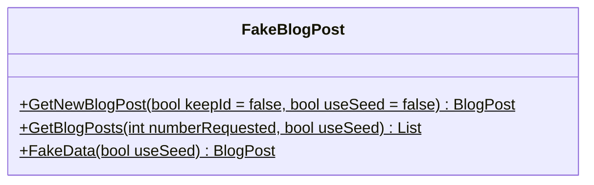

<div id="FakeBlogPostDto-class-diagram"></div>

##### `FakeBlogPostDto` class diagram

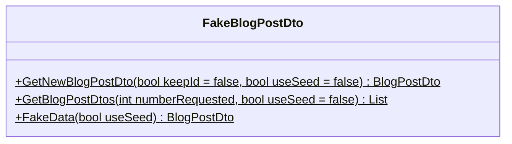

<div id="FakeCategory-class-diagram"></div>

##### `FakeCategory` class diagram

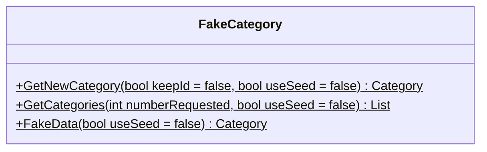

<div id="FakeCategoryDto-class-diagram"></div>

##### `FakeCategoryDto` class diagram

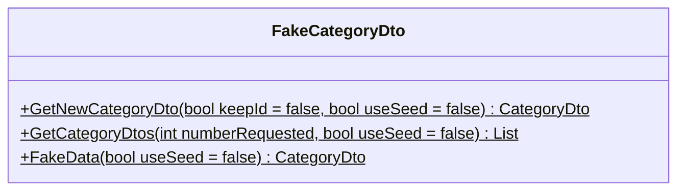

<div id="FakerHelper-class-diagram"></div>

##### `FakerHelper` class diagram

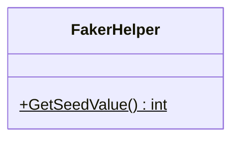

<div id="FakeUser-class-diagram"></div>

##### `FakeUser` class diagram

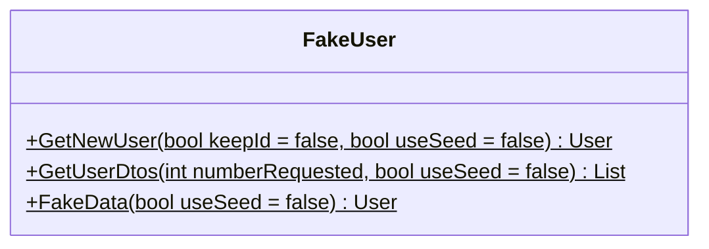

<div id="FakeUserDto-class-diagram"></div>

##### `FakeUserDto` class diagram


<div id="FakeUserInfo-class-diagram"></div>

##### `FakeUserInfo` class diagram

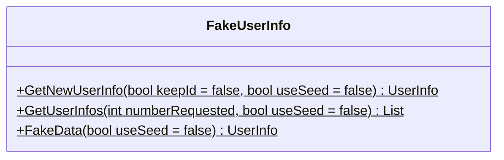

<div id="FakeUserModel-class-diagram"></div>

##### `FakeUserModel` class diagram

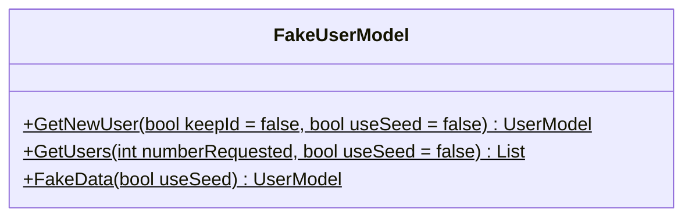

<div id="ServiceNames-class-diagram"></div>

##### `ServiceNames` class diagram

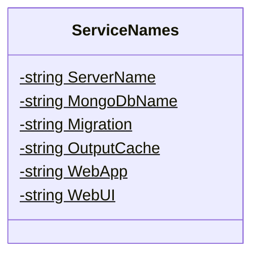

<div id="BlogPost-class-diagram"></div>

##### `BlogPost` class diagram

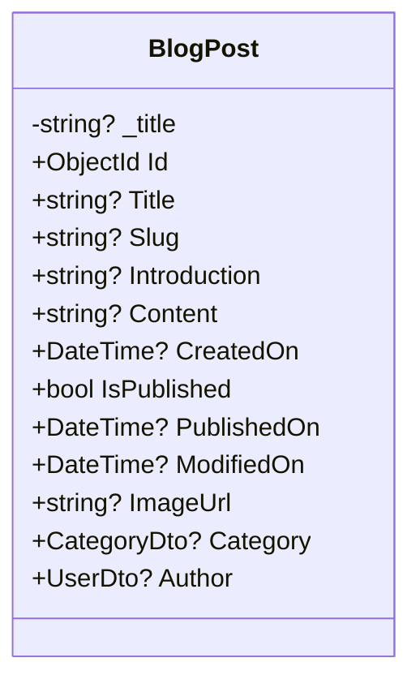

<div id="Category-class-diagram"></div>

##### `Category` class diagram

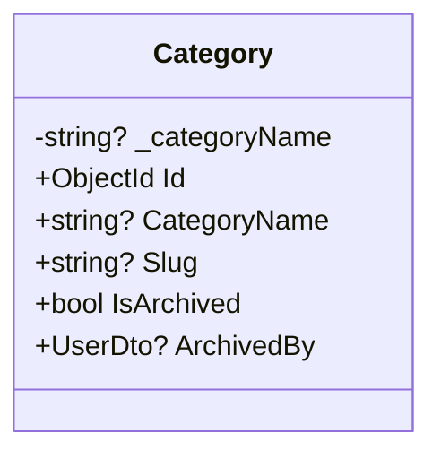

<div id="User-class-diagram"></div>

##### `User` class diagram

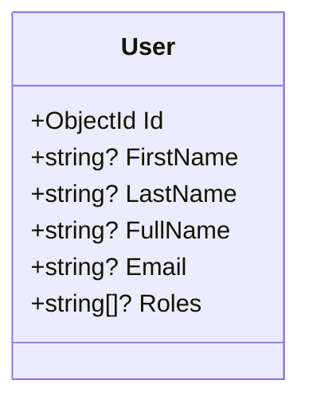

<div id="CategoryNames-class-diagram"></div>

##### `CategoryNames` class diagram

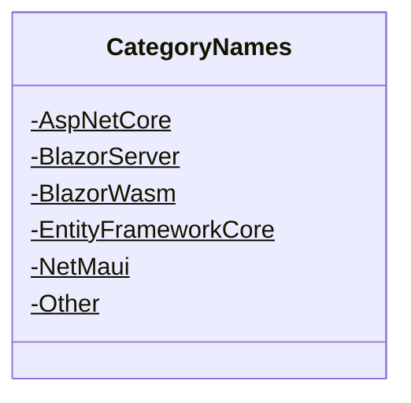

<div id="Gender-class-diagram"></div>

##### `Gender` class diagram

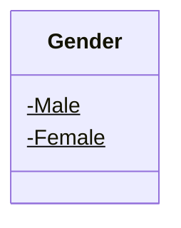

<div id="Roles-class-diagram"></div>

##### `Roles` class diagram

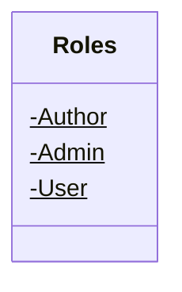

<div id="GuardClauseExtensions-class-diagram"></div>

##### `GuardClauseExtensions` class diagram

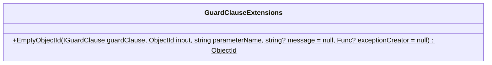

<div id="IBlogPostService-class-diagram"></div>

##### `IBlogPostService` class diagram


<div id="ICategoryService-class-diagram"></div>

##### `ICategoryService` class diagram

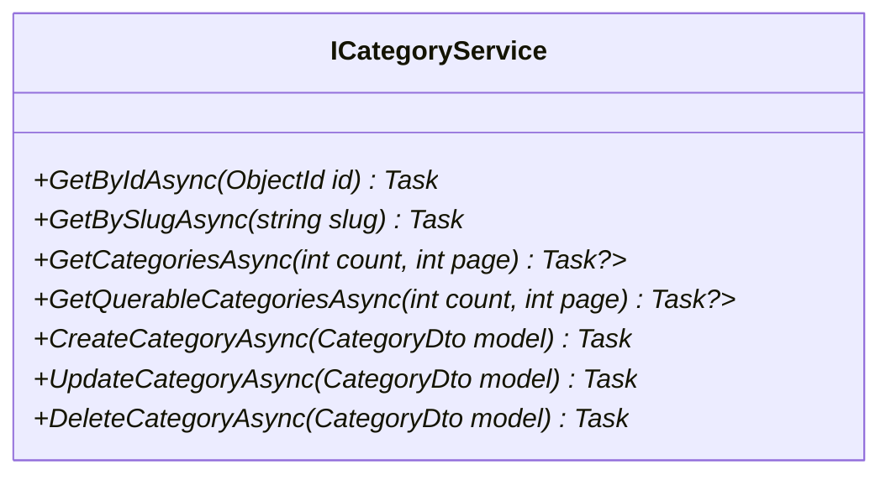

<div id="ILoginProvider-class-diagram"></div>

##### `ILoginProvider` class diagram

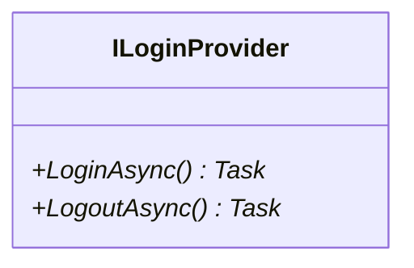

<div id="IUserService-class-diagram"></div>

##### `IUserService` class diagram

```mermaid
classDiagram
class IUserService{
    +LoginUser(LoginModel model)* LoggedInUser?
    +GetByIdAsync(ObjectId id)* Task<UserDto?>
    +GetUsersAsync(int count, int page)* Task<IEnumerable<UserDto?>?>
    +GetQuerableUsersAsync(int count, int page)* Task<IQueryable<UserDto?>?>
    +CreateUserAsync(UserDto model)* Task<MethodResult>
    +UpdateUserAsync(UserDto model)* Task<MethodResult>
    +DeleteUserAsync(UserDto model)* Task<MethodResult>
}

```

<div id="BlogPostDtoMapper-class-diagram"></div>

##### `BlogPostDtoMapper` class diagram

```mermaid
classDiagram
class BlogPostDtoMapper{
    +MapToBlogPostDto(BlogPost? blogPost)$ BlogPostDto
}

```

<div id="BlogPostMapper-class-diagram"></div>

##### `BlogPostMapper` class diagram

```mermaid
classDiagram
class BlogPostMapper{
    +MapToBlogPost(BlogPostDto blogPostDto)$ BlogPost
    +Merge(BlogPostDto? blogPostDto, BlogPost? entity)$ BlogPost?
}

```

<div id="CategoryDtoMapper-class-diagram"></div>

##### `CategoryDtoMapper` class diagram

```mermaid
classDiagram
class CategoryDtoMapper{
    +MapToCategoryDto(Category category)$ CategoryDto
}

```

<div id="CategoryMapper-class-diagram"></div>

##### `CategoryMapper` class diagram

```mermaid
classDiagram
class CategoryMapper{
    +MapToCategory(CategoryDto categoryDto)$ Category
    +Merge(CategoryDto categoryDto, Category entity)$ Category
}

```

<div id="UserDtoMapper-class-diagram"></div>

##### `UserDtoMapper` class diagram

```mermaid
classDiagram
class UserDtoMapper{
    +MapToUserDto(User user)$ UserDto
    +MapToUser(UserDto userDto)$ User
}

```

<div id="UserModelMapper-class-diagram"></div>

##### `UserModelMapper` class diagram

```mermaid
classDiagram
class UserModelMapper{
    +MapToUserModel(UserInfo userInfo)$ UserModel
    +MapToUserModel(UserModelDto userModelDto)$ UserModel
}

```

<div id="-class-diagram"></div>

##### `` class diagram

```mermaid
classDiagram
IEquatable~~ <|--  : implements
class {
}

```

<div id="BlogPostDto-class-diagram"></div>

##### `BlogPostDto` class diagram

```mermaid
classDiagram
class BlogPostDto{
    -string? _title
    +ObjectId Id
    +string? Title
    +string? Slug
    +string? Introduction
    +string? Content
    +DateTime? CreatedOn
    +bool IsPublished
    +DateTime? PublishedOn
    +DateTime? ModifiedOn
    +string? ImageUrl
    +CategoryDto? Category
    +UserDto? Author
}

```

<div id="CategoryDto-class-diagram"></div>

##### `CategoryDto` class diagram

```mermaid
classDiagram
class CategoryDto{
    -string? _categoryName
    +ObjectId Id
    +string? CategoryName
    +string? Slug
    +bool IsArchived
    +UserDto? ArchivedBy
}

```

<div id="LoggedInUser-class-diagram"></div>

##### `LoggedInUser` class diagram

```mermaid
classDiagram
class LoggedInUser{
}

```

<div id="LoginModel-class-diagram"></div>

##### `LoginModel` class diagram

```mermaid
classDiagram
class LoginModel{
    +string? Username
    +string? Password
}

```

<div id="MethodResult-class-diagram"></div>

##### `MethodResult` class diagram

```mermaid
classDiagram
class MethodResult{
}

```

<div id="UserDto-class-diagram"></div>

##### `UserDto` class diagram

```mermaid
classDiagram
class UserDto{
    +ObjectId Id
    +string? FirstName
    +string? LastName
    +string? FullName
    +string? Email
    +string[]? Roles
}

```

<div id="UserInfo-class-diagram"></div>

##### `UserInfo` class diagram

```mermaid
classDiagram
class UserInfo{
    -required ObjectId
}

```

<div id="UserInfoDto-class-diagram"></div>

##### `UserInfoDto` class diagram

```mermaid
classDiagram
class UserInfoDto{
    -required ObjectId
}

```

<div id="UserModel-class-diagram"></div>

##### `UserModel` class diagram

```mermaid
classDiagram
class UserModel{
    +ObjectId Id
    +string? Name
    +string? Email
    +string[]? Roles
}

```

<div id="UserModelDto-class-diagram"></div>

##### `UserModelDto` class diagram

```mermaid
classDiagram
class UserModelDto{
    +ObjectId Id
    +string? Name
    +string? Email
    +string[]? Roles
}

```

<div id="BlogDbContext-class-diagram"></div>

##### `BlogDbContext` class diagram

```mermaid
classDiagram
class BlogDbContext{
    +DbSet<Category>? Categories
    +DbSet<User>? Users
    +DbSet<BlogPost>? BlogPosts
    +.ctor(DbContextOptions<BlogDbContext> options) BlogDbContext
    +Create(IMongoDatabase database)$ BlogDbContext
    +OnConfiguring(DbContextOptionsBuilder optionsBuilder) void
    +OnModelCreating(ModelBuilder modelBuilder) void
}

```

<div id="BlogPostRepository-class-diagram"></div>

##### `BlogPostRepository` class diagram

```mermaid
classDiagram
IBlogPostRepository <|-- BlogPostRepository : implements
class BlogPostRepository{
    -BlogDbContext _context
    +.ctor(BlogDbContext context) BlogPostRepository
}

```

<div id="CategoryRepository-class-diagram"></div>

##### `CategoryRepository` class diagram

```mermaid
classDiagram
ICategoryRepository <|-- CategoryRepository : implements
class CategoryRepository{
    -BlogDbContext _context
    +.ctor(BlogDbContext context) CategoryRepository
}

```

<div id="GenericRepository&lt;T&gt;-class-diagram"></div>

##### `GenericRepository<T>` class diagram

```mermaid
classDiagram
IGenericRepository~T~ <|-- GenericRepository<T> : implements
class GenericRepository<T>{
    -BlogDbContext _context
    +icRepository(BlogDbContext context) void
    +AnyAsync(Expression<Func<T, bool>> predicate) Task<bool>
    +GetByIdAsync(ObjectId id) Task<T>
    +GetBySlugAsync(string slug) Task<T>
    +GetAllAsync(int count, int page) Task<IQueryable<T>>
    +FindAsync(Expression<Func<T, bool>> predicate) Task<IQueryable<T>>
    +AddRange(IEnumerable<T> entities) void
    +RemoveRange(IEnumerable<T> entities) void
    +Create(T entity) void
    +Update(T entity) void
    +Delete(T entity) void
}

```

<div id="UnitOfWork-class-diagram"></div>

##### `UnitOfWork` class diagram

```mermaid
classDiagram
IUnitOfWork <|-- UnitOfWork : implements
class UnitOfWork{
    -BlogDbContext _context
    +IBlogPostRepository BlogPost
    +ICategoryRepository Category
    +IUserRepository User
    +.ctor(IDbContextFactory<BlogDbContext> contextFactory) UnitOfWork
    +CompleteAsync() Task<int>
    +Dispose() void
}

```

<div id="UserRepository-class-diagram"></div>

##### `UserRepository` class diagram

```mermaid
classDiagram
IUserRepository <|-- UserRepository : implements
class UserRepository{
    -BlogDbContext _context
    +.ctor(BlogDbContext context) UserRepository
    +LoginUser(LoginModel model) LoggedInUser?
}

```

<div id="IBlogPostRepository-class-diagram"></div>

##### `IBlogPostRepository` class diagram

```mermaid
classDiagram
IGenericRepository~BlogPost~ <|-- IBlogPostRepository : implements
class IBlogPostRepository{
}

```

<div id="ICategoryRepository-class-diagram"></div>

##### `ICategoryRepository` class diagram

```mermaid
classDiagram
IGenericRepository~Category~ <|-- ICategoryRepository : implements
class ICategoryRepository{
}

```

<div id="IGenericRepository&lt;T&gt;-class-diagram"></div>

##### `IGenericRepository<T>` class diagram

```mermaid
classDiagram
class IGenericRepository<T>{
    +AnyAsync(Expression<Func<T, bool>> predicate)* Task<bool>
    +GetByIdAsync(ObjectId id)* Task<T>
    +GetBySlugAsync(string slug)* Task<T>
    +GetAllAsync(int count, int page)* Task<IQueryable<T>>
    +FindAsync(Expression<Func<T, bool>> predicate)* Task<IQueryable<T>>
    +Create(T entity)* void
    +Update(T entity)* void
    +Delete(T entity)* void
    +AddRange(IEnumerable<T> entities)* void
    +RemoveRange(IEnumerable<T> entities)* void
}

```

<div id="IUnitOfWork-class-diagram"></div>

##### `IUnitOfWork` class diagram

```mermaid
classDiagram
IDisposable <|-- IUnitOfWork : implements
class IUnitOfWork{
    +IBlogPostRepository BlogPost*
    +IUserRepository User*
    +ICategoryRepository Category*
    +CompleteAsync()* Task<int>
}

```

<div id="IUserRepository-class-diagram"></div>

##### `IUserRepository` class diagram

```mermaid
classDiagram
IGenericRepository~User~ <|-- IUserRepository : implements
class IUserRepository{
    +LoginUser(LoginModel model)* LoggedInUser?
}

```

<div id="BlogPostService-class-diagram"></div>

##### `BlogPostService` class diagram

```mermaid
classDiagram
class BlogPostService{
    -ILogger<BlogPostService> _logger
    -IUnitOfWork _unitOfWork
    +.ctor(IUnitOfWork unitOfWork, ILogger<BlogPostService> logger) BlogPostService
    +GetByIdAsync(ObjectId id) Task<BlogPostDto?>
    +GetBySlugAsync(string slug) Task<BlogPostDto?>
    +GetBlogPostsAsync(int count, int page) Task<IEnumerable<BlogPostDto?>?>
    +GetQuerableBlogPostsAsync(int count, int page) Task<IQueryable<BlogPostDto?>?>
    +CreateBlogPostAsync(BlogPostDto model) Task<MethodResult>
    +UpdateBlogPostAsync(BlogPostDto model) Task<MethodResult>
    +DeleteBlogPostAsync(BlogPostDto model) Task<MethodResult>
}

```

<div id="CategoryService-class-diagram"></div>

##### `CategoryService` class diagram

```mermaid
classDiagram
class CategoryService{
    -ILogger<CategoryService> _logger
    -IUnitOfWork _unitOfWork
    +.ctor(IUnitOfWork unitOfWork, ILogger<CategoryService> logger) CategoryService
    +GetByIdAsync(ObjectId id) Task<CategoryDto?>
    +GetBySlugAsync(string slug) Task<CategoryDto?>
    +GetCategoriesAsync(int count, int page) Task<IEnumerable<CategoryDto?>?>
    +GetQuerableCategoriesAsync(int count, int page) Task<IQueryable<CategoryDto?>?>
    +CreateCategoryAsync(CategoryDto model) Task<MethodResult>
    +UpdateCategoryAsync(CategoryDto model) Task<MethodResult>
    +DeleteCategoryAsync(CategoryDto model) Task<MethodResult>
}

```

<div id="UserService-class-diagram"></div>

##### `UserService` class diagram

```mermaid
classDiagram
class UserService{
    -ILogger<UserService> _logger
    -IUnitOfWork _unitOfWork
    +.ctor(IUnitOfWork unitOfWork, ILogger<UserService> logger) UserService
    +LoginUser(LoginModel model) LoggedInUser?
    +GetByIdAsync(ObjectId id) Task<UserDto?>
    +GetUsersAsync(int count, int page) Task<IEnumerable<UserDto?>?>
    +GetQuerableUsersAsync(int count, int page) Task<IQueryable<UserDto?>?>
    +CreateUserAsync(UserDto model) Task<MethodResult>
    +UpdateUserAsync(UserDto model) Task<MethodResult>
    +DeleteUserAsync(UserDto model) Task<MethodResult>
}

```

<div id="Extensions-class-diagram"></div>

##### `Extensions` class diagram

```mermaid
classDiagram
class Extensions{
    +AddServiceDefaults(IHostApplicationBuilder builder)$ IHostApplicationBuilder
    +ConfigureOpenTelemetry(IHostApplicationBuilder builder)$ IHostApplicationBuilder
    +AddOpenTelemetryExporters(IHostApplicationBuilder builder)$ IHostApplicationBuilder
    +AddDefaultHealthChecks(IHostApplicationBuilder builder)$ IHostApplicationBuilder
    +MapDefaultEndpoints(WebApplication app)$ WebApplication
}

```

<div id="WeatherForecast-class-diagram"></div>

##### `WeatherForecast` class diagram

```mermaid
classDiagram
class WeatherForecast{
    +DateTime Date
    +int TemperatureC
    +int TemperatureF
    +string? Summary
}

```

<div id="WeatherForecastService-class-diagram"></div>

##### `WeatherForecastService` class diagram

```mermaid
classDiagram
class WeatherForecastService{
    -string[] Summaries$
    +GetForecastAsync(DateTime startDate) Task<WeatherForecast[]>
}

```

<div id="ServicesExtensions-class-diagram"></div>

##### `ServicesExtensions` class diagram

```mermaid
classDiagram
class ServicesExtensions{
    +RegisterApplicationServices(WebApplicationBuilder builder)$ void
    +AddAuthenticationService(WebApplicationBuilder builder)$ void
    +RegisterBlogDbContext(WebApplicationBuilder builder)$ void
    +RegisterRedisOutputCache(WebApplicationBuilder builder)$ void
    +RegisterImplementations(WebApplicationBuilder builder)$ void
    +RegisterServices(WebApplicationBuilder builder)$ void
    +AddAppSettings(WebApplication app)$ void
}

```

<div id="ErrorModel-class-diagram"></div>

##### `ErrorModel` class diagram

```mermaid
classDiagram
class ErrorModel{
    -ILogger<ErrorModel> _logger
    +string? RequestId
    +bool ShowRequestId
    +.ctor(ILogger<ErrorModel> logger) ErrorModel
    +OnGet() void
}

```

<div id="LoginModel-class-diagram"></div>

##### `LoginModel` class diagram

```mermaid
classDiagram
class LoginModel{
    +OnGet(string redirectUri) Task
}

```

<div id="LogoutModel-class-diagram"></div>

##### `LogoutModel` class diagram

```mermaid
classDiagram
class LogoutModel{
    +OnGet() Task
}

```

<div id="FakeBlogPostDtoTests-class-diagram"></div>

##### `FakeBlogPostDtoTests` class diagram

```mermaid
classDiagram
class FakeBlogPostDtoTests{
    +GetNewBlogPostDto_Should_Return_BlogPostDto_Without_An_Id_When_KeepId_Is_False() void
    +GetNewBlogPostDto_Should_Return_BlogPostDto_Without_An_Id_When_Using_Default_Values() void
    +GetNewBlogPostDto_Should_Return_BlogPostDto_With_KeptId_True_When_KeepId_True() void
    +GetNewBlogPostDto_Should_Return_BlogPostDto_Without_Id_When_When_KeepId_Is_False_And_UseSeed_Is_True() void
    +GetNewBlogPostDto_Should_Return_BlogPostDto_With_Id_When_KeepId_Ie_True_And_UseSeed_Is_True() void
    +GetBlogPostDtos_With_UseSeed_Should_Return_FakeBlogPostDtos_That_Are_Different_Test(int countRequested, bool useSeed) void
    +FakeData_Should_Return_BlogPostDto_With_Valid_Data_When_UseSeed_Is_False() void
    +FakeData_Should_Return_Same_BlogPostDto_When_UseSeed_Is_True() void
}

```

<div id="FakeBlogPostTests-class-diagram"></div>

##### `FakeBlogPostTests` class diagram

```mermaid
classDiagram
class FakeBlogPostTests{
    +GetNewBlogPost_Should_Return_BlogPost_Without_An_Id_When_KeepId_Is_False() void
    +GetNewBlogPost_Should_Return_BlogPost_Id_When_KeepId_True() void
    +GetNewBlogPost_Should_Return_BlogPost_Without_Id_When_When_KeepId_Is_False_And_UseSeed_Is_True() void
    +GetNewBlogPost_Should_Return_BlogPost_With_Id_When_KeepId_Ie_True_And_UseSeed_Is_True() void
    +GetBlogPosts_With_UseSeed_Is_False_Should_Return_FakeBlogPosts_That_Are_Different_Test(int countRequested, bool useSeed) void
    +GetBlogPosts_With_UseSeed_Is_True_Should_Return_FakeBlogPosts_That_Are_Same_Test(int countRequested, bool useSeed) void
}

```

<div id="FakeCategoryDtoTests-class-diagram"></div>

##### `FakeCategoryDtoTests` class diagram

```mermaid
classDiagram
class FakeCategoryDtoTests{
    +GetNewCategoryDto_Should_Return_Category_Without_Id_When_KeepId_Is_False() void
    +GetNewCategoryDto_Should_Return_Category_With_Id_When_KeepId_Is_True_And_UseSeed_Is_True() void
    +GetNewCategoryDto_Should_Return_Category_With_Id_When_KeepId_Is_True_And_UseSeed_Is_False() void
    +GetCategoryDtos_With_UseSeed_Is_False_Should_Return_FakeCategories_That_Are_The_Same_Test(int countRequested, bool useSeed) void
    +GetCategoryDtos_With_UseSeed_Is_True_Should_Return_FakeCategoryDtos_That_Are_Different_Test(int countRequested, bool useSeed) void
    +FakeData_ShouldReturnNonNullCategoryDto_WhenCalled() void
    +FakeData_ShouldHaveCategoryName_WhenCalled() void
    +FakeData_ShouldHaveId_WhenCalled() void
    +FakeData_ShouldHandleIsArchivedCorrectly_WhenCalled() void
    +FakeData_Should_Generate_Consistent_Data_When_UseSeed_Is_True() void
    +FakeData_Should_Generate_Different_Data_When_UseSeed_Is_False() void
}

```

<div id="FakeCategoryTests-class-diagram"></div>

##### `FakeCategoryTests` class diagram

```mermaid
classDiagram
class FakeCategoryTests{
    +GetNewCategory_Should_Return_Category_Without_Id_When_KeepId_Is_False() void
    +GetNewCategory_Should_Return_Category_With_Id_When_KeepId_Is_True() void
    +GetNewCategory_Should_Return_Category_With_Id_When_KeepId_Is_True_And_UseSeed_Is_True() void
    +GetCategories_With_UseSeed_Is_True_Should_Return_FakeCategories_That_Are_Different_Test(int countRequested, bool useSeed) void
    +GetCategories_With_UseSeed_Is_False_Should_Return_FakeCategories_That_Are_The_Same_Test(int countRequested, bool useSeed) void
    +FakeData_Should_Generate_Valid_Category_When_UseSeed_Is_False() void
    +FakeData_Should_Generate_Valid_Category_When_UseSeed_Is_True() void
}

```

<div id="FakerHelperTests-class-diagram"></div>

##### `FakerHelperTests` class diagram

```mermaid
classDiagram
class FakerHelperTests{
    +GetSeedValue_Should_Return_Value_Between_10_And_IntMaxValue() void
    +GetSeedValue_Should_Return_Different_Values_On_Subsequent_Calls() void
}

```

<div id="FakeUserDtoTests-class-diagram"></div>

##### `FakeUserDtoTests` class diagram

```mermaid
classDiagram
class FakeUserDtoTests{
    +GetNewUserDto_Should_Return_User_Without_Id_When_KeepId_Is_False() void
    +GetNewUserDto_Should_Return_User_With_Id_When_KeepId_Is_True() void
    +GetNewUserDto_Should_Return_Different_User_When_UseSeed_Is_False() void
    +GetNewUserDto_Should_Return_Same_User_When_UseSeed_Is_True() void
    +GetUserDtos_Should_Return_List_Of_Users_With_Correct_Count() void
    +GetUserDtos_Should_Return_Different_Users_When_UseSeed_Is_False(int countRequested, bool useSeed) void
    +GetUserDtos_Should_Return_Same_Users_When_UseSeed_Is_True(int countRequested, bool useSeed) void
}

```

<div id="FakeUserInfoTests-class-diagram"></div>

##### `FakeUserInfoTests` class diagram

```mermaid
classDiagram
class FakeUserInfoTests{
    +GetNewUserInfo_Should_Return_UserInfo_With_Default_Id() void
    +GetNewUserInfo_Should_Return_UserInfo_With_Generated_Id_When_KeepId_Is_True() void
    +GetUserInfos_Should_Return_List_Of_UserInfos() void
    +FakeData_Should_Return_UserInfo_With_Valid_Properties() void
}

```

<div id="FakeUserModelTest-class-diagram"></div>

##### `FakeUserModelTest` class diagram

```mermaid
classDiagram
class FakeUserModelTest{
    +GetNewUser_Should_Return_UserModel_With_Default_Id() void
    +GetNewUser_Should_Return_UserModel_With_Generated_Id_When_KeepId_Is_True() void
    +GetUsers_Should_Return_List_Of_UserModels() void
    +FakeData_Should_Return_UserModel_With_Valid_Properties() void
    +FakeData_Should_Return_UserModel_With_KeepId_And_UseSeed() void
    +GetUsers_Should_Return_Different_Users_When_UseSeed_Is_False(int countRequested, bool useSeed) void
    +GetUsers_Should_Return_Same_Users_When_UseSeed_Is_True(int countRequested, bool useSeed) void
}

```

<div id="FakeUserTests-class-diagram"></div>

##### `FakeUserTests` class diagram

```mermaid
classDiagram
class FakeUserTests{
    +GetNewUser_Should_Return_User_Without_Id_When_KeepId_Is_False() void
    +GetNewUser_Should_Return_User_With_Id_When_KeepId_Is_True() void
    +GetNewUser_Should_Return_Same_User_When_UseSeed_Is_True() void
    +GetUserDtos_Should_Return_List_Of_Users_With_Correct_Count() void
    +GetUserDtos_Should_Return_Different_Users_When_UseSeed_Is_False(int countRequested, bool useSeed) void
    +GetUserDtos_Should_Return_Same_Users_When_UseSeed_Is_True(int countRequested, bool useSeed) void
    +FakeData_Should_Return_Valid_User() void
    +FakeData_ShouldReturnDifferentUser_WhenUseSeedIsTrue() void
    +FakeData_Should_Return_Different_User_When_UseSeed_Is_False() void
    +FakeData_ShouldAssignDifferentIdsToDifferentUsers() void
}

```

<div id="ServiceNamesTests-class-diagram"></div>

##### `ServiceNamesTests` class diagram

```mermaid
classDiagram
class ServiceNamesTests{
    +ServerName_ShouldBe_PostsServer() void
    +MongoDbName_ShouldBe_PostsDatabase() void
    +Migration_ShouldBe_DatabaseMigration() void
    +OutputCache_ShouldBe_OutputCache() void
    +WebApp_ShouldBe_WebFrontend() void
    +WebUI_ShouldBe_WebUI() void
}

```

<div id="BlogPostTests-class-diagram"></div>

##### `BlogPostTests` class diagram

```mermaid
classDiagram
class BlogPostTests{
    +Title_SetTitle_ShouldSetSlug() void
    +Title_SetTitle_ShouldNotChangeExistingSlug() void
    +BlogPost_DefaultValues_ShouldBeSetCorrectly() void
}

```

<div id="CategoryTests-class-diagram"></div>

##### `CategoryTests` class diagram

```mermaid
classDiagram
class CategoryTests{
    +Category_Should_Have_Default_Values() void
    +CategoryName_Should_Set_Slug_When_Not_Already_Set() void
    +CategoryName_Should_Not_Change_Slug_When_Already_Set() void
    +Category_Should_Be_Archived() void
}

```

<div id="UserTests-class-diagram"></div>

##### `UserTests` class diagram

```mermaid
classDiagram
class UserTests{
    +User_Should_Have_Default_Id() void
    +User_Should_Require_FirstName() void
    +User_Should_Require_Email() void
    +User_Should_Require_Roles() void
    +ValidateModel(User user) IList<ValidationResult>
}

```

<div id="BlogPostDtoMapperTests-class-diagram"></div>

##### `BlogPostDtoMapperTests` class diagram

```mermaid
classDiagram
class BlogPostDtoMapperTests{
    +MapToBlogPostDtoTest() void
    +MapToBlogPostDto_Null_BlogPost_ThrowsArgumentNullException() void
    +MapToBlogPostDto_Should_Throw_Exception_For_Null_Title() void
    +MapToBlogPost_Should_Throw_Exception_For_Null_Slug() void
    +Merge_Should_Throw_Exception_For_Null_Content() void
    +MapToBlogPost_Should_Throw_Exception_For_Null_Introduction() void
    +MapToBlogPost_Should_Throw_Exception_For_Null_CreatedOn() void
}

```

<div id="BlogPostMapperTests-class-diagram"></div>

##### `BlogPostMapperTests` class diagram

```mermaid
classDiagram
class BlogPostMapperTests{
    +MapToBlogPost_Should_Map_All_Properties_Correctly() void
    +MapToBlogPostDto_Should_Throws_ArgumentNullException_When_BlogPost_Is_Null() void
    +MapToBlogPost_Should_Throw_ArgumentException_When_Id_Is_ObjectId_Empty() void
    +MapToBlogPost_Should_Throw_ArgumentException_When_Title_Is_String_Empty() void
    +MapToBlogPost_Should_Throw_ArgumentException_When_Slug_Is_String_Empty() void
    +MapToBlogPost_Should_Throw_Exception_When_Introduction_Is_String_Empty() void
    +Merge_Should_Update_All_Properties_Correctly() void
    +Merge_Should_Throws_ArgumentNullException_When_BlogPostDto_Is_Null() void
    +Merge_Should_Throws_ArgumentNullException_When_BlogPost_Is_Null() void
    +Merge_Should_Throw_ArgumentException_When_Id_Is_ObjectId_Empty() void
    +Merge_Should_Throw_ArgumentException_When_Title_Is_String_Empty() void
    +Merge_Should_Throw_ArgumentException_When_Slug_Is_String_Empty() void
    +Merge_Should_Throw_Exception_When_Introduction_Is_String_Empty() void
    +Merge_Should_Throw_Exception_For_Null_Content() void
}

```

<div id="CategoryDtoMapperTests-class-diagram"></div>

##### `CategoryDtoMapperTests` class diagram

```mermaid
classDiagram
class CategoryDtoMapperTests{
    +MapToCategoryDto_ValidCategory_ReturnsCategoryDto() void
    +MapToCategoryDto_NullCategory_ThrowsArgumentNullException() void
    +MapToCategoryDto_EmptyCategoryId_ThrowsArgumentException() void
    +MapToCategoryDto_NullCategoryName_ThrowsArgumentException() void
    +MapToCategoryDto_NullSlug_ThrowsArgumentException() void
}

```

<div id="CategoryMapperTests-class-diagram"></div>

##### `CategoryMapperTests` class diagram

```mermaid
classDiagram
class CategoryMapperTests{
    +MapToCategory_ValidCategoryDto_ReturnsCategory() void
    +MapToCategory_NullCategoryDto_ThrowsArgumentNullException() void
    +MapToCategory_EmptyCategoryId_ThrowsArgumentException() void
    +MapToCategory_NullCategoryName_ThrowsArgumentException() void
    +MapToCategory_NullSlug_ThrowsArgumentException() void
    +MapToCategory_NullArchivedBy_ThrowsArgumentNullException() void
    +Merge_ShouldMapCategoryDtoToCategory() void
    +Merge_ShouldSetArchivedBy_WhenIsArchivedIsTrue() void
}

```

<div id="UserDtoMapperTests-class-diagram"></div>

##### `UserDtoMapperTests` class diagram

```mermaid
classDiagram
class UserDtoMapperTests{
    +MapToUserDto_ValidUser_ReturnsUserDto() void
    +MapToUser_ValidUserDto_ReturnsUser() void
}

```

<div id="UserModelMapperTests-class-diagram"></div>

##### `UserModelMapperTests` class diagram

```mermaid
classDiagram
class UserModelMapperTests{
    +MapToUserModel_Valid_User_Info_Returns_UserModel() void
    +MapToUserModel_Valid_UserModelDto_Returns_UserModel() void
}

```

<div id="LoginModelTests-class-diagram"></div>

##### `LoginModelTests` class diagram

```mermaid
classDiagram
class LoginModelTests{
    +LoginModel_Should_Be_Valid_With_Valid_Data() void
    +LoginModel_Should_Be_Invalid_With_Missing_Username() void
    +LoginModel_Should_Be_Invalid_With_Invalid_Email_Format() void
    +LoginModel_Should_Be_Invalid_With_Missing_Password() void
    +LoginModel_Should_Be_Invalid_With_Short_Password() void
    +LoginModel_Should_Be_Invalid_With_Long_Password() void
}

```

<div id="MethodResultTest-class-diagram"></div>

##### `MethodResultTest` class diagram

```mermaid
classDiagram
class MethodResultTest{
    +MethodResult_Success_ReturnsTrueStatus() void
    +MethodResult_Failure_ReturnsFalseStatusAndErrorMessage() void
    +MethodResult_DefaultConstructor_ReturnsFalseStatusAndNullErrorMessage() void
}

```

<div id="UserDtoTest-class-diagram"></div>

##### `UserDtoTest` class diagram

```mermaid
classDiagram
class UserDtoTest{
    +UserDto_Should_Have_Default_Values() void
    +UserDto_Should_Set_Properties_Correctly() void
}

```

<div id="UserInfoDtoTest-class-diagram"></div>

##### `UserInfoDtoTest` class diagram

```mermaid
classDiagram
class UserInfoDtoTest{
    +UserInfoDto_Should_Have_Default_Values() void
    +UserInfoDto_Should_Set_Properties_Correctly() void
}

```

<div id="UserInfoTest-class-diagram"></div>

##### `UserInfoTest` class diagram

```mermaid
classDiagram
class UserInfoTest{
    +UserInfo_Should_Have_Default_Values() void
    +UserInfo_Should_Set_Properties_Correctly() void
}

```

<div id="UserModelDtoTest-class-diagram"></div>

##### `UserModelDtoTest` class diagram

```mermaid
classDiagram
class UserModelDtoTest{
    +UserModelDto_Should_Have_Default_Values() void
    +UserModelDto_Should_Set_Properties_Correctly() void
}

```

<div id="UserModelTests-class-diagram"></div>

##### `UserModelTests` class diagram

```mermaid
classDiagram
class UserModelTests{
    +UserModel_Should_Have_Default_Values() void
    +UserModel_Should_Set_Properties_Correctly() void
}

```

*This file is maintained by a bot.*

<!-- markdownlint-restore -->
